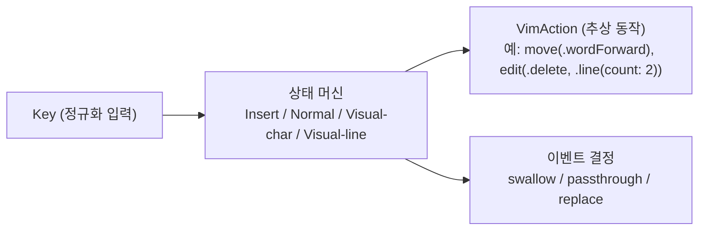

# 모드 엔진

- **Last updated**: 2026-07-24

## 현재 구조

모드 엔진(Insert / Normal / Visual-char / Visual-line 상태 머신)은 **macOS 의존성이 전혀 없는 별도 SPM 타깃의 순수 Swift**다. 입력은 정규화된 `Key` 값, 출력은 `move(.wordForward)`, `edit(.delete, .line(count: 2))` 같은 추상 `VimAction` 값이다.

## 패키지·타깃 위치

엔진은 저장소 내 단일 로컬 SPM 패키지 `Packages/VimActionCore`의 `VimEngine` 타깃에 위치한다 (테스트 타깃 `VimEngineTests`). 앞으로 추가되는 순수 Swift 모듈(ProfileKit 등)도 개별 패키지가 아니라 **같은 패키지의 새 타깃**으로 들어온다. 앱 타깃은 이 패키지의 `VimEngine` 제품에 의존하는 소비자다.

- 관련 결정: [20260712_single-core-spm-package.md](../../decisions/references/20260712_single-core-spm-package.md)

현재 구성:

- `VimEngine`: `struct VimEngine`(`handle(_:) -> EngineOutput`, `private(set) var mode`, 시작 모드 `.insert`), 타입 `Key`/`VimAction`(`move`/`edit`/`beginSelection`/`switchSelectionWise`/`extendSelection`/`clearSelection`/`openLine`/`paste`/`undo`/`redo`/`scroll`)·`Motion`·`Operator`·`TextRange`·`TextObject`·`ScrollExtent`/`EventDecision`·`EngineOutput`/`Mode`(insert/normal/visualChar/visualLine). 내부 상태는 `mode`와 멀티키 커맨드 누적용 `pending: PendingCommand?` 둘뿐이다.
- **`PendingCommand`는 문법 기반 누적 빌더**(부분 파스 상태)다: `count`(선행 카운트) / `op`(대기 오퍼레이터) / `opCount`(오퍼레이터 뒤 카운트) / `prefix`(`.g` 또는 `.textObjectScope` — 완결 키 하나를 기다리는 접두) 슬롯을 키가 채워간다. `.g`는 `op` 유무로 완결이 갈린다: `op == nil`이면 모션 `gg`, `op != nil`이면 linewise `dgg`/`cgg`.
- 구현된 키셋: 모드 전환 `Esc, i, a, I, A` / 모션 `h j k l / w b e / 0 ^ $ / gg G` + 선행 카운트(`3w` → `.move` 반복 출력) / 새 줄 열기 `o`/`O`(`openLine(above:)` + Insert 전이, 카운트 무시) / 붙여넣기 `p`/`P`(`paste(before:count:)` — 카운트는 한 편집 단위의 count, charwise/linewise 판정은 클립보드를 아는 어댑터 몫, v1은 레지스터 없이 시스템 클립보드) / 실행 취소·재실행 `u`/`Ctrl-r`(`undo`/`redo` — 네이티브 위임, 카운트는 반복 출력) / 스크롤 `Ctrl-d`/`Ctrl-u`(half)·`Ctrl-f`/`Ctrl-b`(full)(`scroll(ScrollExtent, forward:)` — 실행 수단·커서 동반은 어댑터 몫, 카운트는 반복 출력, Normal 전용 테이블 `normalCtrlCombos`) / Esc 별칭 `Ctrl-[`(`handle()` 진입부에서 `.escape`로 정규화 — 정확 매치만, 세 모드 전부 Esc와 동일) / 편집 `x`(`3x`), 오퍼레이터 `d`/`c`/`y`(`operatorKeys` 테이블) — +모션(charwise-safe 화이트리스트), 자기 키 반복 `dd`/`cc`/`yy`(줄 범위, 유효 카운트는 두 카운트의 곱 `2d3w`=6), +텍스트 오브젝트(`diw`/`ciw`/`ya(` 등 — word·quote 3종·pair 4종, 여닫이 양쪽+b/B 별칭), +linewise 모션(`dj dk dG dgg`). `.change` 완결 시 엔진이 즉시 Insert 전이(`complete` 헬퍼 단일화), `cw` 특례(Vim의 ce 동작)는 어댑터 몫 — 어댑터는 change 삭제 실행 후 후속 이벤트를 처리해야 한다. Visual: 진입 `v`/`V`, 이탈 `Esc`·같은 키 재입력, `v`↔`V` 전환, 모션 전부의 선택 확장 + 선행 카운트, 선택 동작 `y d x c`(`x`≡`d`).
- Normal 모드 처리 규칙: ⓪ `handle()` 진입부에서 `Ctrl-[` → `.escape` 정규화(정확 매치만 — `Cmd+Ctrl+[`는 별칭 아님, 모드 분기·탈출 판정 이전이라 세 모드 공통) — [20260724_ctrl-bracket-escape-normalization.md](../../decisions/references/20260724_ctrl-bracket-escape-normalization.md). → ① **취소 최우선** (cross-cutting, step 진입 전) — Esc **정확 매치**는 pending 폐기+swallow+Normal 유지, 탈출 modifier 콤보(`isEscapeCombo`)는 pending 폐기+passthrough+Insert 전이하되 **매핑된 Ctrl 콤보(`mappedComboKeys` — `normalCtrlCombos` 키에서 파생)는 탈출 판정에서 제외**한다(매핑 키는 Vim 기능이 항상 이김, Normal 전용·키 단위 예외 — [20260724_ctrl-combo-mapped-exception-cancellation.md](../../decisions/references/20260724_ctrl-combo-mapped-exception-cancellation.md)). 수식자 붙은 Esc(Cmd+Esc)는 Esc 분기가 아니라 콤보 판정을 탄다. 탈출 대상 modifier 셋은 `Configuration.normalModeEscapeModifiers` 주입(기본 `Cmd`/`Opt`, `Ctrl` 제외)이며 앱 설정으로 on/off한다 — [20260714_normal-mode-escape-modifiers.md](../../decisions/references/20260714_normal-mode-escape-modifiers.md). → ② `step` — pending을 이번 키로 한 스텝 진행: **extend**(슬롯 채워 유지: 카운트 digit·`d`·`g`·`di`/`da`) / **complete**(커맨드 완결, 액션 출력) / **invalid**(pending과 키를 함께 버리는 no-op). step 내부 우선순위: prefix 완결 → g extend(op 유무 무관 공통 — gg/dgg 동일 경로) → 오퍼레이터 대기(스코프 i/a → opCount digit → dd → opMotions 테이블) → 최상위(오퍼레이터 키 → 모드 전환 → x·o/O·p/P·u → Ctrl 콤보 테이블(`normalCtrlCombos`) → count digit → 단일 모션 → 미매핑 콤보 passthrough / 미매핑 키 swallow). `o`/`O`·`p`/`P`·`u`·Ctrl 콤보는 오퍼레이터 대기 중이면 화이트리스트 밖이라 invalid(`do`/`dp`/`du`/`d Ctrl-d` no-op)이고, Visual에서 `o`/`O`·`p`/`P`·`u`는 미매핑 swallow, Ctrl 콤보는 미매핑 passthrough다(v1 Visual 어휘 밖).
- **0-규칙**: `0`은 해당 카운트 슬롯이 비어 있으면 모션(lineStart), 누적 중이면 자리값. **카운트 클램프**: 9,999 (초과 자리 digit 무시). **절대 모션 카운트**: 모션 `3G`는 반복 출력 수용(멱등·무해, Vim 의미와 다름을 인지한 이연), `3gg`·`3i`는 count 무시. **카운트 정책 3갈래**(표현 가능성이 기준): 표현 불가면 무시(`3o` — Vim의 "입력 반복"은 Insert 세션 기억 필요), 한 편집 단위면 액션의 count(`3p`·`3x`), 이산 반복 동작이면 반복 출력(`3u`·`3w`·`3 Ctrl-d`) — [20260723_openline-output-contract.md](../../decisions/references/20260723_openline-output-contract.md), [20260723_paste-output-contract.md](../../decisions/references/20260723_paste-output-contract.md), [20260723_undo-output-contract.md](../../decisions/references/20260723_undo-output-contract.md), [20260724_scroll-redo-output-contract.md](../../decisions/references/20260724_scroll-redo-output-contract.md). 반면 **편집은 파괴적이라 오해석을 수용하지 않는다**: 오퍼레이터+절대 linewise 모션(`d3G`/`3dgg`)과 카운트+텍스트 오브젝트(`d2i(`/`3diw`)는 카운트가 하나라도 있으면 invalid.
- **opMotion 화이트리스트**: 오퍼레이터 뒤 유효 단일 키 모션은 kind 딸린 **단일 테이블 `opMotions`** — charwise(`w b e h l 0 ^ $` → `.motion`, 카운트 곱)·linewiseRelative(`j k` → `.linewiseMotion`, 카운트 곱)·linewiseAbsolute(`G` → `.linewiseMotion`, 카운트 있으면 invalid·항상 count 1)를 kind가 가른다. 멀티키 `gg`만 prefix 메커니즘(`.g`)이 따로 완결한다. 화이트리스트 밖은 invalid. 관련 결정: [20260719_opmotion-unified-dispatch-table.md](../../decisions/references/20260719_opmotion-unified-dispatch-table.md)
- **Visual 출력 계약**: 모션은 이동이 아니라 선택 확장 — `extendSelection(Motion)`(카운트는 `.move`와 같은 반복 출력). 진입은 `beginSelection(linewise:)`(**항상 새 세션·앵커 리셋**, V는 현재 줄 즉시 선택), v↔V 전환은 `switchSelectionWise(linewise:)`(앵커 유지 + wise 교체·재적용, 활성 세션이 없으면 begin 취급 — 방어 규칙), 이탈은 `clearSelection`(화면 선택 해제) 명시 출력. charwise/linewise는 세션 속성이라 모드 케이스(visualChar/visualLine)와 진입 신호가 나르고 개별 확장 액션에는 없다 — linewise 줄 반올림은 어댑터의 실행 규칙. 선택 앵커·실제 범위는 어댑터 상태다. 선택 동작 `y d x c`는 오퍼레이터 대기 없이 `.edit(op, .selection)` 즉시 완결(`x`≡`d`, `c`는 complete 헬퍼로 Insert 전이, `y d x`는 Normal 복귀), 단 `y`는 범위를 파괴하지 않아 `clearSelection`을 뒤이어 동반한다(collapse 목적지는 어댑터 몫 — [20260723_visual-yank-clear-selection.md](../../decisions/references/20260723_visual-yank-clear-selection.md)). 카운트+오퍼레이터는 카운트를 버리고 즉시 실행(Vim 동일 — 선택 범위가 피연산자라 오해석 위험이 없음, [20260723_visual-count-operator-executes.md](../../decisions/references/20260723_visual-count-operator-executes.md)). 관련 결정: [20260722_visual-mode-output-contract.md](../../decisions/references/20260722_visual-mode-output-contract.md), [20260723_visual-begin-reset-switch-wise-split.md](../../decisions/references/20260723_visual-begin-reset-switch-wise-split.md)
- **Visual 처리 규칙**: 취소 최우선은 Normal과 동일 — Esc 정확 매치는 pending 폐기 + `clearSelection` + Normal 복귀, 탈출 콤보는 pending 폐기 + passthrough + Insert 탈출(`clearSelection` 미동반 — passthrough와 replace가 배타적이고 콤보(Cmd+C 등)가 선택에 작용할 수 있어 원본 전달 우선; 남는 화면 선택·어댑터 세션은 수용 — begin이 항상 리셋이라 다음 진입을 오염시키지 않음, [20260723_visual-begin-reset-switch-wise-split.md](../../decisions/references/20260723_visual-begin-reset-switch-wise-split.md)). pending에는 카운트·`g` 접두만 쌓인다(오퍼레이터 대기 없음). 미매핑 콤보 passthrough / 맨 키 swallow도 Normal과 동일(`i`/`a`는 v1 Visual에 미매핑 — swallow). Normal pending과의 상호작용은 특례 없음: `3v`는 카운트 무시 진입(`3i` 선례), `dv`는 invalid no-op(`dq` 선례) — [20260722_visual-entry-pending-interaction.md](../../decisions/references/20260722_visual-entry-pending-interaction.md)
- Insert 모드는 Esc(→Normal, 삼킴) 외 전부 `.passthrough`.
- append 계열은 전용 모션 케이스: `a`→`charRightForAppend`, `A`→`lineEndForAppend` (`l`·`$`는 Vim에서 마지막 문자 위에 멈추고 append는 그 뒤로 가므로 어댑터가 구분해야 함). `I`는 `^`와 목표가 같아 `lineFirstNonBlank` 재사용.
- 관련 결정: [20260714_multikey-command-grammar-builder.md](../../decisions/references/20260714_multikey-command-grammar-builder.md), [20260717_vimaction-edit-output-shape.md](../../decisions/references/20260717_vimaction-edit-output-shape.md), [20260719_change-insert-transition-and-cw-deferral.md](../../decisions/references/20260719_change-insert-transition-and-cw-deferral.md), [20260719_textobject-quote-pair-expansion.md](../../decisions/references/20260719_textobject-quote-pair-expansion.md), [20260719_linewise-textrange-absolute-count-invalid.md](../../decisions/references/20260719_linewise-textrange-absolute-count-invalid.md), [20260717_cancellation-first-ordering-premise.md](../../decisions/references/20260717_cancellation-first-ordering-premise.md), [20260712_pending-invalid-sequence-noop.md](../../decisions/references/20260712_pending-invalid-sequence-noop.md), [20260712_unmapped-modifier-passthrough.md](../../decisions/references/20260712_unmapped-modifier-passthrough.md), [20260712_append-dedicated-motion-cases.md](../../decisions/references/20260712_append-dedicated-motion-cases.md)

## 불변식·계약

- 엔진 타깃은 `import AppKit`, `import Cocoa`, `import ApplicationServices` 등 macOS 프레임워크를 import하지 않는다. (Foundation 수준까지만.) 어기면 픽스처 단위 테스트 가능성이 깨진다.
- 엔진은 AX API 호출, 키 이벤트 합성, 최전면 앱 인식을 **하지 않는다**. 그런 로직이 엔진에 들어오려 하면 리졸버나 디스패처로 옮긴다.
- 입출력 계약: `Key`(정규화된 키 입력) → 엔진 → `VimAction`(추상 동작) + 이벤트 처리 결정(삼키기/통과/대체).
- `VimAction`의 편집 출력은 `.edit(Operator, TextRange)` — 모션 카운트는 `.move` 반복으로, 에디트 카운트는 `TextRange`의 `count` 값으로 담는다. `x`는 전용 케이스 없이 `.edit(.delete, .motion(.charRight, count:))` 재사용. **소비자는 `VimAction`에 exhaustive switch를 걸지 않는다** — 케이스 추가에 견디도록 `String(describing:)` 로깅 또는 `default:` 흡수를 쓴다. 관련 결정: [20260717_vimaction-edit-output-shape.md](../../decisions/references/20260717_vimaction-edit-output-shape.md)
- **취소 최우선과 modifier 매핑의 공존 규칙**: 탈출 콤보 판정은 여전히 step보다 선행하지만, 매핑된 Ctrl 콤보(`mappedComboKeys` — `normalCtrlCombos` 키에서 파생, 단일 소스)는 판정에서 제외된다. Normal 전용·키 단위 예외다: Visual에는 매핑이 없어 탈출이 이기고, pending 중(`d` 후 `Ctrl-d`)에는 탈출이 아니라 invalid다. 새 modifier 매핑은 `normalCtrlCombos`에 추가하면 예외 동기화가 자동이다. 관련 결정: [20260724_ctrl-combo-mapped-exception-cancellation.md](../../decisions/references/20260724_ctrl-combo-mapped-exception-cancellation.md), [20260717_cancellation-first-ordering-premise.md](../../decisions/references/20260717_cancellation-first-ordering-premise.md)
- `Key`는 `struct { base: Base; modifiers: Set<Modifier> }`. 문자 키는 `Base.char(Character)`로 일반화하고 특수키만 케이스로 둔다. **Shift는 modifiers에 없다** — 문자에 이미 반영된 shift(`$`, `G`, `^`)는 해당 `Character`로 들어오며, modifiers는 문자로 흡수되지 않는 Ctrl/Option/Command 조합에만 쓴다. 이 정규화가 탭 계층↔엔진의 계약이다. 관련 결정: [20260712_key-representation-and-fixture-format.md](../../decisions/references/20260712_key-representation-and-fixture-format.md)

## 근거 요약

macOS 의존이 없으면 엔진이 결정론적이라 실제 앱 없이 완전한 단위 테스트가 가능하고, 엔진이 실행 방법을 모르면 두 전략 어댑터를 교체 가능한 소비자로 둘 수 있다. pending을 케이스 열거가 아니라 문법 슬롯 빌더로 두면 오퍼레이터·카운트·오브젝트가 조합 폭발 없이 확장된다.

- 관련 결정: [20260712_pure-swift-mode-engine.md](../../decisions/references/20260712_pure-swift-mode-engine.md), [20260714_multikey-command-grammar-builder.md](../../decisions/references/20260714_multikey-command-grammar-builder.md)

## 관련

- 소비자: [strategy-dispatch.md](strategy-dispatch.md)
- 테스트 전략: 엔진은 Swift Testing(`@Test(arguments:)`) 픽스처 기반 단위 테스트로 철저히 커버 (워크스페이스 `docs/architecture.md` §7). 픽스처("키 시퀀스 → 기대 EngineOutput + 최종 모드")는 Swift 코드 테이블(`KeySequenceFixture` 배열)로 정의해 파라미터라이즈드 테스트에 직접 물리고, 키셋 그룹별 파일(`ModeTransitionTests.swift`, `MotionFixtures.swift`, `CountFixtures.swift`, `EditFixtures.swift`, `OperatorFixtures.swift`, `TextObjectFixtures.swift`, `LinewiseFixtures.swift`, `VisualFixtures.swift`, `OpenPasteUndoFixtures.swift`, `CtrlComboFixtures.swift`, `CancellationFixtures.swift`, `EscapeModifierFixtures.swift`)로 나눈다. 별도로 엔진 소스에 macOS 프레임워크 import가 없음을 검사하는 가드 테스트(`EngineInvariantTests`)가 no-macOS-import 불변식을 이중 방어한다. 관련 결정: [20260712_swift-testing-for-engine-tests.md](../../decisions/references/20260712_swift-testing-for-engine-tests.md), [20260712_key-representation-and-fixture-format.md](../../decisions/references/20260712_key-representation-and-fixture-format.md)
