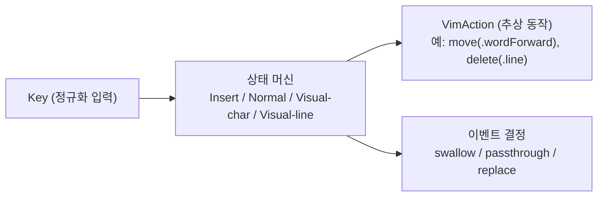

# 모드 엔진

- **Last updated**: 2026-07-12

## 현재 구조

모드 엔진(Insert / Normal / Visual-char / Visual-line 상태 머신)은 **macOS 의존성이 전혀 없는 별도 SPM 타깃의 순수 Swift**다. 입력은 정규화된 `Key` 값, 출력은 `move(.wordForward)`, `delete(.line)` 같은 추상 `VimAction` 값이다.

## 패키지·타깃 위치

엔진은 저장소 내 단일 로컬 SPM 패키지 `Packages/VimActionCore`의 `VimEngine` 타깃에 위치한다 (테스트 타깃 `VimEngineTests`). 앞으로 추가되는 순수 Swift 모듈(ProfileKit 등)도 개별 패키지가 아니라 **같은 패키지의 새 타깃**으로 들어온다. 앱 타깃은 이 패키지의 `VimEngine` 제품에 의존하는 소비자다.

- 관련 결정: [20260712_single-core-spm-package.md](../../decisions/references/20260712_single-core-spm-package.md)

현재 구성:

- `VimEngine`: `struct VimEngine`(`handle(_:) -> EngineOutput`, `private(set) var mode`, 시작 모드 `.insert`), 타입 `Key`/`VimAction`·`Motion`/`EventDecision`·`EngineOutput`/`Mode`. 내부 상태는 `mode`와 멀티키 시퀀스용 `pending`(현재 `g` 하나) 둘뿐이다.
- 구현된 키셋 (1차 이동 최소셋): `Esc, i, a, I, A / h j k l / w b e / 0 ^ $ / gg G`. 편집 키(x, dd 등), 카운트(3w), Visual 모드는 다음 마일스톤.
- Normal 모드 처리 규칙 (우선순위 순): ① pending 해소 — `gg`만 유효, 무효 연속 키는 둘 다 버리는 no-op, Esc는 pending 취소 → ② 모드 전환 키(i/a/I/A — a/I/A는 진입 이동과 함께 `.replace`) → ③ `g` pending 진입 → ④ 단일 키 모션(`singleKeyMotions` 테이블) → ⑤ 매핑 없는 modifier 조합은 `.passthrough` (시스템 단축키 보존) → ⑥ 그 외 미매핑 키는 `.swallow`.
- Insert 모드는 Esc(→Normal, 삼킴) 외 전부 `.passthrough`.
- append 계열은 전용 모션 케이스: `a`→`charRightForAppend`, `A`→`lineEndForAppend` (`l`·`$`는 Vim에서 마지막 문자 위에 멈추고 append는 그 뒤로 가므로 어댑터가 구분해야 함). `I`는 `^`와 목표가 같아 `lineFirstNonBlank` 재사용.
- 관련 결정: [20260712_pending-invalid-sequence-noop.md](../../decisions/references/20260712_pending-invalid-sequence-noop.md), [20260712_unmapped-modifier-passthrough.md](../../decisions/references/20260712_unmapped-modifier-passthrough.md), [20260712_append-dedicated-motion-cases.md](../../decisions/references/20260712_append-dedicated-motion-cases.md)

## 불변식·계약

- 엔진 타깃은 `import AppKit`, `import Cocoa`, `import ApplicationServices` 등 macOS 프레임워크를 import하지 않는다. (Foundation 수준까지만.) 어기면 픽스처 단위 테스트 가능성이 깨진다.
- 엔진은 AX API 호출, 키 이벤트 합성, 최전면 앱 인식을 **하지 않는다**. 그런 로직이 엔진에 들어오려 하면 리졸버나 디스패처로 옮긴다.
- 입출력 계약: `Key`(정규화된 키 입력) → 엔진 → `VimAction`(추상 동작) + 이벤트 처리 결정(삼키기/통과/대체).
- `Key`는 `struct { base: Base; modifiers: Set<Modifier> }`. 문자 키는 `Base.char(Character)`로 일반화하고 특수키만 케이스로 둔다. **Shift는 modifiers에 없다** — 문자에 이미 반영된 shift(`$`, `G`, `^`)는 해당 `Character`로 들어오며, modifiers는 문자로 흡수되지 않는 Ctrl/Option/Command 조합에만 쓴다. 이 정규화가 탭 계층↔엔진의 계약이다. 관련 결정: [20260712_key-representation-and-fixture-format.md](../../decisions/references/20260712_key-representation-and-fixture-format.md)

## 근거 요약

macOS 의존이 없으면 엔진이 결정론적이라 실제 앱 없이 완전한 단위 테스트가 가능하고, 엔진이 실행 방법을 모르면 두 전략 어댑터를 교체 가능한 소비자로 둘 수 있다.

- 관련 결정: [20260712_pure-swift-mode-engine.md](../../decisions/references/20260712_pure-swift-mode-engine.md)

## 관련

- 소비자: [strategy-dispatch.md](strategy-dispatch.md)
- 테스트 전략: 엔진은 Swift Testing(`@Test(arguments:)`) 픽스처 기반 단위 테스트로 철저히 커버 (워크스페이스 `docs/architecture.md` §7). 픽스처("키 시퀀스 → 기대 EngineOutput + 최종 모드")는 Swift 코드 테이블(`KeySequenceFixture` 배열)로 정의해 파라미터라이즈드 테스트에 직접 물리고, 키셋 그룹별 파일(`ModeTransitionTests.swift`, 이후 `MotionFixtures.swift` 등)로 나눈다. 별도로 엔진 소스에 macOS 프레임워크 import가 없음을 검사하는 가드 테스트(`EngineInvariantTests`)가 no-macOS-import 불변식을 이중 방어한다. 관련 결정: [20260712_swift-testing-for-engine-tests.md](../../decisions/references/20260712_swift-testing-for-engine-tests.md), [20260712_key-representation-and-fixture-format.md](../../decisions/references/20260712_key-representation-and-fixture-format.md)
