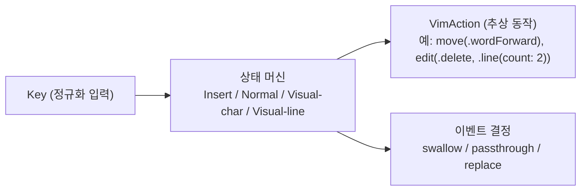

# 모드 엔진

- **Last updated**: 2026-07-17

## 현재 구조

모드 엔진(Insert / Normal / Visual-char / Visual-line 상태 머신)은 **macOS 의존성이 전혀 없는 별도 SPM 타깃의 순수 Swift**다. 입력은 정규화된 `Key` 값, 출력은 `move(.wordForward)`, `edit(.delete, .line(count: 2))` 같은 추상 `VimAction` 값이다.

## 패키지·타깃 위치

엔진은 저장소 내 단일 로컬 SPM 패키지 `Packages/VimActionCore`의 `VimEngine` 타깃에 위치한다 (테스트 타깃 `VimEngineTests`). 앞으로 추가되는 순수 Swift 모듈(ProfileKit 등)도 개별 패키지가 아니라 **같은 패키지의 새 타깃**으로 들어온다. 앱 타깃은 이 패키지의 `VimEngine` 제품에 의존하는 소비자다.

- 관련 결정: [20260712_single-core-spm-package.md](../../decisions/references/20260712_single-core-spm-package.md)

현재 구성:

- `VimEngine`: `struct VimEngine`(`handle(_:) -> EngineOutput`, `private(set) var mode`, 시작 모드 `.insert`), 타입 `Key`/`VimAction`(`move`/`edit`)·`Motion`·`Operator`·`TextRange`·`TextObject`/`EventDecision`·`EngineOutput`/`Mode`. 내부 상태는 `mode`와 멀티키 커맨드 누적용 `pending: PendingCommand?` 둘뿐이다.
- **`PendingCommand`는 문법 기반 누적 빌더**(부분 파스 상태)다: `count`(선행 카운트) / `op`(대기 오퍼레이터) / `opCount`(오퍼레이터 뒤 카운트) / `prefix`(`.g` 또는 `.textObjectScope` — 완결 키 하나를 기다리는 접두, `op` 유무로 구분) 슬롯을 키가 채워간다.
- 구현된 키셋: 모드 전환 `Esc, i, a, I, A` / 모션 `h j k l / w b e / 0 ^ $ / gg G` + 선행 카운트(`3w` → `.move` 반복 출력) / 편집 `x`(`3x`), `d`+모션(`dw d$ d0 de` 등 charwise-safe 화이트리스트), `dd`(`2dd`, `d3w`, `2d3w` — 유효 카운트는 두 카운트의 곱), `diw`/`daw`. c/y 오퍼레이터·다른 텍스트 오브젝트·Visual 모드는 이후 확장.
- Normal 모드 처리 규칙: ① **취소 최우선** (cross-cutting, step 진입 전) — Esc **정확 매치**는 pending 폐기+swallow+Normal 유지, 탈출 modifier 콤보(`isEscapeCombo`)는 pending 폐기+passthrough+Insert 전이. 수식자 붙은 Esc(Cmd+Esc)는 Esc 분기가 아니라 콤보 판정을 탄다. → ② `step` — pending을 이번 키로 한 스텝 진행: **extend**(슬롯 채워 유지: 카운트 digit·`d`·`g`·`di`/`da`) / **complete**(커맨드 완결, 액션 출력) / **invalid**(pending과 키를 함께 버리는 no-op). step 내부 우선순위: prefix 완결 → 오퍼레이터 대기(스코프 i/a → opCount digit → dd/opMotion) → 최상위(모드 전환 → g/d/x → count digit → 단일 모션 → 미매핑 콤보 passthrough / 미매핑 키 swallow).
- **0-규칙**: `0`은 해당 카운트 슬롯이 비어 있으면 모션(lineStart), 누적 중이면 자리값. **카운트 클램프**: 9,999 (초과 자리 digit 무시). **절대 모션 카운트**: `3G`는 반복 출력 수용(멱등·무해, Vim 의미와 다름을 인지한 이연), `3gg`·`3i`는 count 무시.
- **opMotion 화이트리스트**: 오퍼레이터 뒤 유효 모션은 charwise-safe 집합(`w b e h l 0 ^ $`)만 — `dj`/`dk`/`dG`는 linewise 범위인데 `TextRange.motion`에 구분이 없어 invalid로 이연.
- Insert 모드는 Esc(→Normal, 삼킴) 외 전부 `.passthrough`.
- append 계열은 전용 모션 케이스: `a`→`charRightForAppend`, `A`→`lineEndForAppend` (`l`·`$`는 Vim에서 마지막 문자 위에 멈추고 append는 그 뒤로 가므로 어댑터가 구분해야 함). `I`는 `^`와 목표가 같아 `lineFirstNonBlank` 재사용.
- 관련 결정: [20260714_multikey-command-grammar-builder.md](../../decisions/references/20260714_multikey-command-grammar-builder.md), [20260717_vimaction-edit-output-shape.md](../../decisions/references/20260717_vimaction-edit-output-shape.md), [20260717_cancellation-first-ordering-premise.md](../../decisions/references/20260717_cancellation-first-ordering-premise.md), [20260712_pending-invalid-sequence-noop.md](../../decisions/references/20260712_pending-invalid-sequence-noop.md), [20260712_unmapped-modifier-passthrough.md](../../decisions/references/20260712_unmapped-modifier-passthrough.md), [20260712_append-dedicated-motion-cases.md](../../decisions/references/20260712_append-dedicated-motion-cases.md)

## 불변식·계약

- 엔진 타깃은 `import AppKit`, `import Cocoa`, `import ApplicationServices` 등 macOS 프레임워크를 import하지 않는다. (Foundation 수준까지만.) 어기면 픽스처 단위 테스트 가능성이 깨진다.
- 엔진은 AX API 호출, 키 이벤트 합성, 최전면 앱 인식을 **하지 않는다**. 그런 로직이 엔진에 들어오려 하면 리졸버나 디스패처로 옮긴다.
- 입출력 계약: `Key`(정규화된 키 입력) → 엔진 → `VimAction`(추상 동작) + 이벤트 처리 결정(삼키기/통과/대체).
- `VimAction`의 편집 출력은 `.edit(Operator, TextRange)` — 모션 카운트는 `.move` 반복으로, 에디트 카운트는 `TextRange`의 `count` 값으로 담는다. `x`는 전용 케이스 없이 `.edit(.delete, .motion(.charRight, count:))` 재사용. **소비자는 `VimAction`에 exhaustive switch를 걸지 않는다** — 케이스 추가에 견디도록 `String(describing:)` 로깅 또는 `default:` 흡수를 쓴다. 관련 결정: [20260717_vimaction-edit-output-shape.md](../../decisions/references/20260717_vimaction-edit-output-shape.md)
- **취소 최우선 순서의 전제**: 탈출 콤보 판정을 모든 매핑보다 선행시키는 순서는 "매핑 테이블에 modifier 콤보 키가 없다"는 사실 위에서만 동치다 — `Ctrl-d` 류 modifier 매핑 추가 시 이 순서를 재검토해야 한다. 관련 결정: [20260717_cancellation-first-ordering-premise.md](../../decisions/references/20260717_cancellation-first-ordering-premise.md)
- `Key`는 `struct { base: Base; modifiers: Set<Modifier> }`. 문자 키는 `Base.char(Character)`로 일반화하고 특수키만 케이스로 둔다. **Shift는 modifiers에 없다** — 문자에 이미 반영된 shift(`$`, `G`, `^`)는 해당 `Character`로 들어오며, modifiers는 문자로 흡수되지 않는 Ctrl/Option/Command 조합에만 쓴다. 이 정규화가 탭 계층↔엔진의 계약이다. 관련 결정: [20260712_key-representation-and-fixture-format.md](../../decisions/references/20260712_key-representation-and-fixture-format.md)

## 근거 요약

macOS 의존이 없으면 엔진이 결정론적이라 실제 앱 없이 완전한 단위 테스트가 가능하고, 엔진이 실행 방법을 모르면 두 전략 어댑터를 교체 가능한 소비자로 둘 수 있다. pending을 케이스 열거가 아니라 문법 슬롯 빌더로 두면 오퍼레이터·카운트·오브젝트가 조합 폭발 없이 확장된다.

- 관련 결정: [20260712_pure-swift-mode-engine.md](../../decisions/references/20260712_pure-swift-mode-engine.md), [20260714_multikey-command-grammar-builder.md](../../decisions/references/20260714_multikey-command-grammar-builder.md)

## 관련

- 소비자: [strategy-dispatch.md](strategy-dispatch.md)
- 테스트 전략: 엔진은 Swift Testing(`@Test(arguments:)`) 픽스처 기반 단위 테스트로 철저히 커버 (워크스페이스 `docs/architecture.md` §7). 픽스처("키 시퀀스 → 기대 EngineOutput + 최종 모드")는 Swift 코드 테이블(`KeySequenceFixture` 배열)로 정의해 파라미터라이즈드 테스트에 직접 물리고, 키셋 그룹별 파일(`ModeTransitionTests.swift`, `MotionFixtures.swift`, `CountFixtures.swift`, `EditFixtures.swift`, `CancellationFixtures.swift`, `EscapeModifierFixtures.swift`)로 나눈다. 별도로 엔진 소스에 macOS 프레임워크 import가 없음을 검사하는 가드 테스트(`EngineInvariantTests`)가 no-macOS-import 불변식을 이중 방어한다. 관련 결정: [20260712_swift-testing-for-engine-tests.md](../../decisions/references/20260712_swift-testing-for-engine-tests.md), [20260712_key-representation-and-fixture-format.md](../../decisions/references/20260712_key-representation-and-fixture-format.md)
