# 온스크린 모드 인디케이터 (오버레이)

- **Last updated**: 2026-09-06

## 현재 구조

모드가 바뀌면 포커스 요소 근처에 라벨 알약("NORMAL"·"INSERT"·"VISUAL"·"V-LINE")을 약 1초 띄우고 페이드아웃한다. 트리거는 모드 전환 하나뿐이고, 갱신은 이벤트 기반만이다 — 타이머 폴링도 키당 재배치도 없다.

```mermaid
graph LR
    A["EventTapController.updateMode(_:)<br/>(등가 가드, 유일한 mode 대입 자리)"] -->|onModeChange 훅| B["AppState 클로저<br/>menuBarIndicator 사다리 + observedProcessID"]
    B --> C["ModeIndicatorController.modeDidChange<br/>(.mode 아니면 hide, pending·token)"]
    C -->|전용 직렬 큐 .utility| D["ModeIndicatorGeometryReader.read(pid)<br/>요소 rect → (없으면) 창 rect"]
    D -->|rect만 메인 홉| E["ModeIndicatorLayout.panelFrame<br/>사다리·배치·flip·클램프 (순수)"]
    E --> F["ModeIndicatorPanel.flash<br/>비활성화 NSPanel, 0.15/0.7/0.3s"]
```

| 구성 요소 | 격리 | 역할 |
|---|---|---|
| `ModeIndicatorController` (`AppState` 소유) | `@MainActor` | 게이팅·코얼레싱. `pending` 한 칸이 최신 요청만 들고, 읽기는 동시에 하나. 모든 전환이 `token`을 올리고 착지한 읽기는 토큰이 같을 때만 그린다. 전용 큐 `dev.pilyang.VimAction.mode-indicator-geometry`(`.utility`) 소유 |
| `ModeIndicatorGeometryReader` | `nonisolated` | pid만 받아 `AXRead.focusedElement` → `AXPosition`+`AXSize`, 요소 rect가 쓸 만하지 않을 때만 `AXFocusedWindow`의 위치·크기. 50ms 타임아웃은 `AXRead` 상속 |
| `ModeIndicatorLayout` | `nonisolated` 순수 | 앵커 사다리(요소 → 창 → 없음, 면적 있는 rect만 인정) → 배치(요소 단은 요소 바깥 오른쪽 위 4pt, 창 단은 창 안쪽 오른쪽 위 12/6pt) → AX→AppKit flip → 앵커가 있는 화면으로 클램프. 화면 frame은 호출자가 넘긴다 |
| `ModeIndicatorPanel` | `@MainActor` | `NSPanel(.borderless, .nonactivatingPanel)`, `level = .statusBar`, `ignoresMouseEvents`, `hidesOnDeactivate = false`, `collectionBehavior = [.canJoinAllSpaces, .fullScreenAuxiliary, .stationary, .ignoresCycle]`. 라벨은 강조색 배경 + 흰 글씨. 표시 중 새 flash는 라벨·위치를 갈아 끼우고 타이머를 재시작하며 알파를 0으로 되돌리지 않는다. 첫 flash에서 lazy 생성 |

라벨 문자열은 `Mode.overlayLabel`(`AppState.swift`)이다 — `displayName`("Visual Line")보다 짧아야 입력칸을 가리지 않는다.

현재 구현된 것은 **전환 시 순간 표시**뿐이다. 상시 배지·설정 토글·캐럿 앵커·화면 테두리 스타일은 이 구조에 없다(목표 상태는 결정 문서가 정의한다).

## 불변식·계약

- **훅은 탭 콜백의 동기 구간에서 불린다.** 거기서 하는 일은 사다리 판정(순수)·라벨 상수·`pending` 대입·`queue.async` 1회까지다. AX 호출과 `NSScreen` 조회는 전부 큐/메인 홉 뒤다 — 어기면 콜백 경량 불변식이 깨진다.
- **AX는 전용 큐에서만, pid만 건너간다.** `AXUIElement`는 큐 경계를 넘지 않고 돌아오는 것은 rect뿐이다. **리졸버 `readQueue`를 재사용하지 않는다** — 콜드 앱에서 이 읽기는 AX 호출 6회×50ms까지 걸릴 수 있고, 리졸버 큐는 키 디스패치가 의존하는 포커스 계열 캐시를 먹인다.
- **표시 조건은 메뉴바 사다리와 동일하다.** `MenuBarIndicator.resolve`가 `.mode`가 아니면(탭 고장·마스터 off·앱별 disabled·Secure Input) 즉시 `hide()`. 읽는 도중 사다리를 벗어나면 토큰 불일치로 그 읽기를 버린다 — "가로채지 않는데 NORMAL"을 띄우면 안 된다.
- **패널은 절대 앱을 활성화하지 않는다.** `orderFrontRegardless()`만 쓰고 `makeKey…`·`NSApp.activate` 계열은 없다. 활성화되면 `FrontmostAppGate`의 최전면 캐시가 자기 자신으로 덮인다.
- **pid 출처는 리졸버**(`EventTapController.observedProcessID`)다 — 디스패치 경로와 같은 앱을 겨눈다. `FrontmostAppGate`가 아니다.
- **좌표 변환은 전역 flip 하나**: `y' = NSScreen.screens[0].frame.maxY - (y + h)`. 보조 디스플레이(AX x 음수)에서도 그대로다.
- **순수 계층은 테스트로 고정된다**: `VimActionTests/ModeIndicatorLayoutTests.swift`(swift-testing) — 사다리·퇴화 rect·배치·flip·보조 디스플레이·클램프·nil.
- 테스트에서는 아무 일도 하지 않는다 — 훅 배선이 `bootstrap()`의 XCTest 가드 뒤에 있고 패널은 첫 flash에서야 만들어진다.

## 근거 요약

메뉴바 글리프는 시야 밖이라 모드 인지 문제를 풀지 못한다. 표시 정책(전환 시 순간 표시 + 비-Insert 상시 배지), 앵커 사다리와 이벤트 기반 갱신, Chromium 스크린리더 모드 미강제, 설정 소유권은 각각 결정 문서에 있다.

- 관련 결정: [20260906_mode-indicator-hybrid-display-policy.md](../../decisions/references/20260906_mode-indicator-hybrid-display-policy.md), [20260906_mode-indicator-anchor-ladder-event-driven.md](../../decisions/references/20260906_mode-indicator-anchor-ladder-event-driven.md), [20260906_no-forced-chromium-screen-reader-mode.md](../../decisions/references/20260906_no-forced-chromium-screen-reader-mode.md), [20260906_mode-indicator-settings-in-userdefaults.md](../../decisions/references/20260906_mode-indicator-settings-in-userdefaults.md), [20260725_callback-light-invariant.md](../../decisions/references/20260725_callback-light-invariant.md), [20260725_tap-main-runloop-retention.md](../../decisions/references/20260725_tap-main-runloop-retention.md)

## 관련

- 코드: `VimAction/ModeIndicatorController.swift`, `VimAction/ModeIndicatorGeometryReader.swift`, `VimAction/ModeIndicatorLayout.swift`, `VimAction/ModeIndicatorPanel.swift`, `VimAction/EventTapController.swift`(`updateMode`·`onModeChange`·`observedProcessID`), `VimAction/AppState.swift`(배선·`Mode.overlayLabel`)
- 표시 사다리: [reentrancy-and-safety.md](reentrancy-and-safety.md)(메뉴바 글리프 우선순위) — 오버레이는 그 사다리의 두 번째 소비자다
- pid 출처·읽기 큐 규율: [focus-and-dispatch-reads.md](focus-and-dispatch-reads.md)
- 앱 셸: [app-shell.md](app-shell.md)
