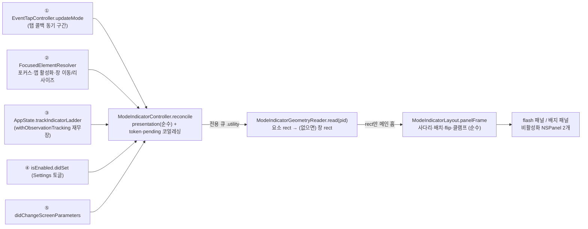

# 온스크린 모드 인디케이터 (오버레이)

- **Last updated**: 2026-09-06

## 현재 구조

화면의 라벨 알약은 **두 겹**이다. 모드가 바뀌면 **순간 표시**(flash)가 포커스 요소 근처에 약 1초 뜨고 페이드아웃하며, **Insert가 아닌 동안**에는 한 단계 작은 **상시 배지**가 같은 자리에 계속 붙어 있는다 (Insert는 배지 없음). 둘 다 Settings General 탭 토글 하나로 꺼진다. 갱신은 **이벤트 기반만**이다 — 타이머 폴링도, 키마다 재배치도 없다.

| 구성 요소 | 격리 | 역할 |
|---|---|---|
| `ModeIndicatorController` (`AppState` 소유) | `@MainActor @Observable` | 다섯 트리거의 합류점. 표시 판정은 순수 `presentation(isEnabled:inputs:)`, 조율은 `reconcile(flashes:rereadGeometry:)` 하나. `pending` 한 칸이 최신 요청만 들고 읽기는 동시에 하나이며, 표시를 바꾸는 트리거가 `token`을 올려 늦게 착지한 읽기를 버린다. 설정 토글(`isEnabled`)의 소유자이자 전용 큐 `dev.pilyang.VimAction.mode-indicator-geometry`(`.utility`)의 소유자 |
| `ModeIndicatorGeometryReader` | `nonisolated` | pid만 받아 `AXRead.focusedElement` → `AXPosition`+`AXSize`, 요소 rect가 쓸 만하지 않을 때만 `AXFocusedWindow`. 50ms 타임아웃은 `AXRead` 상속 |
| `ModeIndicatorLayout` | `nonisolated` 순수 | 앵커 사다리(요소 → 창 → 없음, 면적 있는 rect만) → 배치(요소 단은 요소 바깥 오른쪽 위 4pt, 창 단은 창 안쪽 오른쪽 위 12/6pt) → AX→AppKit flip → 클램프. 화면은 호출자가 `Screen`(frame + visibleFrame) 배열로 넘긴다 |
| `ModeIndicatorPanel` × 2 | `@MainActor` | `NSPanel(.borderless, .nonactivatingPanel)`, `ignoresMouseEvents`, `hidesOnDeactivate = false`, `collectionBehavior = [.canJoinAllSpaces, .fullScreenAuxiliary, .stationary, .ignoresCycle]`. `ModeIndicatorStyle`이 폰트·여백·radius·창 층을 가른다: flash는 bold 12pt/`.statusBar`, 배지는 semibold 10pt/`.statusBar - 1`. `flash`는 0.15/0.7/0.3s 페이드, `show`는 애니메이션도 타이머도 없다. 각각 첫 표시에서 lazy 생성 |

라벨 문자열은 `Mode.overlayLabel`, 배지 표시 여부는 `Mode.showsPersistentBadge`(Insert만 false)로 둘 다 `AppState.swift`에 있다.

### 트리거 다섯

| # | 계기 | 경로 | 하는 일 |
|---|---|---|---|
| ① | 모드 전환 | `updateMode` → `onModeChange` → `modeDidChange` | flash + 배지, 항상 읽는다 |
| ② | 포커스 요소 변경·앱 활성화·창 이동·리사이즈 | `FocusedElementResolver.onFocusGeometryChanged` → (`EventTapController` 통로) → `anchorDidChange` | 배지가 보여야 할 때만 읽는다 |
| ③ | 사다리 변화 (탭 고장·마스터 off·킬스위치·앱별 disabled·Secure Input·설정 리로드) | `AppState.trackIndicatorLadder()`의 `withObservationTracking` 재무장 루프 → `stateDidChange` | 표시할 것이 실제로 달라졌을 때만 읽는다 |
| ④ | Settings 토글 | `isEnabled.didSet` | 마지막 입력으로 다시 판정 (off는 즉시 숨김, on은 즉시 복귀) |
| ⑤ | 디스플레이 재구성 | `NSApplication.didChangeScreenParametersNotification` → `anchorDidChange` | ②와 같다 |

## 불변식·계약

- **훅은 탭 콜백의 동기 구간에서 불린다.** 거기서 하는 일은 판정(순수)·`pending` 대입·`queue.async` 1회까지다. AX 호출과 `NSScreen` 조회는 전부 큐/메인 홉 뒤다 — 어기면 콜백 경량 불변식이 깨진다.
- **AX는 전용 큐에서만, pid만 건너간다.** `AXUIElement`는 큐 경계를 넘지 않고 돌아오는 것은 rect뿐이다. **리졸버 `readQueue`를 재사용하지 않는다** — 콜드 앱에서 이 읽기는 AX 호출 6회×50ms까지 걸릴 수 있고, 리졸버 큐는 키 디스패치가 의존하는 포커스 계열 캐시를 먹인다.
- **표시 조건은 메뉴바 사다리와 동일하다.** `MenuBarIndicator.resolve`가 `.mode`가 아니면 즉시 두 패널 모두 `hide()`. 읽는 도중 사다리를 벗어나면 토큰 불일치로 그 읽기를 버린다 — "가로채지 않는데 NORMAL"을 띄우면 안 된다.
- **사다리 관찰 루프는 레벨 트리거다.** `onChange`는 willSet에서(킬스위치 경로면 메인 밖에서도) 불리므로 거기서는 홉만 걸고, 재무장이 **현재 값**을 다시 읽어 수렴한다. 그래서 `reconcile`은 직전 이벤트가 아니라 **자기 현재 표시(`current`)와만** 비교한다. 관찰 블록은 값만 만들고 부수효과가 없어야 한다 — 컨트롤러 메서드를 그 안에서 부르면 컨트롤러 내부 상태까지 추적돼 읽기가 끝날 때마다 루프가 스스로를 깨운다 (그래서 `isEnabled` 외 저장 프로퍼티는 전부 `@ObservationIgnored`).
- **flash 요청은 `pending`과 따로 산다.** 같이 담으면 읽는 사이에 온 앵커·사다리 이벤트가 `pending`을 덮어써 정당한 flash가 사라진다(Cmd-Tab 직후 Esc). 다만 붙일 앵커가 없어 그리지 못한 경우에는 **버린다** — 들고 있으면 한참 뒤 앵커 이벤트에 얹혀 살아나 엉뚱한 때 번쩍인다.
- **아무것도 안 바뀐 reconcile은 토큰을 올리지 않고, 같은 상태를 같은 토큰으로 이미 읽는 중이면 새 읽기를 띄우지 않는다**(`needsGeometryRead`가 그 판정의 순수 소유자다). 둘 다 같은 사고를 막는다: 토큰이 올라가면 진행 중인 읽기가 폐기된다. 후자가 없으면 **모드 전환마다 읽기가 두 번 난다** — 사다리 관찰 루프의 재무장이 `mode`의 willSet에서 예약돼 전환 읽기가 착지하기 전에 뒤따라 오는데, 그때 밀린 flash 때문에 판정이 참이 되기 때문이다.
- **패널은 절대 앱을 활성화하지 않는다.** `orderFrontRegardless()`만 쓰고 `makeKey…`·`NSApp.activate` 계열은 없다. 활성화되면 `FrontmostAppGate`의 최전면 캐시가 자기 자신으로 덮인다.
- **자기 자신(VimAction) pid는 앵커로 삼지 않는다.** 메뉴바 클릭·설정 창이 우리를 최전면으로 만들면 리졸버가 우리 pid에 붙는데, 사다리는 비자신 캐시 축이라 여전히 `.mode`다 — 그대로 두면 배지가 우리 설정 창에 붙는다. 감추지는 않는다(메뉴를 열 때마다 깜빡이면 더 나쁘다).
- **pid 출처는 리졸버**(`EventTapController.observedProcessID`)다 — 디스패치 경로와 같은 앱을 겨눈다. `FrontmostAppGate`가 아니다.
- **좌표 변환은 전역 flip 하나**: `y' = NSScreen.screens[0].frame.maxY - (y + h)`. 보조 디스플레이(AX x 음수)에서도 그대로다.
- **클램프는 `visibleFrame`, 화면 선택은 `frame`.** 텍스트 뷰가 창 전체인 앱을 최대화하면 "요소 위쪽 바깥" 규칙이 알약을 메뉴바·노치 뒤로 보낸다. 반대로 화면 선택까지 `visibleFrame`으로 하면 메뉴바 띠 안의 앵커가 자기 디스플레이를 못 찾고 주 화면으로 튄다.
- **앵커가 없으면 재시도하지 않는다** — 그것이 답이고, 다음 앵커 이벤트가 다시 부른다.
- **글씨 색은 강조색에서 파생된다** — 흰 글씨 대비가 3:1 아래로 떨어지는 밝은 강조색(노랑 1.41:1·초록·주황·그래파이트)에서만 검은 글씨다. 색만으로 구분하지 않는다는 PRD NFR 때문에 라벨 텍스트는 항상 동반된다.
- **순수 계층은 테스트로 고정된다**: `ModeIndicatorLayoutTests`(사다리·퇴화 rect·배치·flip·보조 디스플레이·클램프·메뉴바 띠·nil), `ModeIndicatorControllerTests`(표시 판정 표·읽기 코얼레싱 판정 표·토글 영속·대비).
- 테스트에서는 아무 일도 하지 않는다 — 배선이 `bootstrap()`의 XCTest 가드 뒤이고, 입력이 밀린 적 없으면 판정이 통째로 막히며, 패널은 첫 표시에서야 만들어진다.

### 알려진 한계

- **킬스위치 발동 중에는 배지가 남는다.** 발동 상황은 메인이 굳은 상황이라 `orderOut`이 불릴 수 없다 — 그동안 배지는 "NORMAL"을 계속 주장한다. 1초짜리 flash에는 없던 노출이다(스스로 사라졌다).
- **Secure Input 진입은 워치독 폴링으로만 관측**되므로 배지가 한 틱만큼 늦게 사라진다 (메뉴바와 같은 기존 지연, 화면에서 더 잘 보일 뿐).
- **창 드래그 추종은 알림이 오는 만큼이다.** 실측에서 창 기하 변경은 알림이 한 번이 아니라 여러 건 몰려 오고, 1-in-flight 코얼레싱이 그 버스트를 접는다.

## 근거 요약

메뉴바 글리프는 시야 밖이라 모드 인지 문제를 풀지 못한다. 표시 정책(전환 시 순간 표시 + 비-Insert 상시 배지), 앵커 사다리와 이벤트 기반 갱신, Chromium 스크린리더 모드 미강제, 설정 소유권은 각각 결정 문서에 있다.

- 관련 결정: [20260906_mode-indicator-hybrid-display-policy.md](../../decisions/references/20260906_mode-indicator-hybrid-display-policy.md), [20260906_mode-indicator-anchor-ladder-event-driven.md](../../decisions/references/20260906_mode-indicator-anchor-ladder-event-driven.md), [20260906_no-forced-chromium-screen-reader-mode.md](../../decisions/references/20260906_no-forced-chromium-screen-reader-mode.md), [20260906_mode-indicator-settings-in-userdefaults.md](../../decisions/references/20260906_mode-indicator-settings-in-userdefaults.md), [20260725_callback-light-invariant.md](../../decisions/references/20260725_callback-light-invariant.md), [20260725_tap-main-runloop-retention.md](../../decisions/references/20260725_tap-main-runloop-retention.md)

## 관련

- 코드: `VimAction/ModeIndicatorController.swift`, `VimAction/ModeIndicatorGeometryReader.swift`, `VimAction/ModeIndicatorLayout.swift`, `VimAction/ModeIndicatorPanel.swift`, `VimAction/FocusedElementResolver.swift`(`onFocusGeometryChanged`·창 알림), `VimAction/EventTapController.swift`(`updateMode`·`onModeChange`·`onFocusGeometryChanged`·`observedProcessID`), `VimAction/AppState.swift`(배선·`indicatorInputs`·`trackIndicatorLadder`·`Mode.overlayLabel`·`Mode.showsPersistentBadge`), `VimAction/SettingsView.swift`(토글)
- 표시 사다리: [reentrancy-and-safety.md](reentrancy-and-safety.md)(메뉴바 글리프 우선순위) — 오버레이는 그 사다리의 두 번째 소비자다
- pid 출처·읽기 큐 규율·리졸버 알림: [focus-and-dispatch-reads.md](focus-and-dispatch-reads.md)
- 앱 셸·설정 토글: [app-shell.md](app-shell.md), [profiles-and-config.md](profiles-and-config.md)
