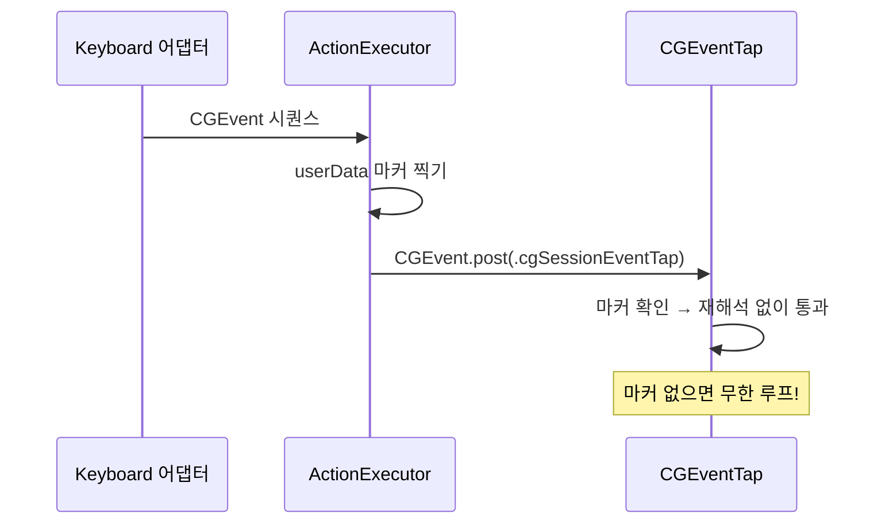

# 재진입과 안전장치

- **Last updated**: 2026-07-25

## 현재 구조

1. 모든 출력(AX 쓰기, 합성 이벤트 게시)은 **단일 `ActionExecutor`** 를 거친다.
2. 합성한 모든 `CGEvent`에는 게시 전에 비공개 `userData` 마커(`CGEvent.setIntegerValueField(.eventSourceUserData, …)`)를 찍고, 이벤트 탭은 마킹된 이벤트를 재해석 없이 통과시킨다.
3. 안전장치 단축키(기본 `Ctrl-Option-Cmd-Esc`)는 메인 탭과 **별도의 `CGEventTap`** 으로 `kCGHIDEventTap`에 최고 우선순위로 설치한다.

의존 순서대로 정리한 완화책 (전부 유지할 것):

1. **안전장치 단축키** — 별도 탭, 고정 코드, 사용자 설정 가능. 메인 탭 즉시 비활성화.
2. **예외 폭주 자동 비활성화** — 엔진·어댑터의 모든 호출 지점을 카운터로 감싸고, 1초 창에서 예외 ≥5회면 가로채기 비활성화 후 알림.
3. **동작별 AX 타임아웃** — 3ms 하드 캡 ([strategy-dispatch.md](strategy-dispatch.md)).
4. **깔끔한 SIGTERM 처리** — 종료 전 탭 제거, 대롱거리는 탭 방지.
5. **보안 입력 인식** — 탭 비활성의 원인이 `IsSecureEventInputEnabled()`(비밀번호 필드 등)면 재활성화를 시도하지 않고 전용 상태 `Status.secureInput`으로 표시한다(메뉴바 `lock.square`, Settings "Secure Input"). 고장(`.failed`)이 아닌 보호 상태이며, 해제 후엔 워치독 다음 폴링이 복귀시킨다. 표시 우선순위: 탭 고장 > 토글 off > Secure Input ([20260719_secure-input-status.md](../../decisions/references/20260719_secure-input-status.md)).
6. **탭 자동복구 워치독** — 콜백의 `tapDisabledBy*` 재활성화는 콜백이 전달되지 못하는 완전 정지/장기 스톨에서는 무력하다. 별도 백그라운드 타이머로 `CGEventTapIsEnabled()`를 주기 폴링해(2초), **정지/스톨이 풀린 뒤에도** 죽은 채 방치된 탭을 다시 켠다 ([20260713_tap-reenable-watchdog-polling.md](../../decisions/references/20260713_tap-reenable-watchdog-polling.md)). 스톨 "중"에는 재활성화를 보류한다(스톨 게이트 — 직전 status 홉 미소비를 신호로 틱 스킵): 탭 소스가 메인 런루프에 있어 스톨 중 되살린 탭은 키를 처리하지 못한 채 잡아두기만 하기 때문. status 홉은 FIFO(`main.async`), 토글 off의 최종 disable은 워치독 시리얼 큐 뒤에 게시해 in-flight 틱 경합을 봉인한다 ([20260719_watchdog-stall-gate-post-stall-recovery.md](../../decisions/references/20260719_watchdog-stall-gate-post-stall-recovery.md)).
7. **가로채기 마스터 토글** — 메뉴바 `isInterceptionEnabled`. off는 통과만이 아니라 `tapEnable(false)`로 스트림을 놓고(포트는 유지) 엔진을 Insert 리셋 + 워치독 정지 + 콜백 재활성화까지 게이트한다 — 앱이 오동작(스톨)할 때 모든 키가 메인 콜백을 왕복하는 것을 실제로 끊는다. on 복귀는 선제 `tapEnable(true)` 1회. 안전장치 단축키(#1)가 하드 킬 스위치라면 이 토글은 사용자가 명시적으로 가로채기를 끄는 소프트 경로다. `Status.running`은 "탭 설치·헬스 정상"을 뜻하고 on/off와 직교하며, Settings 표시는 토글을 반영해 파생한다 ([20260718_interception-toggle-semantics.md](../../decisions/references/20260718_interception-toggle-semantics.md)).

권한: 접근성 확인은 매 실행 시 `AXIsProcessTrustedWithOptions`로 수행하고, 권한이 없으면 이벤트 탭 설치를 거부한다.

**과도기 상태 (배선 마일스톤)**: ActionExecutor·합성 이벤트·마커 인프라는 아직 없다 — 실행은 디스패처 마일스톤의 몫이다. 그때까지 엔진의 `.replace` 결정은 실행 없이 삼키고 DEBUG 요약만 로그한다. 릴리스 빌드에선 이 삼킴이 무로그라 사용자에게 "죽은 키"로 보이므로, **디스패처 마일스톤 전 릴리스 배포는 금지**한다 ([20260717_replace-swallow-transitional-rule.md](../../decisions/references/20260717_replace-swallow-transitional-rule.md)).

## 불변식·계약

- **탭 콜백의 동기 구간은 "번역 + 순수 엔진 step + 캐시된 컨텍스트 읽기"까지만** — AX 등 블로킹 가능 호출은 콜백에 들어오지 않는다(프로브는 포커스 변경 시 캐시 갱신, 실행은 콜백 밖 직렬 큐). OS 탭 타임아웃은 콜백 스레드와 무관하므로 탭 생존은 스레드 배치가 아니라 이 불변식이 지킨다. 탭 소스는 메인 런루프 유지 확정 ([20260725_callback-light-invariant.md](../../decisions/references/20260725_callback-light-invariant.md), [20260725_tap-main-runloop-retention.md](../../decisions/references/20260725_tap-main-runloop-retention.md)).
- 이벤트 게시는 반드시 `ActionExecutor`를 거친다 — 우회 경로가 생기면 마커 불변식을 감사할 수 없다.
- 마커 없는 합성 이벤트는 존재하지 않는다. **마커를 빠뜨리면 탭이 자기 출력을 재해석해 무한 루프** — 이벤트 탭 기반 도구의 병적 루프의 가장 흔한 원인.
- 안전장치 탭은 메인 탭과 생명주기를 공유하지 않는다.

## 근거 요약

버그 있는 전역 키 탭은 사용자를 키보드에서 완전히 차단할 수 있으므로 안전장치는 타협 불가이고, 메인 탭 안에서 감지하면 킬 스위치가 버그와 함께 죽으므로 별도 탭이어야 한다.

- 관련 결정: [20260712_synthetic-event-marker-and-failsafe.md](../../decisions/references/20260712_synthetic-event-marker-and-failsafe.md)

## 관련

- 시스템 내 위치: [system-overview.md](system-overview.md)
- 합성 시퀀스 생성: [strategy-dispatch.md](strategy-dispatch.md)
