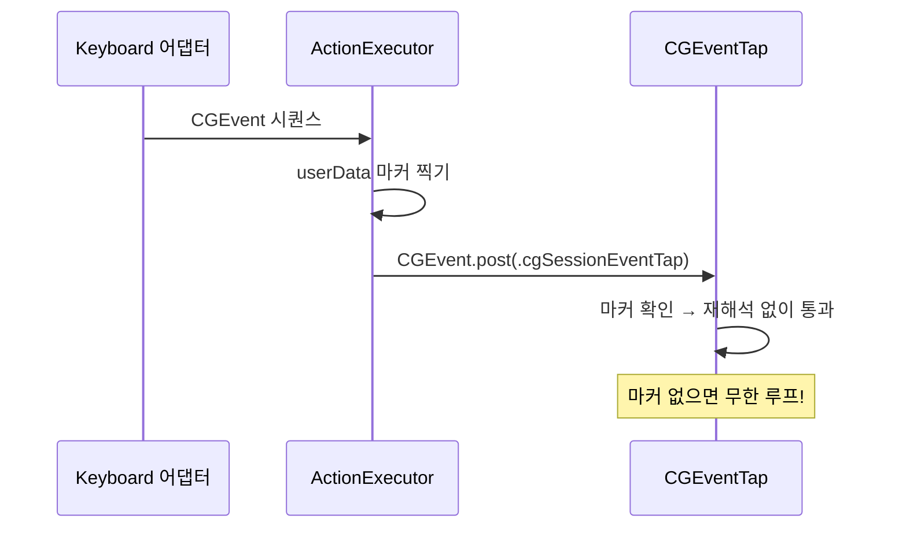

# 재진입과 안전장치

- **Last updated**: 2026-08-20 (문서 압축 — 근거 서사를 결정 문서 링크로 이관, auto 관측 셋은 [auto-strategy-probe.md](auto-strategy-probe.md)로 이동·프로브 신호 수 5종으로 갱신)

## 현재 구조

1. 모든 출력은 **프리미티브마다 단일 통로**를 거친다 — 합성 이벤트 게시는 `ActionExecutor`, AX 속성 쓰기는 `AXWriter`, `NSPasteboard`는 `PasteWiseResolver`/`Clipboard` seam. 우회 경로가 생기면 감사할 수 없다는 규칙은 통로마다 동일하다. **마커는 `ActionExecutor`만의 책임이다** — AX 쓰기는 탭으로 되돌아오지 않아 마커 개념 자체가 없다. 실패 보고의 수렴 지점은 통로가 아니라 어댑터다 ([20260808_ax-writer-per-primitive-channel.md](../../decisions/references/20260808_ax-writer-per-primitive-channel.md)).
2. 합성한 모든 `CGEvent`에는 게시 전에 비공개 `userData` 마커(`CGEvent.setIntegerValueField(.eventSourceUserData, …)`)를 찍고, 이벤트 탭은 마킹된 이벤트를 재해석 없이 통과시킨다.
3. 안전장치 단축키(고정 `Ctrl-Option-Cmd-Esc`)는 메인 탭과 **별도의 `CGEventTap`** 으로 `kCGHIDEventTap`에 최고 우선순위로, **전용 스레드의 자체 런루프**에 설치한다.

```mermaid
sequenceDiagram
    participant KBD as Keyboard 어댑터
    participant EX as ActionExecutor
    participant TAP as CGEventTap

    KBD->>EX: CGEvent 시퀀스
    EX->>EX: userData 마커 찍기
    EX->>TAP: CGEvent.post(.cgSessionEventTap)
    TAP->>TAP: 마커 확인 → 재해석 없이 통과
    Note over TAP: 마커 없으면 무한 루프!
```

### 완화책 (의존 순서, 전부 유지할 것)

1. **안전장치 단축키(킬스위치)** — 고정 콤보 `Ctrl-Opt-Cmd-Esc`. 별도 탭(`KillSwitchTap`)이 `kCGHIDEventTap`에 `.headInsertEventTap` 능동 탭으로(생성 실패 시 세션 탭 1회 폴백 — 설치는 메인 탭 **다음**이어야 앞선다), 소스는 **전용 스레드의 자체 CFRunLoop**에 붙어 메인 스톨 중에도 배달된다. 발동은 **단방향 off**·효과 2겹: ① 킬 스레드에서 메인 탭 포트에 직접 `tapEnable(false)` ② `main.async` 홉으로 `isInterceptionEnabled = false`(리셋·정지·글리프는 소프트 off didSet이 전담 — 전용 off 경로 없음). **영속만은 예외로 킬 경로가 직접** 수행한다(공유 함수 `persistInterceptionEnabled` — 메인 스톨 중에는 ②의 홉이 영영 착지하지 않아, 홉에만 맡기면 강제 종료 후 재실행이 사용자를 같은 상태로 돌려보낸다). 호출 위치는 ①·②·로그 **뒤의 함수 말미**다 — 이 호출만 `cfprefsd`로 나가는 XPC라 유일하게 블록될 수 있어, 안전장치 경로를 막지 않게 맨 뒤가 계약이다. ①이 도로 풀리지 않게 하는 것은 **킬 요청 래치**다 — 킬 스레드가 ① 직전에 세우고 토글 on 복귀에서만 내려가며, 콜백 재활성화·워치독 틱이 게이트 대상이다. 콤보 판정은 keycode 53 + 의도 modifier 5종 정확 일치(상태 비트 무시), 술어는 `shouldSwallow`(마커 아님 + 콤보 일치) 하나이며 **삼킨 콤보는 오토리핏 포함 전부 발동 경로로 간다**(제외하면 "꾹 누르면 발동"이 성립하지 않는다). 발동·fault 로그의 1회성은 `triggerKillSwitch`의 래치 test-and-set이 보장한다(실행 중단 래치 무효화만은 dedupe 앞·무조건). 부분 콤보는 시스템으로 새어 나간다(수용). 킬 탭에는 전용 워치독이 없다 — 통지 유실 실패 모드가 없고, 그 자리를 **활성화 검증 2지점**(`tapIsEnabled` 확인, 실패 시 `fault` + `Installation.failed` 강등)이 메운다 ([20260726_kill-switch-dedicated-runloop-thread.md](../../decisions/references/20260726_kill-switch-dedicated-runloop-thread.md), [20260726_kill-switch-hid-tap-session-fallback.md](../../decisions/references/20260726_kill-switch-hid-tap-session-fallback.md), [20260726_kill-switch-trigger-semantics.md](../../decisions/references/20260726_kill-switch-trigger-semantics.md), [20260726_kill-combo-swallow-independent-of-fire.md](../../decisions/references/20260726_kill-combo-swallow-independent-of-fire.md), [20260801_kill-combo-autorepeat-fires.md](../../decisions/references/20260801_kill-combo-autorepeat-fires.md), [20260726_kill-tap-enable-verification.md](../../decisions/references/20260726_kill-tap-enable-verification.md), [20260726_kill-switch-off-persistence-off-main.md](../../decisions/references/20260726_kill-switch-off-persistence-off-main.md)).
2. **예외 폭주 자동 비활성화** — 실행 계층의 실패는 전부 `EventTapController.reportExecutionFailure` 한 곳으로 모이고(어댑터가 유일한 보고 지점 — 엔진은 throw하지 않는다), 슬라이딩 창(기본 1초)에서 ≥5회면 트립한다. 판정은 시간 주입 순수 타입 `FailureBurstCounter`(트립 시 창 비움). 트립 효과는 `isInterceptionEnabled = false` 대입뿐 — 소프트 off didSet이 전담, 알림은 글리프 변화 + `fault` 1건 ([20260725_failure-burst-autodisable-shape.md](../../decisions/references/20260725_failure-burst-autodisable-shape.md)). **보고 단위는 원인 키 입력 1건당 최대 1회** — 액션별 보고는 카운트 반복 출력이 임계를 압도한다 ([20260726_execution-failure-report-granularity.md](../../decisions/references/20260726_execution-failure-report-granularity.md)). 보고 의미론은 "**실행을 시도했는데 깨졌다**"로 한정 — 미구현 액션은 실패가 아니라 스킵+DEBUG 로그다 ([20260726_unsupported-action-not-failure.md](../../decisions/references/20260726_unsupported-action-not-failure.md)).
3. **AX 배치·타임아웃** — AX 호출은 콜백·메인 스레드에 들어오지 않는다(리졸버는 전용 큐, 디스패치 읽기는 게시 큐). 타임아웃은 경로 불문 50ms 단일 상수 — 탭 생존은 캡 값이 아니라 배치가 지킨다 ([20260802_ax-read-timeout-50ms-supersedes-3ms.md](../../decisions/references/20260802_ax-read-timeout-50ms-supersedes-3ms.md), [focus-and-dispatch-reads.md](focus-and-dispatch-reads.md)).
4. **깔끔한 SIGTERM 처리** — 종료 전 탭 제거. 메인 탭과 킬 탭이 각자 `willTerminate` 옵저버로 자기 탭만 정리한다(생명주기 비공유). 킬 탭은 런루프 소스를 따로 제거하지 않는다 — 포트 invalidate가 소스를 무효화해 전용 스레드의 `CFRunLoopRun`이 스스로 반환한다.
5. **보안 입력 인식** — Secure Event Input은 이벤트 **배달만 억제하며 탭 활성화에는 관여하지 않는다**(실측). 따라서 되살리기가 먼저다 — 워치독은 SEI 여부와 무관하게 재활성화를 시도하고, `IsSecureEventInputEnabled()` 확인은 그것이 실패한 뒤에만 한다. `Status.secureInput`은 "**재활성화 실패 + SEI 동시 관측**"이며 `.failed`의 하위 표시 구분이다(메뉴바 `lock.square`) — 원인 판정이 아니라 덜 놀라운 표시다 ([20260726_secure-input-suppresses-delivery-not-enablement.md](../../decisions/references/20260726_secure-input-suppresses-delivery-not-enablement.md), [20260719_secure-input-status.md](../../decisions/references/20260719_secure-input-status.md)).

   **메뉴바 글리프 우선순위**(`AppState.menuBarGlyph`, 파생 값들도 같은 사다리): 탭 고장 `square.dashed` > 마스터 토글 off `square.slash` > **앱별 disabled `minus.square`** > Secure Input `lock.square` > 모드 글리프. 넓은 상태가 좁은 상태를 이기고, 사용자 의도(영구)가 OS의 일시 억제를 이긴다. 앱별 disabled의 **표시** 판정은 `FrontmostAppGate.lastNonSelfBundleID`이고 **게이트** 판정은 계속 `frontmostBundleID`다(축 분리 — [profiles-and-config.md](profiles-and-config.md)). fill은 "키 차단 여부" 축이라 통과 상태인 `minus.square`는 미채움이다 ([20260814_menubar-disabled-app-indicator.md](../../decisions/references/20260814_menubar-disabled-app-indicator.md)).
6. **탭 자동복구 워치독** — 콜백의 `tapDisabledBy*` 재활성화는 콜백이 전달되지 못하는 완전 정지/장기 스톨에서 무력하므로, 별도 백그라운드 타이머가 `CGEventTapIsEnabled()`를 2초 폴링해 **정지/스톨이 풀린 뒤에도** 죽은 채 방치된 탭을 다시 켠다 ([20260713_tap-reenable-watchdog-polling.md](../../decisions/references/20260713_tap-reenable-watchdog-polling.md)). 스톨 "중"에는 재활성화를 보류한다(스톨 게이트 — 직전 status 홉 미소비를 신호로 틱 스킵): 스톨 중 되살린 탭은 키를 처리하지 못한 채 잡아두기만 한다. status 홉은 FIFO(`main.async`), 토글 off의 최종 disable은 워치독 시리얼 큐 뒤에 게시해 in-flight 틱 경합을 봉인한다 ([20260719_watchdog-stall-gate-post-stall-recovery.md](../../decisions/references/20260719_watchdog-stall-gate-post-stall-recovery.md)).
7. **실행 중단 래치** — 게시 중인 합성 이벤트 버스트를 도중에 끊는 신호(`ExecutionAbortLatch`). **형태는 세대 카운터**: 실행 1건은 dispatch 시점에 `beginRun()`으로 자기 세대를 받고, 어댑터가 청크 사이마다 `isCurrent(run)`을 묻는다. 무효화 주체 셋이 `invalidate()`로 세대만 올린다 — **새 사용자 입력**(`handleKeyDown`), **마스터 토글 off**(didSet 맨 앞), **킬스위치**(`triggerKillSwitch` 맨 앞). **해제 API가 없다** — 새 실행이 이전 실행을 밀어내므로 "해제를 빠뜨리면 영구 보류"라는 조용한 고장이 구조적으로 없다. 소유자는 컨트롤러이고 게시 sink 팩토리에 주입된다. `beginRun()`은 **게시 큐 밖**(탭 콜백 스레드)에서 불려야 한다 — 큐 안이면 이미 도는 버스트가 끝난 뒤에야 세대가 오른다 ([20260730_execution-abort-generation-latch.md](../../decisions/references/20260730_execution-abort-generation-latch.md)).

   소비 쪽은 어댑터의 **청크 게시**다: 8 키스트로크(=16 이벤트)씩 게시하며, 중단 신호 재확인은 **각 청크의 페이싱 뒤·게시 직전**이다(앞이면 페이싱 수면 중 온 무효화를 놓쳐 1청크 폭 순서 역전이 난다). 남는 것은 무효화 순간 이미 게시 중이던 in-flight 꼬리뿐(≤1 스트로크 — 수용). CGEvent 생성도 청크 단위로 미뤄진다. **첫 청크는 지연 없이** 나가고 두 번째 청크부터 2ms 간격 — 이 지연이 중단을 **가능하게 하는 장치**다(`CGEvent.post`는 배달만 걸고 즉시 돌아오므로 간격이 없으면 끊을 잔여가 남지 않는다). 두 값은 도그푸딩 조절값 ([20260730_chunked-posting-with-pacing.md](../../decisions/references/20260730_chunked-posting-with-pacing.md)).
8. **가로채기 마스터 토글** — 메뉴바 `isInterceptionEnabled`. off는 통과만이 아니라 `tapEnable(false)`로 스트림을 놓고(포트 유지) 엔진 Insert 리셋 + 워치독 정지 + 콜백 재활성화 게이트까지 — 앱이 오동작할 때 모든 키의 콜백 왕복을 실제로 끊는다. on 복귀는 선제 `tapEnable(true)` 1회. `Status.running`은 "탭 설치·헬스 정상"을 뜻하고 on/off와 직교한다 ([20260718_interception-toggle-semantics.md](../../decisions/references/20260718_interception-toggle-semantics.md)).

권한: 접근성 확인은 매 실행 시 `AXIsProcessTrustedWithOptions`로 수행하고, 권한이 없으면 이벤트 탭 설치를 거부한다.

사용자 노출: 킬 탭이 어느 지점에 설치됐는지(HID / 세션 폴백 / 활성화 실패 / 미설치)는 Settings의 읽기 전용 "Kill Switch" 행과 콤보 안내 각주로 표시한다 — 안전장치가 조용히 부재하는 것이 이 기능의 가장 위험한 실패 모드다. 단축키 커스터마이즈 UI는 아직 없다(고정 콤보).

### 실행 배선과 실패 보고

`.replace` 결정은 콜백이 원본을 삼킨 뒤 actions를 **실행 sink**로 넘겨 실행된다 — 그 클로저가 게시 직렬 큐 위에서 어댑터를 부르고(`CGEvent` 생성·게시가 같은 컨텍스트여야 하는 계약), 컨트롤러는 sink 클로저 하나만 알며 큐의 소유자·수명이 곧 그 클로저다. **실행 중단 래치(#7)만은 컨트롤러가 소유해 sink 팩토리에 주입한다** — sink는 dispatch마다 세대를 받아 어댑터에 중단 질의 클로저로 넘기므로 `dispatchActions`의 시그니처는 그대로다. 기본 sink와 앱 게이트는 XCTest 하위에서 무해한 것으로 바꿔치기된다 — 그냥 두면 테스트가 실제 키를 머신에 주입하거나, disable 앱(Ghostty) 터미널에서 게이트가 켜져 결정 테스트가 뒤집힌다 ([20260726_m2-execution-wiring-shape.md](../../decisions/references/20260726_m2-execution-wiring-shape.md)).

실행 범위는 v1 어휘 전체이며, 매퍼가 `nil`을 내는 것(aw·따옴표·괄호쌍 오브젝트 — 양 경로 공통, 그리고 조건 미충족 시의 `V`→`v` 전환)만 미지원 스킵+DEBUG 로그다(미지원≠실패). 게시 전 게이트는 요소 걸러내기와 비-QWERTY 레이아웃 가드 두 축([keyboard-adapter.md](keyboard-adapter.md)). 스크롤 반복은 엔진이 33으로 클램프한다 — 액션당 수십 타로 증폭되는 유일한 어휘라 1,000 클램프를 우회한다 ([20260801_scroll-count-clamp-33.md](../../decisions/references/20260801_scroll-count-clamp-33.md)).

**stale 선택 위험**: 엔진은 Visual에서 탈출 콤보를 받으면 `clearSelection` 없이 passthrough+Insert로 빠지므로(결정이 배타적 — "남는 화면 선택은 수용") 살아 있는 선택이 Normal로 넘어올 수 있고, Normal `x`(`Shift-→, Cmd-X`)가 그 선택을 통째로 잘라낸다(마우스 선택도 같은 경로). 원자 그룹 규칙 ②(아래 불변식)가 여기서 나왔다.

**실패 보고 배선**: 첫 실호출 경로는 `AXWriter` 쪽이다(Keyboard 게시 경로는 오류를 돌려주지 않아 보고가 없다). 분류는 default-deny 화이트리스트([ax-adapter.md](ax-adapter.md) — 실보고는 `.failure`만, `.illegalArgument`·`.cannotComplete`는 관측·경합 스킵 유지 확정 [20260813_illegalargument-cannotcomplete-observation-kept.md](../../decisions/references/20260813_illegalargument-cannotcomplete-observation-kept.md)), 실패 시 keyboard 폴백 없음, 첫 실패에서 execute 잔여 통째 스킵(보고 1회 구조 보장). **실패 시각은 게시 큐에서 캡처해 `at:`으로 전달한다** — 메인 스톨 후 홉이 뭉쳐 착지하면 거짓 트립이 나기 때문이며, auto 강등 신호(`noteAutoAXUnavailable`)도 같은 배선이다 ([20260808_ax-write-failure-whitelist-no-fallback.md](../../decisions/references/20260808_ax-write-failure-whitelist-no-fallback.md)).

효과 실행은 `AXWriteEffects`(execute 1회 수명)가 맡는다 — 분류 결과를 보고·요약 로그·전용 버킷으로 바꾸는 유일한 자리이며, **보고는 인스턴스당 1회로 접힌다**. 배선은 컨트롤러 → sink(`reportFailure:`) → `KeyboardAdapter(reportExecutionFailure:now:)` → `axWriteEffects(bundleID:)`이고, 컨트롤러 쪽 클로저가 `main.async` 홉만 얹는다.

### 관측 로그 레벨 정책

**사후 판독 관측의 레벨은 전부 `.notice`(default — 디스크 영속)다** — `.info`는 macOS가 메모리에만 두다 버려 `log show` 사후 회수가 안 된다. 회수는 `log show --predicate 'subsystem == "dev.pilyang.VimAction"'`(기본 레벨로 충분), 실시간은 `log stream --level debug` ([20260814_observation-notice-promotion-and-probe-completion-log.md](../../decisions/references/20260814_observation-notice-promotion-and-probe-completion-log.md)). AX 요약 로그는 **클래스마다 레벨이 갈리며 클래스별 레벨이 곧 계약이다**(`AXWriteEffects`의 요약 표 — `.failure`류 = error, 관측 데이터 = 상시, 스킵류 = DEBUG). 상시 관측 버킷: `.illegalArgument` 요약, 되읽어 검증 불일치, AX pin Visual 세션의 위임 직전 가드 불일치 스킵(번들 ID 포함 — "가드 불일치가 잦으면 수렴 폴링 재검토"의 판정 데이터, [20260814_visual-guard-mismatch-log-info.md](../../decisions/references/20260814_visual-guard-mismatch-log-info.md); 가드의 읽기 실패 스킵은 DEBUG). auto 프로브의 릴리스 생존 관측 4종(판정 전이·auto발 `.axUnavailable` 요약·강등·프로브 완료)은 [auto-strategy-probe.md](auto-strategy-probe.md).

## 불변식·계약

- **탭 콜백의 동기 구간은 "번역 + 순수 엔진 step + 캐시된 컨텍스트 읽기"까지만** — AX 등 블로킹 가능 호출은 콜백에 들어오지 않는다. OS 탭 타임아웃은 콜백 스레드와 무관하므로 탭 생존은 스레드 배치가 아니라 이 불변식이 지킨다 ([20260725_callback-light-invariant.md](../../decisions/references/20260725_callback-light-invariant.md), [20260725_tap-main-runloop-retention.md](../../decisions/references/20260725_tap-main-runloop-retention.md)).
- 이벤트 게시는 반드시 `ActionExecutor`를 거친다 — 우회 경로가 생기면 마커 불변식을 감사할 수 없다. AX 쓰기는 `AXWriter`(요소는 `AXRead.focusedElement` — 50ms 상수가 쓰기에도 상속), `NSPasteboard`는 `PasteWiseResolver`/`Clipboard` seam — "프리미티브당 통로 하나"가 공통 규칙이다.
- **`ActionExecutor`와 `SyntheticEventMarker`는 스레드 자유 타입이다** — 타입 단위 `nonisolated`, `ActionExecutor`는 `Sendable` 명시. 게시는 콜백 밖 직렬 큐에서, 마커 판독은 메인 탭 콜백과 킬 탭 전용 스레드 양쪽에서 일어난다. 게시 클로저 계약은 `@Sendable (CGEvent) -> Void`.
- **합성 `CGEvent`는 `post`를 호출하는 그 컨텍스트(직렬 큐)에서 만든다** — `CGEvent`는 `Sendable`이 아니다. 우회(`nonisolated(unsafe)`)가 필요해졌다는 것은 이 계약을 재검토할 시점이라는 뜻이다 ([20260726_action-executor-nonisolated-sendable.md](../../decisions/references/20260726_action-executor-nonisolated-sendable.md)).
- 마커 없는 합성 이벤트는 존재하지 않는다. **마커를 빠뜨리면 탭이 자기 출력을 재해석해 무한 루프.**
- 마커 확인은 `handleKeyDown`의 **최우선 판정**이다 — 어떤 상태 가드보다 앞 ([20260725_marker-guard-highest-precedence.md](../../decisions/references/20260725_marker-guard-highest-precedence.md)).
- 안전장치 탭은 메인 탭과 생명주기를 공유하지 않는다 — 메인 탭의 off/failed/재설치와 무관하게 살아 있고, 정리 시점은 앱 종료뿐이다.
- **킬 탭 콜백은 메인 격리를 가정하지 않는다** — 메인과 공유하는 상태(탭 포트, 킬 요청 래치)는 전부 잠금을 거친다(`TapPortBox`, `OSAllocatedUnfairLock`).
- **킬 요청 래치가 서 있으면 아무도 탭을 되살리지 않는다** — 콜백 재활성화와 워치독 틱 둘 다 게이트 대상이다.
- **실행 중단 래치의 무효화는 마커 가드 뒤다** — 앞에 두면 우리가 게시한 합성 이벤트가 자기 버스트를 끊는다(항상 첫 청크 만에 죽는 조용한 고장).
- **실행 중단은 결정 종류를 가리지 않는다** — passthrough·swallow·replace 전부가 잔여를 폐기한다(버스트 중 passthrough 타이핑이 문서를 오염시키는 순서 역전이 실증 근거).
- **청크 경계는 원자 그룹 사이에만 온다** — ① 액션 1개의 전체 시퀀스 ② `.edit(_, .selection)`과 뒤따르는 `clearSelection` 사이(끊기면 살아 있는 선택이 Normal로 넘어온다 — 판정은 액션 진입 시점) ③ `.paste`의 `접두 + 첫 Cmd-V` ④ 하이브리드의 `AX 접두 쓰기(및 되읽어 검증) + 첫 게시 그룹`(래치 질의는 접두 쓰기 직전까지만 — [20260808_hybrid-prefix-atomic-with-first-group.md](../../decisions/references/20260808_hybrid-prefix-atomic-with-first-group.md)). ④가 덮는 것은 첫 그룹까지다 — 다중 그룹 하이브리드(`.paste`)의 둘째 그룹부터는 ③과 같은 모양이다.
- **`.paste`만 액션 내부가 갈라진다** — 카운트가 곱해지는 유일한 액션이라 매퍼(`pasteStrokeGroups`)가 직접 그룹을 낸다. 다른 액션은 평평한 `[KeyStroke]?`를 어댑터가 단일 그룹으로 감싼다.

## 근거 요약

버그 있는 전역 키 탭은 사용자를 키보드에서 완전히 차단할 수 있으므로 안전장치는 타협 불가이고, 메인 탭 안에서 감지하면 킬 스위치가 버그와 함께 죽으므로 별도 탭이어야 한다. 킬스위치가 "새 키 가로채기"만 막고 이미 게시된 출력을 못 멈추면 안전장치가 절반만 작동한다 — 버스트는 `Cmd-X`로 종결되는 파괴적 폭주일 수 있어, 중단 수단은 킬스위치와 같은 등급의 안전장치다.

- 관련 결정: [20260712_synthetic-event-marker-and-failsafe.md](../../decisions/references/20260712_synthetic-event-marker-and-failsafe.md), [20260730_execution-abort-generation-latch.md](../../decisions/references/20260730_execution-abort-generation-latch.md), [20260730_chunked-posting-with-pacing.md](../../decisions/references/20260730_chunked-posting-with-pacing.md)

## 관련

- 시스템 내 위치: [system-overview.md](system-overview.md)
- 합성 시퀀스 생성: [keyboard-adapter.md](keyboard-adapter.md)
- AX 실패 분류·효과: [ax-adapter.md](ax-adapter.md)
