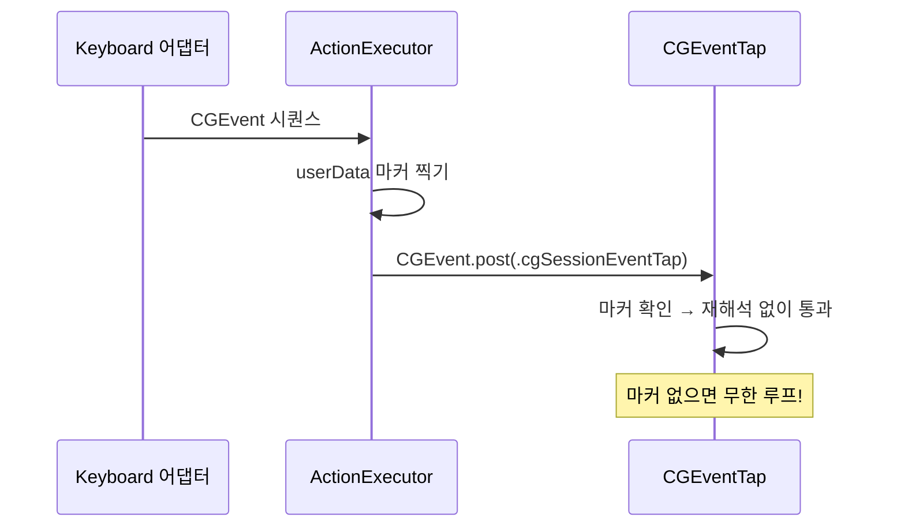

# 재진입과 안전장치

- **Last updated**: 2026-07-26

## 현재 구조

1. 모든 출력(AX 쓰기, 합성 이벤트 게시)은 **단일 `ActionExecutor`** 를 거친다.
2. 합성한 모든 `CGEvent`에는 게시 전에 비공개 `userData` 마커(`CGEvent.setIntegerValueField(.eventSourceUserData, …)`)를 찍고, 이벤트 탭은 마킹된 이벤트를 재해석 없이 통과시킨다.
3. 안전장치 단축키(고정 `Ctrl-Option-Cmd-Esc`)는 메인 탭과 **별도의 `CGEventTap`** 으로 `kCGHIDEventTap`에 최고 우선순위로, **전용 스레드의 자체 런루프**에 설치한다.

```mermaid
sequenceDiagram
    participant KBD as Keyboard 어댑터
    participant EX as ActionExecutor
    participant TAP as CGEventTap

    KBD->>EX: CGEvent 시퀀스
    EX->>EX: userData 마커 찍기
    EX->>TAP: CGEvent.post(.cgSessionEventTap)
    TAP->>TAP: 마커 확인 → 재해석 없이 통과
    Note over TAP: 마커 없으면 무한 루프!
```

의존 순서대로 정리한 완화책 (전부 유지할 것):

1. **안전장치 단축키(킬스위치)** — 고정 콤보 `Ctrl-Opt-Cmd-Esc`. 메인 탭과 **별도 탭**(`KillSwitchTap`)이며 `kCGHIDEventTap`에 `.headInsertEventTap` 능동 탭으로 설치한다(생성 실패 시 세션 탭 1회 폴백 — 설치 순서가 계약이라 메인 탭 **다음에** 설치해야 앞선다). 소스는 **전용 스레드의 자체 CFRunLoop**에 붙어 메인 스톨 중에도 콜백이 배달된다. 발동은 **단방향 off**이며 효과는 2겹이다: ① 킬 스레드에서 메인 탭 포트에 직접 `tapEnable(false)` ② `main.async` 홉으로 `isInterceptionEnabled = false` 대입 — 엔진 리셋·워치독 정지·글리프는 소프트 off의 didSet(#7)이 전담하고 전용 off 경로는 없다(#2와 같은 규칙). **영속만은 예외로 킬 경로가 직접** 수행한다(공유 함수 `persistInterceptionEnabled`, 호출은 ①·②·로그 **뒤**의 함수 말미 — `cfprefsd` XPC가 안전장치 경로를 막지 않게). 메인 스톨 중에는 ②의 홉이 영영 착지하지 않아 홉에만 맡기면 강제 종료 후 재실행이 사용자를 같은 상태로 돌려보내기 때문이다. ①이 도로 풀리지 않게 하는 것은 **킬 요청 래치**다: 우리가 끈 데 대해 OS가 메인 탭 콜백에 `tapDisabledByUserInput`을 통지하는데, 그때 두 재활성화 경로(콜백 재활성화·워치독 bg 틱)의 토글 가드는 아직 ②의 홉이 착지하지 않아 on을 본다. 래치는 킬 스레드가 ① 직전에 세우고 토글 on 복귀에서만 내려간다. 콤보 판정은 keycode 53 + 의도 modifier 5종(ctrl/opt/cmd/shift/fn) 정확 일치이며 상태 비트(Caps Lock·numericPad·nonCoalesced)는 무시하고, **삼킴과 발동은 별개 술어다**: `shouldSwallow`(마커 아님 + 콤보 일치)가 삼킴을, `shouldFire`(= `shouldSwallow` + 오토리핏 아님)가 발동을 정한다 — 오토리핏 콤보는 발동하지 않지만 **삼킨다**(통과시키면 콤보를 꾹 누르는 동안 초당 십여 건이 포커스 앱으로 샌다). 마커가 찍힌 이벤트와 콤보 아닌 키는 통과시킨다.

킬 탭에는 전용 워치독을 두지 않는다 — 콜백이 `(keycode, flags)` 비교뿐이라 통지 유실 실패 모드가 없고, 메인 탭과 달리 재활성화에 게이트가 없어 "보류됐다 잊히는" 상태 자체가 없다. 그 자리를 메우는 것은 **검증**이다: 두 활성화 지점(스레드 최초 enable, `reenableAfterDisable`) 모두 `tapIsEnabled`로 확인하고, 실패 시 킬 스레드에서 직접 `fault`를 남긴 뒤 홉으로 `Installation.failed`로 강등한다(Settings "Failed (tap inactive)"). `tapDisabledBy*` 통지는 **평생 1회**라(꺼진 탭은 이벤트를 못 받는다) 여기서 놓치면 복구 기회가 없기 때문이다. 재시도 타이머는 런루프를 영구 점유해 "포트 invalidate → 스레드 종료" 수명 계약을 깨므로 기각했다 ([20260726_kill-switch-dedicated-runloop-thread.md](../../decisions/references/20260726_kill-switch-dedicated-runloop-thread.md), [20260726_kill-switch-hid-tap-session-fallback.md](../../decisions/references/20260726_kill-switch-hid-tap-session-fallback.md), [20260726_kill-switch-trigger-semantics.md](../../decisions/references/20260726_kill-switch-trigger-semantics.md), [20260726_kill-combo-swallow-independent-of-fire.md](../../decisions/references/20260726_kill-combo-swallow-independent-of-fire.md), [20260726_kill-tap-enable-verification.md](../../decisions/references/20260726_kill-tap-enable-verification.md), [20260726_kill-switch-off-persistence-off-main.md](../../decisions/references/20260726_kill-switch-off-persistence-off-main.md)).
2. **예외 폭주 자동 비활성화** — 실행 계층의 실패는 전부 `EventTapController.reportExecutionFailure` 한 곳으로 모이고(어댑터가 유일한 보고 지점 — 엔진은 throw하지 않는다), 슬라이딩 창(기본 1초)에서 ≥5회면 트립한다. 판정은 시간을 주입받는 순수 타입 `FailureBurstCounter`(트립 시 창을 비워 재트립 방지). 트립의 효과는 `isInterceptionEnabled = false` 대입뿐 — 소프트 off의 didSet(#7)이 리셋·정지·비활성·영속·메뉴바 반영을 전담하며 자동 off 전용 경로는 없다. 사용자 알림은 그 글리프 변화 + `fault` 로그 1건이 전부다 ([20260725_failure-burst-autodisable-shape.md](../../decisions/references/20260725_failure-burst-autodisable-shape.md)). **보고 단위는 원인 키 입력 1건당 최대 1회** — 한 `.replace`의 action 시퀀스가 여럿 실패해도 어댑터가 접어서 한 건으로 보고한다. action별로 보고하면 카운트 반복 출력(`100j` 등)이 임계를 즉시 압도해 명령 하나 미지원이 가로채기 전체를 끄는 오탐이 된다 ([20260726_execution-failure-report-granularity.md](../../decisions/references/20260726_execution-failure-report-granularity.md)).
3. **동작별 AX 타임아웃** — 3ms 하드 캡 ([strategy-dispatch.md](strategy-dispatch.md)).
4. **깔끔한 SIGTERM 처리** — 종료 전 탭 제거, 대롱거리는 탭 방지. 메인 탭과 킬 탭이 각자 `willTerminate` 옵저버를 들고 자기 탭만 정리한다(생명주기 비공유). 킬 탭은 런루프 소스를 따로 제거하지 않는다 — 포트 invalidate가 소스를 무효화해 전용 스레드의 `CFRunLoopRun`이 스스로 반환한다.
5. **보안 입력 인식** — Secure Event Input은 이벤트 **배달만 억제하며 탭 활성화에는 관여하지 않는다**(실측: SEI 중에도 `tapCreate`·`tapEnable`·`tapIsEnabled` 모두 정상, 켜진 탭이 꺼지지도 통지가 오지도 않는다). 따라서 **되살리기가 먼저**다 — 워치독은 SEI 여부와 무관하게 비활성 탭의 재활성화를 시도하고, `IsSecureEventInputEnabled()` 확인은 그것이 **실패한 뒤에만** 한다. 전용 상태 `Status.secureInput`은 "SEI가 원인이라 보류한 상태"가 아니라 "**재활성화 실패 + SEI 동시 관측**"이며, `.failed`의 하위 표시 구분이다(메뉴바 `lock.square`, Settings "Secure Input"). 그 조합에서는 어차피 키가 오지 않으므로 "고장"보다 덜 놀라운 표시를 택한 것이지 원인 판정이 아니다. 표시 우선순위는 그대로 탭 고장 > 토글 off > Secure Input ([20260726_secure-input-suppresses-delivery-not-enablement.md](../../decisions/references/20260726_secure-input-suppresses-delivery-not-enablement.md), 전용 상태·표시·우선순위의 원 근거는 [20260719_secure-input-status.md](../../decisions/references/20260719_secure-input-status.md)).
6. **탭 자동복구 워치독** — 콜백의 `tapDisabledBy*` 재활성화는 콜백이 전달되지 못하는 완전 정지/장기 스톨에서는 무력하다. 별도 백그라운드 타이머로 `CGEventTapIsEnabled()`를 주기 폴링해(2초), **정지/스톨이 풀린 뒤에도** 죽은 채 방치된 탭을 다시 켠다 ([20260713_tap-reenable-watchdog-polling.md](../../decisions/references/20260713_tap-reenable-watchdog-polling.md)). 스톨 "중"에는 재활성화를 보류한다(스톨 게이트 — 직전 status 홉 미소비를 신호로 틱 스킵): 탭 소스가 메인 런루프에 있어 스톨 중 되살린 탭은 키를 처리하지 못한 채 잡아두기만 하기 때문. status 홉은 FIFO(`main.async`), 토글 off의 최종 disable은 워치독 시리얼 큐 뒤에 게시해 in-flight 틱 경합을 봉인한다 ([20260719_watchdog-stall-gate-post-stall-recovery.md](../../decisions/references/20260719_watchdog-stall-gate-post-stall-recovery.md)).
7. **가로채기 마스터 토글** — 메뉴바 `isInterceptionEnabled`. off는 통과만이 아니라 `tapEnable(false)`로 스트림을 놓고(포트는 유지) 엔진을 Insert 리셋 + 워치독 정지 + 콜백 재활성화까지 게이트한다 — 앱이 오동작(스톨)할 때 모든 키가 메인 콜백을 왕복하는 것을 실제로 끊는다. on 복귀는 선제 `tapEnable(true)` 1회. 안전장치 단축키(#1)가 하드 킬 스위치라면 이 토글은 사용자가 명시적으로 가로채기를 끄는 소프트 경로다. `Status.running`은 "탭 설치·헬스 정상"을 뜻하고 on/off와 직교하며, Settings 표시는 토글을 반영해 파생한다 ([20260718_interception-toggle-semantics.md](../../decisions/references/20260718_interception-toggle-semantics.md)).

권한: 접근성 확인은 매 실행 시 `AXIsProcessTrustedWithOptions`로 수행하고, 권한이 없으면 이벤트 탭 설치를 거부한다.

사용자 노출: 킬 탭이 어느 지점에 설치됐는지(HID / 세션 폴백 / 활성화 실패 / 미설치)는 Settings의 읽기 전용 "Kill Switch" 행과 콤보 안내 각주로 표시한다 — 안전장치가 조용히 부재하는 것이 이 기능의 가장 위험한 실패 모드다. 단축키 커스터마이즈 UI는 아직 없다(고정 콤보).

**과도기 상태 (배선 마일스톤)**: 출력 인프라는 존재하되 **호출자가 없다** — `ActionExecutor`(마커를 찍는 유일한 지점)와 탭측 마커 가드, 폭주 카운터와 보고 훅은 모두 구현·테스트돼 있지만, `VimAction` → CGEvent 시퀀스 매핑이 아직 없어 게시하는 코드도 실패를 보고하는 코드도 없다. 그때까지 엔진의 `.replace` 결정은 실행 없이 삼키고 DEBUG 요약만 로그한다. 릴리스 빌드에선 이 삼킴이 무로그라 사용자에게 "죽은 키"로 보이므로, **디스패처 마일스톤 전 릴리스 배포는 금지**한다 ([20260717_replace-swallow-transitional-rule.md](../../decisions/references/20260717_replace-swallow-transitional-rule.md)).

## 불변식·계약

- **탭 콜백의 동기 구간은 "번역 + 순수 엔진 step + 캐시된 컨텍스트 읽기"까지만** — AX 등 블로킹 가능 호출은 콜백에 들어오지 않는다(프로브는 포커스 변경 시 캐시 갱신, 실행은 콜백 밖 직렬 큐). OS 탭 타임아웃은 콜백 스레드와 무관하므로 탭 생존은 스레드 배치가 아니라 이 불변식이 지킨다. 탭 소스는 메인 런루프 유지 확정 ([20260725_callback-light-invariant.md](../../decisions/references/20260725_callback-light-invariant.md), [20260725_tap-main-runloop-retention.md](../../decisions/references/20260725_tap-main-runloop-retention.md)).
- 이벤트 게시는 반드시 `ActionExecutor`를 거친다 — 우회 경로가 생기면 마커 불변식을 감사할 수 없다.
- 마커 없는 합성 이벤트는 존재하지 않는다. **마커를 빠뜨리면 탭이 자기 출력을 재해석해 무한 루프** — 이벤트 탭 기반 도구의 병적 루프의 가장 흔한 원인.
- 마커 확인은 `handleKeyDown`의 **최우선 판정**이다 — 마스터 토글을 포함한 어떤 상태 가드보다 앞. 상태 무관 불변식을 상태 뒤로 미루면 상태 조합 하나가 루프의 입구가 된다 ([20260725_marker-guard-highest-precedence.md](../../decisions/references/20260725_marker-guard-highest-precedence.md)).
- 안전장치 탭은 메인 탭과 생명주기를 공유하지 않는다 — 메인 탭의 off/failed/재설치와 무관하게 살아 있고, 정리 시점은 앱 종료뿐이다.
- **킬 탭 콜백은 메인 격리를 가정하지 않는다** — 전용 런루프에서 돌므로 `MainActor.assumeIsolated`를 쓰지 않고, 메인과 공유하는 상태(탭 포트, 킬 요청 래치)는 전부 잠금을 거친다(`TapPortBox`, `OSAllocatedUnfairLock`).
- **킬 요청 래치가 서 있으면 아무도 탭을 되살리지 않는다** — 콜백 재활성화와 워치독 bg 틱 둘 다 게이트 대상이다. 한쪽만 막으면 나머지가 발동 직후의 탭을 되살린다.

## 근거 요약

버그 있는 전역 키 탭은 사용자를 키보드에서 완전히 차단할 수 있으므로 안전장치는 타협 불가이고, 메인 탭 안에서 감지하면 킬 스위치가 버그와 함께 죽으므로 별도 탭이어야 한다.

- 관련 결정: [20260712_synthetic-event-marker-and-failsafe.md](../../decisions/references/20260712_synthetic-event-marker-and-failsafe.md), [20260726_kill-switch-dedicated-runloop-thread.md](../../decisions/references/20260726_kill-switch-dedicated-runloop-thread.md), [20260726_kill-switch-hid-tap-session-fallback.md](../../decisions/references/20260726_kill-switch-hid-tap-session-fallback.md), [20260726_kill-switch-trigger-semantics.md](../../decisions/references/20260726_kill-switch-trigger-semantics.md)

## 관련

- 시스템 내 위치: [system-overview.md](system-overview.md)
- 합성 시퀀스 생성: [strategy-dispatch.md](strategy-dispatch.md)
