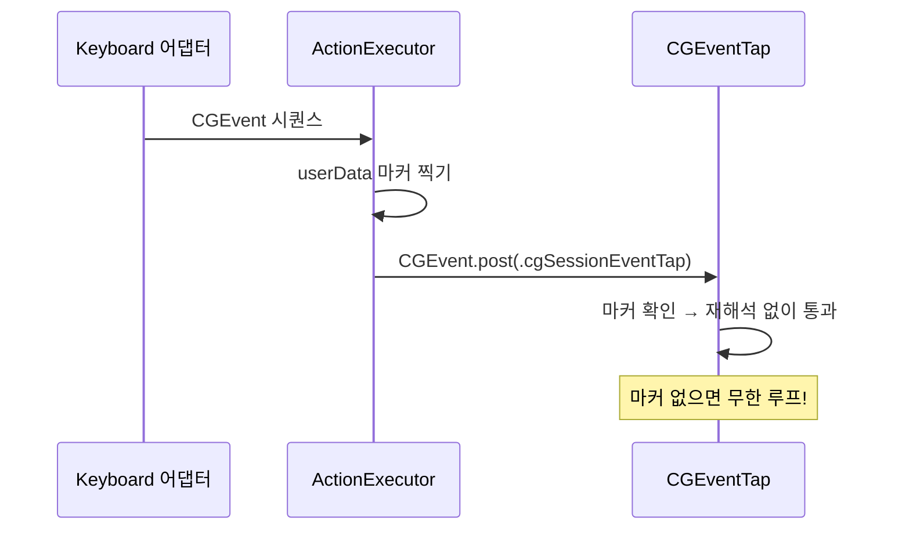

# 재진입과 안전장치

- **Last updated**: 2026-08-09 (M5 PR-D1b 세션3 — 원자 그룹 ④의 범위를 "첫 그룹까지"로 명시(`.paste` 하이브리드의 둘째 그룹부터는 ③과 같은 모양))

## 현재 구조

1. 모든 출력은 **프리미티브마다 단일 통로**를 거친다 — 합성 이벤트 게시는 `ActionExecutor`, AX 속성 쓰기는 `AXWriter`(M5 D1, 구현은 PR-D1a). 우회 경로가 생기면 감사할 수 없다는 규칙은 통로마다 동일하다. **마커는 `ActionExecutor`만의 책임이다** — AX 쓰기는 탭으로 되돌아오지 않아 마커 개념 자체가 없다. 실패 보고의 수렴 지점은 통로가 아니라 어댑터다("키 입력 1건당 최대 1회" 접기는 액션 시퀀스 전체를 보는 층만 가능) ([20260808_ax-writer-per-primitive-channel.md](../../decisions/references/20260808_ax-writer-per-primitive-channel.md)).
2. 합성한 모든 `CGEvent`에는 게시 전에 비공개 `userData` 마커(`CGEvent.setIntegerValueField(.eventSourceUserData, …)`)를 찍고, 이벤트 탭은 마킹된 이벤트를 재해석 없이 통과시킨다.
3. 안전장치 단축키(고정 `Ctrl-Option-Cmd-Esc`)는 메인 탭과 **별도의 `CGEventTap`** 으로 `kCGHIDEventTap`에 최고 우선순위로, **전용 스레드의 자체 런루프**에 설치한다.

```mermaid
sequenceDiagram
    participant KBD as Keyboard 어댑터
    participant EX as ActionExecutor
    participant TAP as CGEventTap

    KBD->>EX: CGEvent 시퀀스
    EX->>EX: userData 마커 찍기
    EX->>TAP: CGEvent.post(.cgSessionEventTap)
    TAP->>TAP: 마커 확인 → 재해석 없이 통과
    Note over TAP: 마커 없으면 무한 루프!
```

의존 순서대로 정리한 완화책 (전부 유지할 것):

1. **안전장치 단축키(킬스위치)** — 고정 콤보 `Ctrl-Opt-Cmd-Esc`. 메인 탭과 **별도 탭**(`KillSwitchTap`)이며 `kCGHIDEventTap`에 `.headInsertEventTap` 능동 탭으로 설치한다(생성 실패 시 세션 탭 1회 폴백 — 설치 순서가 계약이라 메인 탭 **다음에** 설치해야 앞선다). 소스는 **전용 스레드의 자체 CFRunLoop**에 붙어 메인 스톨 중에도 콜백이 배달된다. 발동은 **단방향 off**이며 효과는 2겹이다: ① 킬 스레드에서 메인 탭 포트에 직접 `tapEnable(false)` ② `main.async` 홉으로 `isInterceptionEnabled = false` 대입 — 엔진 리셋·워치독 정지·글리프는 소프트 off의 didSet(#8)이 전담하고 전용 off 경로는 없다(#2와 같은 규칙). **영속만은 예외로 킬 경로가 직접** 수행한다(공유 함수 `persistInterceptionEnabled`, 호출은 ①·②·로그 **뒤**의 함수 말미 — `cfprefsd` XPC가 안전장치 경로를 막지 않게). 메인 스톨 중에는 ②의 홉이 영영 착지하지 않아 홉에만 맡기면 강제 종료 후 재실행이 사용자를 같은 상태로 돌려보내기 때문이다. ①이 도로 풀리지 않게 하는 것은 **킬 요청 래치**다: 우리가 끈 데 대해 OS가 메인 탭 콜백에 `tapDisabledByUserInput`을 통지하는데, 그때 두 재활성화 경로(콜백 재활성화·워치독 bg 틱)의 토글 가드는 아직 ②의 홉이 착지하지 않아 on을 본다. 래치는 킬 스레드가 ① 직전에 세우고 토글 on 복귀에서만 내려간다. 콤보 판정은 keycode 53 + 의도 modifier 5종(ctrl/opt/cmd/shift/fn) 정확 일치이며 상태 비트(Caps Lock·numericPad·nonCoalesced)는 무시한다. 판정 술어는 `shouldSwallow`(마커 아님 + 콤보 일치) 하나다 — 삼킨 콤보는 **오토리핏 포함 전부 발동 경로로 간다**. Esc가 modifier보다 먼저 눌린 채 꾹 누르면 최초 keyDown은 콤보 미달이고 이후는 전부 오토리핏이라, 오토리핏을 발동에서 제외하면 "꾹 누르면 발동"이 영영 성립하지 않기 때문이다(실기기 실증). 발동 효과·fault 로그의 1회성은 `triggerKillSwitch`의 킬 요청 래치 **test-and-set**이 보장한다(같은 에피소드 = 발동~토글 on 복귀의 재발동은 no-op이며 반환값 `false`, 단 실행 중단 래치 무효화만은 dedupe 앞·무조건). 마커가 찍힌 이벤트와 콤보 아닌 키는 통과시킨다(부분 콤보는 시스템으로 새어 나간다 — Ctrl이 늦으면 Cmd-Opt-Esc가 Force Quit 창을 연다, 수용).

킬 탭에는 전용 워치독을 두지 않는다 — 콜백이 `(keycode, flags)` 비교뿐이라 통지 유실 실패 모드가 없고, 메인 탭과 달리 재활성화에 게이트가 없어 "보류됐다 잊히는" 상태 자체가 없다. 그 자리를 메우는 것은 **검증**이다: 두 활성화 지점(스레드 최초 enable, `reenableAfterDisable`) 모두 `tapIsEnabled`로 확인하고, 실패 시 킬 스레드에서 직접 `fault`를 남긴 뒤 홉으로 `Installation.failed`로 강등한다(Settings "Failed (tap inactive)"). `tapDisabledBy*` 통지는 **평생 1회**라(꺼진 탭은 이벤트를 못 받는다) 여기서 놓치면 복구 기회가 없기 때문이다. 재시도 타이머는 런루프를 영구 점유해 "포트 invalidate → 스레드 종료" 수명 계약을 깨므로 기각했다 ([20260726_kill-switch-dedicated-runloop-thread.md](../../decisions/references/20260726_kill-switch-dedicated-runloop-thread.md), [20260726_kill-switch-hid-tap-session-fallback.md](../../decisions/references/20260726_kill-switch-hid-tap-session-fallback.md), [20260726_kill-switch-trigger-semantics.md](../../decisions/references/20260726_kill-switch-trigger-semantics.md), [20260726_kill-combo-swallow-independent-of-fire.md](../../decisions/references/20260726_kill-combo-swallow-independent-of-fire.md), [20260801_kill-combo-autorepeat-fires.md](../../decisions/references/20260801_kill-combo-autorepeat-fires.md), [20260726_kill-tap-enable-verification.md](../../decisions/references/20260726_kill-tap-enable-verification.md), [20260726_kill-switch-off-persistence-off-main.md](../../decisions/references/20260726_kill-switch-off-persistence-off-main.md)).
2. **예외 폭주 자동 비활성화** — 실행 계층의 실패는 전부 `EventTapController.reportExecutionFailure` 한 곳으로 모이고(어댑터가 유일한 보고 지점 — 엔진은 throw하지 않는다), 슬라이딩 창(기본 1초)에서 ≥5회면 트립한다. 판정은 시간을 주입받는 순수 타입 `FailureBurstCounter`(트립 시 창을 비워 재트립 방지). 트립의 효과는 `isInterceptionEnabled = false` 대입뿐 — 소프트 off의 didSet(#8)이 리셋·정지·비활성·영속·메뉴바 반영을 전담하며 자동 off 전용 경로는 없다. 사용자 알림은 그 글리프 변화 + `fault` 로그 1건이 전부다 ([20260725_failure-burst-autodisable-shape.md](../../decisions/references/20260725_failure-burst-autodisable-shape.md)). **보고 단위는 원인 키 입력 1건당 최대 1회** — 한 `.replace`의 action 시퀀스가 여럿 실패해도 어댑터가 접어서 한 건으로 보고한다. action별로 보고하면 카운트 반복 출력(`100j` 등)이 임계를 즉시 압도해 명령 하나 미지원이 가로채기 전체를 끄는 오탐이 된다 ([20260726_execution-failure-report-granularity.md](../../decisions/references/20260726_execution-failure-report-granularity.md)). 보고 의미론은 "**실행을 시도했는데 깨졌다**"로 한정한다 — 어댑터가 아직 구현하지 않은 액션은 실패가 아니며 스킵+DEBUG 로그다(정상 사용의 `dd` 연타가 자동 off를 트립하는 오탐 차단, [20260726_unsupported-action-not-failure.md](../../decisions/references/20260726_unsupported-action-not-failure.md)).
3. **AX 배치·타임아웃** — AX 호출은 콜백·메인 스레드에 들어오지 않는다(리졸버는 전용 큐, M5 디스패치 읽기는 게시 큐). 메시징 타임아웃은 경로 불문 50ms 단일 상수 — 실패 반환이 캡+2ms로 바운드됨이 실측된 병적 정지 차단기이며, 탭 생존은 캡 값이 아니라 배치가 지킨다 ([20260802_ax-read-timeout-50ms-supersedes-3ms.md](../../decisions/references/20260802_ax-read-timeout-50ms-supersedes-3ms.md), [strategy-dispatch.md](strategy-dispatch.md)).
4. **깔끔한 SIGTERM 처리** — 종료 전 탭 제거, 대롱거리는 탭 방지. 메인 탭과 킬 탭이 각자 `willTerminate` 옵저버를 들고 자기 탭만 정리한다(생명주기 비공유). 킬 탭은 런루프 소스를 따로 제거하지 않는다 — 포트 invalidate가 소스를 무효화해 전용 스레드의 `CFRunLoopRun`이 스스로 반환한다.
5. **보안 입력 인식** — Secure Event Input은 이벤트 **배달만 억제하며 탭 활성화에는 관여하지 않는다**(실측: SEI 중에도 `tapCreate`·`tapEnable`·`tapIsEnabled` 모두 정상, 켜진 탭이 꺼지지도 통지가 오지도 않는다). 따라서 **되살리기가 먼저**다 — 워치독은 SEI 여부와 무관하게 비활성 탭의 재활성화를 시도하고, `IsSecureEventInputEnabled()` 확인은 그것이 **실패한 뒤에만** 한다. 전용 상태 `Status.secureInput`은 "SEI가 원인이라 보류한 상태"가 아니라 "**재활성화 실패 + SEI 동시 관측**"이며, `.failed`의 하위 표시 구분이다(메뉴바 `lock.square`, Settings "Secure Input"). 그 조합에서는 어차피 키가 오지 않으므로 "고장"보다 덜 놀라운 표시를 택한 것이지 원인 판정이 아니다 ([20260726_secure-input-suppresses-delivery-not-enablement.md](../../decisions/references/20260726_secure-input-suppresses-delivery-not-enablement.md), 전용 상태·표시의 원 근거는 [20260719_secure-input-status.md](../../decisions/references/20260719_secure-input-status.md)).

   **메뉴바 글리프 우선순위**(`AppState.menuBarGlyph`, 파생 `menuBarShowsVisualLineGlyph`·`menuBarAccessibilityLabel`이 같은 사다리를 따른다): 탭 고장 `square.dashed` > 마스터 토글 off `square.slash` > **앱별 disabled `minus.square`** > Secure Input `lock.square` > 모드 글리프. 넓은 상태가 좁은 상태를 이기고, 사용자 의도(영구)가 OS의 일시 억제를 이긴다 — 앱별 off에 `lock.square`를 보이면 "SEI가 풀리면 재개된다"는 오해를 준다. 앱별 disabled의 **표시** 판정은 `FrontmostAppGate.lastNonSelfBundleID`이고 **게이트** 판정은 계속 `frontmostBundleID`다(축 분리 — [profiles-and-config.md](profiles-and-config.md)). fill은 여기서도 "키 차단 여부" 축이라 통과 상태인 `minus.square`는 미채움이다 ([20260814_menubar-disabled-app-indicator.md](../../decisions/references/20260814_menubar-disabled-app-indicator.md)).
6. **탭 자동복구 워치독** — 콜백의 `tapDisabledBy*` 재활성화는 콜백이 전달되지 못하는 완전 정지/장기 스톨에서는 무력하다. 별도 백그라운드 타이머로 `CGEventTapIsEnabled()`를 주기 폴링해(2초), **정지/스톨이 풀린 뒤에도** 죽은 채 방치된 탭을 다시 켠다 ([20260713_tap-reenable-watchdog-polling.md](../../decisions/references/20260713_tap-reenable-watchdog-polling.md)). 스톨 "중"에는 재활성화를 보류한다(스톨 게이트 — 직전 status 홉 미소비를 신호로 틱 스킵): 탭 소스가 메인 런루프에 있어 스톨 중 되살린 탭은 키를 처리하지 못한 채 잡아두기만 하기 때문. status 홉은 FIFO(`main.async`), 토글 off의 최종 disable은 워치독 시리얼 큐 뒤에 게시해 in-flight 틱 경합을 봉인한다 ([20260719_watchdog-stall-gate-post-stall-recovery.md](../../decisions/references/20260719_watchdog-stall-gate-post-stall-recovery.md)).
7. **실행 중단 래치** — 게시 중인 합성 이벤트 버스트를 도중에 끊는 신호(`ExecutionAbortLatch`). **형태는 세대 카운터**다: 실행 1건은 dispatch 시점에 `beginRun()`으로 자기 세대를 받고, 어댑터가 청크 사이마다 `isCurrent(run)`을 묻는다. 무효화 주체 셋이 `invalidate()`로 세대만 올린다 — **새 사용자 입력**(`handleKeyDown`), **마스터 토글 off**(didSet 맨 앞), **킬스위치**(`triggerKillSwitch` 맨 앞, 잠금+증가뿐이라 아래 어느 단계도 이것을 기다리지 않는다). **해제 API가 없다**는 것이 요점이다 — 새 실행이 이전 실행을 자동으로 밀어내므로 아무도 래치를 내릴 필요가 없고, 킬 요청 래치(#1)가 안고 있는 "해제를 빠뜨리면 영구 보류되는 조용한 고장"이 구조적으로 존재하지 않는다. 소유자는 컨트롤러이고 게시 sink 팩토리에 주입된다 — 큐를 sink 클로저가 단독 소유하던 배선에서는 컨트롤러에 취소 핸들이 없어 킬스위치가 in-flight를 못 멈췄다(단계 0 실측). `beginRun()`은 **게시 큐 밖**(탭 콜백 스레드)에서 불려야 한다: 큐 안이면 이미 도는 버스트가 끝난 뒤에야 세대가 올라간다 ([20260730_execution-abort-generation-latch.md](../../decisions/references/20260730_execution-abort-generation-latch.md)).

   소비 쪽은 어댑터의 **청크 게시**다. `KeyboardAdapter.execute`는 8 키스트로크(=16 이벤트)씩 게시하며, 중단 신호 재확인은 **각 청크의 페이싱 뒤·게시 직전**이다 — 밀려났으면 그 청크째 게시하지 않고 반환한다. 체크가 페이싱보다 앞이면 간격에 잠들어 있는 동안 온 무효화를 놓쳐 청크 하나가 더 나가고, 그 화살표들이 새 사용자 키와 인터리브되는 1청크 폭 순서 역전이 실기기에서 실증됐다(도그푸딩에서 발견·수정). 남는 것은 무효화 순간 이미 게시 중이던 in-flight 꼬리뿐이다(실측 ≤1 스트로크 — 수용). CGEvent 생성도 청크 단위로 미뤄진다(`1000p`가 게시 전에 2,000개를 통째로 만들지 않는다). **첫 청크는 지연 없이** 나가고 두 번째 청크부터 2ms 간격을 둔다 — 이 지연이 중단을 **가능하게 하는 장치**다: `CGEvent.post`는 배달만 걸고 즉시 돌아오는 반면 소비하는 쪽은 대상 앱이라, 간격이 없으면 수천 개를 수십 ms에 다 넘겨버려 끊을 잔여가 남지 않는다. 두 값은 도그푸딩 조절값이고, 부수 효과로 Notion의 버스트 이벤트 드랍 완화를 노린다. `ActionExecutor.post`는 게시 프리미티브 그대로이며 청크 분할은 어댑터 몫이다 ([20260730_chunked-posting-with-pacing.md](../../decisions/references/20260730_chunked-posting-with-pacing.md)).

8. **가로채기 마스터 토글** — 메뉴바 `isInterceptionEnabled`. off는 통과만이 아니라 `tapEnable(false)`로 스트림을 놓고(포트는 유지) 엔진을 Insert 리셋 + 워치독 정지 + 콜백 재활성화까지 게이트한다 — 앱이 오동작(스톨)할 때 모든 키가 메인 콜백을 왕복하는 것을 실제로 끊는다. on 복귀는 선제 `tapEnable(true)` 1회. 안전장치 단축키(#1)가 하드 킬 스위치라면 이 토글은 사용자가 명시적으로 가로채기를 끄는 소프트 경로다. `Status.running`은 "탭 설치·헬스 정상"을 뜻하고 on/off와 직교하며, Settings 표시는 토글을 반영해 파생한다 ([20260718_interception-toggle-semantics.md](../../decisions/references/20260718_interception-toggle-semantics.md)).

권한: 접근성 확인은 매 실행 시 `AXIsProcessTrustedWithOptions`로 수행하고, 권한이 없으면 이벤트 탭 설치를 거부한다.

사용자 노출: 킬 탭이 어느 지점에 설치됐는지(HID / 세션 폴백 / 활성화 실패 / 미설치)는 Settings의 읽기 전용 "Kill Switch" 행과 콤보 안내 각주로 표시한다 — 안전장치가 조용히 부재하는 것이 이 기능의 가장 위험한 실패 모드다. 단축키 커스터마이즈 UI는 아직 없다(고정 콤보).

**과도기 상태 (모션·편집·Visual까지 배선됨)**: `.replace` 결정은 이제 실제로 실행된다 — 콜백은 원본을 삼킨 뒤 actions를 **실행 sink**로 넘기고, 그 클로저가 게시 직렬 큐 위에서 `KeyboardAdapter`를 부른다(`CGEvent` 생성·게시가 같은 컨텍스트여야 하는 계약). 컨트롤러는 sink 클로저 하나만 알고, 큐의 소유자·수명이 곧 그 클로저다 — **다만 실행 중단 래치(#7)만은 컨트롤러가 소유해 sink 팩토리에 주입한다**. sink는 dispatch마다 세대를 받아 어댑터에 중단 질의 클로저로 넘기므로 `dispatchActions`의 시그니처는 그대로다. 기본 sink와 앱 게이트는 XCTest 하위에서 무해한 것으로 바꿔치기된다 — 그냥 두면 테스트가 개발자 머신에 실제 키를 주입하거나, disable 앱(Ghostty) 터미널에서 테스트를 돌릴 때 게이트가 켜져 결정 테스트가 통째로 뒤집힌다 ([20260726_m2-execution-wiring-shape.md](../../decisions/references/20260726_m2-execution-wiring-shape.md)).

실행 범위는 **v1 어휘 전체**다: 어댑터는 액션을 네 매퍼(`MotionKeyMapper`/`EditKeyMapper`/`VisualKeyMapper`/`CommandKeyMapper`) 중 하나로 보내고, 매퍼가 `nil`을 내는 것(aw·따옴표·괄호쌍 오브젝트, `V`→`v` wise 전환)만 미지원 스킵+DEBUG 로그다(미지원≠실패). 게시 전 게이트는 두 축이다 — 요소 걸러내기(비텍스트·미확정에서 편집·Visual·명령 위임 보류)와 **비-QWERTY 레이아웃 가드**(문자 명령 키 `Cmd-Z/X/C/V`를 합성하는 `.edit`·`.paste`·`.undo`·`.redo` 보류 — AZERTY에서 `u`의 `Cmd-Z`가 `Cmd-W`(창 닫기)로 나가는 데이터 손실 축, [20260801_non-qwerty-command-key-layout-guard.md](../../decisions/references/20260801_non-qwerty-command-key-layout-guard.md)). 스크롤 반복은 엔진이 33으로 클램프한다 — 액션당 수십 타로 증폭되는 유일한 어휘라 1,000 클램프를 우회하기 때문 ([20260801_scroll-count-clamp-33.md](../../decisions/references/20260801_scroll-count-clamp-33.md)).

**Visual 배선이 만든 위험 하나**: 엔진은 Visual에서 탈출 콤보를 받으면 `clearSelection` 없이 passthrough+Insert로 빠진다(결정이 배타적이라 함께 실을 수 없음 — "남는 화면 선택은 수용"). 지금까지는 어댑터가 선택을 만들지 않아 이론상 조항이었지만, 이제 **살아 있는 선택이 Normal로 넘어올 수 있다**. Normal `x`는 `Shift-→, Cmd-X`라 그 stale 선택을 확장해 통째로 잘라낸다(사용자의 마우스 선택도 같은 경로). 래치의 원자 그룹 규칙이 여기서 나왔다 — 청크 경계는 `.edit(_, .selection)`과 뒤따르는 `clearSelection` **사이에 올 수 없다**(#7). **릴리스 배포 금지 게이트는 해제됐다** — 무로그 삼킴 0건 전수 확인 + 안전망 회귀 + 위험 심사 4건 종결로 M3가 닫혔다 ([20260801_release-block-gate-lifted.md](../../decisions/references/20260801_release-block-gate-lifted.md)). **실패 보고의 첫 실호출 경로는 `AXWriter` 쪽으로 서 있다**(Keyboard 게시 경로는 오류를 돌려주지 않아 계속 보고가 없다). 분류는 default-deny 화이트리스트(실보고는 `.failure`만, `.illegalArgument`는 관측 전용 — 승격 재심사는 D2 세션 0 실측(재현 불가)으로 종결·관측 유지 확정, `.cannotComplete`·`.invalidUIElement`는 경합 스킵 유지 확정 — [20260813_illegalargument-cannotcomplete-observation-kept.md](../../decisions/references/20260813_illegalargument-cannotcomplete-observation-kept.md)), 실패 시 keyboard 폴백 없음, 첫 실패에서 execute 잔여 통째 스킵(보고 1회 구조 보장), 실패 시각은 게시 큐에서 캡처해 `at:`으로 전달(메인 스톨 후 뭉침 착지의 거짓 트립 방지 — 카운터 MainActor 계약은 홉으로 유지) ([20260808_ax-write-failure-whitelist-no-fallback.md](../../decisions/references/20260808_ax-write-failure-whitelist-no-fallback.md)).

효과 실행은 `AXWriteEffects`(execute 1회 수명의 struct)가 맡는다 — `AXWriteOutcome`이 값으로 돌려준 클래스를 보고·요약 로그·전용 버킷으로 바꾸는 유일한 자리이며, **보고는 인스턴스당 1회로 접힌다**(= 키 입력 1건당 1회를 드라이버 루프와 무관하게 구조로 보장). 배선은 컨트롤러 → sink(`reportFailure:`) → `KeyboardAdapter(reportExecutionFailure:now:)` → `axWriteEffects(bundleID:)`이고, 컨트롤러 쪽 클로저가 `main.async` 홉만 얹는다(시각은 이미 게시 큐에서 캡처돼 있다). 요약 로그는 클래스마다 레벨이 갈리며 `.illegalArgument`(관측 데이터)와 되읽어 검증 불일치 버킷만 `#if DEBUG` 밖 `.info`다 — 사후에 `log show --info`로 회수해야 하는 판정 데이터이기 때문이다 ([20260808_ax-illegal-argument-observation-log-level.md](../../decisions/references/20260808_ax-illegal-argument-observation-log-level.md)). **D2 설계가 릴리스 생존 `.info`를 셋 늘린다** (구현은 PR-D2): auto 판정 전이(번들 ID+판정+탈락 계층)·auto가 라우팅한 실행의 `.axUnavailable` 요약(전략 출처 라벨 — 명시 accessibility와 구분)·강등 이벤트. 강등(auto trusted의 런타임 반증 — 연속 `.axUnavailable` N회)은 `FailureBurstCounter`가 이 축에 원리적으로 안 걸리는 것(검증 실패·스킵은 `reportExecutionFailure` 대상이 아니다)의 보완이며, auto 기본값 전환 게이트의 판정 데이터다 ([20260813_auto-trusted-runtime-demotion-and-observability.md](../../decisions/references/20260813_auto-trusted-runtime-demotion-and-observability.md)).

## 불변식·계약

- **탭 콜백의 동기 구간은 "번역 + 순수 엔진 step + 캐시된 컨텍스트 읽기"까지만** — AX 등 블로킹 가능 호출은 콜백에 들어오지 않는다(프로브는 포커스 변경 시 캐시 갱신, 실행은 콜백 밖 직렬 큐). OS 탭 타임아웃은 콜백 스레드와 무관하므로 탭 생존은 스레드 배치가 아니라 이 불변식이 지킨다. 탭 소스는 메인 런루프 유지 확정 ([20260725_callback-light-invariant.md](../../decisions/references/20260725_callback-light-invariant.md), [20260725_tap-main-runloop-retention.md](../../decisions/references/20260725_tap-main-runloop-retention.md)).
- 이벤트 게시는 반드시 `ActionExecutor`를 거친다 — 우회 경로가 생기면 마커 불변식을 감사할 수 없다. AX 속성 쓰기는 같은 규칙으로 `AXWriter`를 거치며(요소 획득은 반드시 `AXRead.focusedElement` — 50ms 단일 상수가 이 고리로 쓰기에도 상속된다), `NSPasteboard` 쓰기는 `PasteWiseResolver`/`Clipboard` seam이 담당한다 — "프리미티브당 통로 하나"가 공통 규칙이다.
- **`ActionExecutor`와 `SyntheticEventMarker`는 스레드 자유 타입이다** — 둘 다 타입 단위 `nonisolated`이고(멤버별이 아니라 타입에 붙여 `magic`·`postEvent`까지 기본 MainActor 격리에서 벗어난다) `ActionExecutor`는 `Sendable`을 명시한다. 게시는 콜백 밖 직렬 큐에서, 마커 판독은 메인 탭 콜백과 킬 탭 전용 스레드 양쪽에서 일어나므로 어느 격리도 가정할 수 없다. 게시 클로저 계약은 **`@Sendable (CGEvent) -> Void`** — 이것이 있어야 `ActionExecutor`가 `Sendable`이 되어 큐로 넘어간다.
- **합성 `CGEvent`는 `post`를 호출하는 그 컨텍스트(직렬 큐)에서 만든다** — `CGEvent`는 `Sendable`이 아니라 격리를 건너면 안 된다. 어댑터가 큐 위에서 시퀀스를 생성하면 건너갈 값이 애초에 없다. 콜백에서 만들어 큐로 넘기는 형태는 `nonisolated(unsafe)` 없이는 성립하지 않으며, 그 우회가 필요해졌다는 것은 곧 이 계약을 재검토할 시점이라는 뜻이다 ([20260726_action-executor-nonisolated-sendable.md](../../decisions/references/20260726_action-executor-nonisolated-sendable.md)).
- 마커 없는 합성 이벤트는 존재하지 않는다. **마커를 빠뜨리면 탭이 자기 출력을 재해석해 무한 루프** — 이벤트 탭 기반 도구의 병적 루프의 가장 흔한 원인.
- 마커 확인은 `handleKeyDown`의 **최우선 판정**이다 — 마스터 토글을 포함한 어떤 상태 가드보다 앞. 상태 무관 불변식을 상태 뒤로 미루면 상태 조합 하나가 루프의 입구가 된다 ([20260725_marker-guard-highest-precedence.md](../../decisions/references/20260725_marker-guard-highest-precedence.md)).
- 안전장치 탭은 메인 탭과 생명주기를 공유하지 않는다 — 메인 탭의 off/failed/재설치와 무관하게 살아 있고, 정리 시점은 앱 종료뿐이다.
- **킬 탭 콜백은 메인 격리를 가정하지 않는다** — 전용 런루프에서 돌므로 `MainActor.assumeIsolated`를 쓰지 않고, 메인과 공유하는 상태(탭 포트, 킬 요청 래치)는 전부 잠금을 거친다(`TapPortBox`, `OSAllocatedUnfairLock`).
- **킬 요청 래치가 서 있으면 아무도 탭을 되살리지 않는다** — 콜백 재활성화와 워치독 bg 틱 둘 다 게이트 대상이다. 한쪽만 막으면 나머지가 발동 직후의 탭을 되살린다.
- **실행 중단 래치의 무효화는 마커 가드 뒤다** — 앞에 두면 우리가 게시한 합성 이벤트가 탭으로 되돌아오며 **자기 버스트를 끊는다**(항상 첫 청크 만에 죽는 조용한 고장). 마커 가드가 최우선인 규칙의 두 번째 존재 이유다.
- **실행 중단은 결정 종류를 가리지 않는다** — passthrough(Insert 타이핑)·swallow·replace 전부가 잔여를 폐기한다. 실증된 순서 역전은 버스트 중 타이핑이 문서를 오염시킨 것이고 그 키들은 passthrough라, replace만 보면 목적을 못 이룬다.
- **청크 경계는 원자 그룹 사이에만 온다** — ① 액션 1개의 전체 시퀀스(중간에서 끊으면 "선택만 만들고 `Cmd-X`는 안 나가는" 파괴적 실행), ② `.edit(_, .selection)`과 뒤따르는 `clearSelection` 사이(끊기면 살아 있는 선택이 Normal로 넘어온다), ③ `.paste`의 `접두 + 첫 Cmd-V`(접두만 나가면 붙여넣기 없이 캐럿만 움직인다), ④ 하이브리드의 `AX 접두 쓰기(및 되읽어 검증) + 첫 게시 그룹`(사이에서 끊기면 편집의 AX 선택이 화면에 잔류해 ②와 같은 축 — 래치 질의는 접두 쓰기 **직전**까지만, [20260808_hybrid-prefix-atomic-with-first-group.md](../../decisions/references/20260808_hybrid-prefix-atomic-with-first-group.md)). **④가 덮는 것은 첫 그룹까지다** — 그룹이 여럿인 하이브리드(`.paste`)의 둘째 그룹부터는 `.groups`와 같은 청크·페이싱 경로를 타므로 ③과 같은 모양이 된다(접두+첫 `Cmd-V`가 한 몸이고 그 뒤는 각각 독립 — 어디서 끊겨도 "덜 붙여넣음"). ②의 판정은 **액션 진입 시점**이어야 한다 — 처리 후에 세우면 이미 그 뒤에서 끊긴 다음이다.
- **`.paste`만 액션 내부가 갈라진다** — 액션 1개 안에서 카운트가 곱해지는 유일한 액션이라(`1000p` = `Cmd-V` 1,000타) 매퍼(`pasteStrokeGroups`)가 직접 그룹을 낸다. 다른 액션의 매퍼는 평평한 `[KeyStroke]?`를 그대로 내고 어댑터가 단일 그룹으로 감싼다.

## 근거 요약

버그 있는 전역 키 탭은 사용자를 키보드에서 완전히 차단할 수 있으므로 안전장치는 타협 불가이고, 메인 탭 안에서 감지하면 킬 스위치가 버그와 함께 죽으므로 별도 탭이어야 한다.

킬스위치가 "새 키 가로채기"만 막고 이미 게시된 출력은 못 멈추면 안전장치가 절반만 작동한다 — 편집이 배선된 뒤로 버스트는 `Cmd-X`로 종결되는 파괴적 폭주라, 중단 수단은 킬스위치와 같은 등급의 안전장치다.

- 관련 결정: [20260712_synthetic-event-marker-and-failsafe.md](../../decisions/references/20260712_synthetic-event-marker-and-failsafe.md), [20260726_kill-switch-dedicated-runloop-thread.md](../../decisions/references/20260726_kill-switch-dedicated-runloop-thread.md), [20260726_kill-switch-hid-tap-session-fallback.md](../../decisions/references/20260726_kill-switch-hid-tap-session-fallback.md), [20260726_kill-switch-trigger-semantics.md](../../decisions/references/20260726_kill-switch-trigger-semantics.md), [20260730_execution-abort-generation-latch.md](../../decisions/references/20260730_execution-abort-generation-latch.md), [20260730_chunked-posting-with-pacing.md](../../decisions/references/20260730_chunked-posting-with-pacing.md)

## 관련

- 시스템 내 위치: [system-overview.md](system-overview.md)
- 합성 시퀀스 생성: [strategy-dispatch.md](strategy-dispatch.md)
