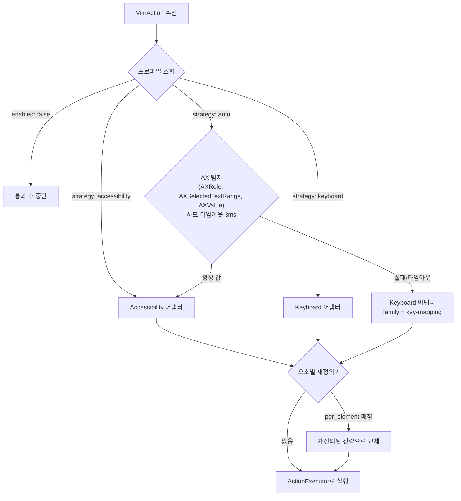

# 전략 디스패치

- **Last updated**: 2026-07-12

## 현재 구조

엔진에서 온 각 `VimAction`은 전략 디스패처가 앱별 프로파일과 AX 자동 감지(하드 타임아웃 3ms)를 통해 **Accessibility 어댑터** 또는 **Keyboard 어댑터** 중 하나로 라우팅한다. Keyboard 어댑터는 `key-mapping`(요소 인식, 선호 폴백)과 `force-text`(요소 감지 우회, 최후 수단) 두 계열을 가진다.

### 선택 플로우 (VimAction마다 실행)

### Accessibility 어댑터

`VimAction` → AX 호출 변환. 예: `move(.charLeft)` → `kAXSelectedTextRangeAttribute`를 `(location-1, 0)`으로 설정, `delete(.line)` → 줄 범위 얻어 `kAXSelectedText`를 `""`로 설정, `yank(.selection)` → `kAXSelectedText` 읽어 `NSPasteboard`에 쓰기.

### Keyboard 어댑터 — 요소 계열(element family)

같은 `VimAction`이라도 리졸버가 보고한 요소 계열(TextArea / TextField / List·비텍스트)에 따라 다른 `CGEvent` 시퀀스를 낸다. 키 시퀀스가 요소 타입마다 다르게 동작하기 때문 (예: `delete(.line)`은 TextArea에서 `Cmd-Left, Shift-Down, Cmd-X`, TextField에서 `Cmd-A, Delete`).

- **key-mapping 계열**: 리졸버를 참조해 요소 인식 시퀀스 선택. AX 불가 시 자동 감지가 사용하는 기본 폴백.
- **force-text 계열**: 항상 TextArea 시퀀스 사용. 프로파일 명시 선택 전용, 자동 감지 금지.

### 포커스/컨텍스트 리졸버

`(bundleID, focusedRole, selectedRange)` 튜플을 캐싱해 키 입력마다 AX를 재탐지하지 않는다. 캐시 무효화 시점: 포커스 변경 시(`AXObserver`의 `kAXFocusedUIElementChangedNotification`, `NSWorkspace`의 앱 활성화 알림), 그리고 캐럿을 이동시킨 것으로 알려진 Keyboard 전략 동작 후.

## 불변식·계약

- AX 자동 감지는 하드 타임아웃(3ms)을 절대 초과하지 않는다 — 응답 없는 AX 호출이 이벤트 탭 전체를 멈추게 하면 안 된다.
- `force-text`는 프로파일에서 명시적으로만 선택하며, 자동 감지가 선택하는 일은 없다.

## 근거 요약

올바른 AX 앱에서는 AX가 정밀하지만 너무 많은 앱이 AX 지원을 거짓말하므로, 자동 감지 + Keyboard 폴백의 이중 전략이 필요하다.

- 관련 결정: [20260712_ax-keyboard-strategy-dispatch.md](../../decisions/references/20260712_ax-keyboard-strategy-dispatch.md)

## 미결 질문 (결정 시 decisions에 기록 후 이 파일 갱신)

- 일회성 Accessibility → Keyboard 다운그레이드 수정 키 (kindaVim의 `fn` 방식) — 채택 여부와 키 선택.
- "AX 거짓말" 감지 휴리스틱 (왕복 테스트, 번들 거부 목록) — `strategy: auto` 신뢰 전 결정.
- `key-mapping` → `force-text` 자동 폴백 휴리스틱 존재 여부.

## 관련

- 선택 알고리즘 요구사항: 워크스페이스 `docs/prd.md` §9
- 프로파일 스키마: [profiles-and-config.md](profiles-and-config.md)
- 실행/재진입: [reentrancy-and-safety.md](reentrancy-and-safety.md)
- 테스트: 기록된 `AXUIElement` 픽스처로 회귀 테스트, 어댑터는 골든 출력 테스트 (워크스페이스 `docs/architecture.md` §7)
