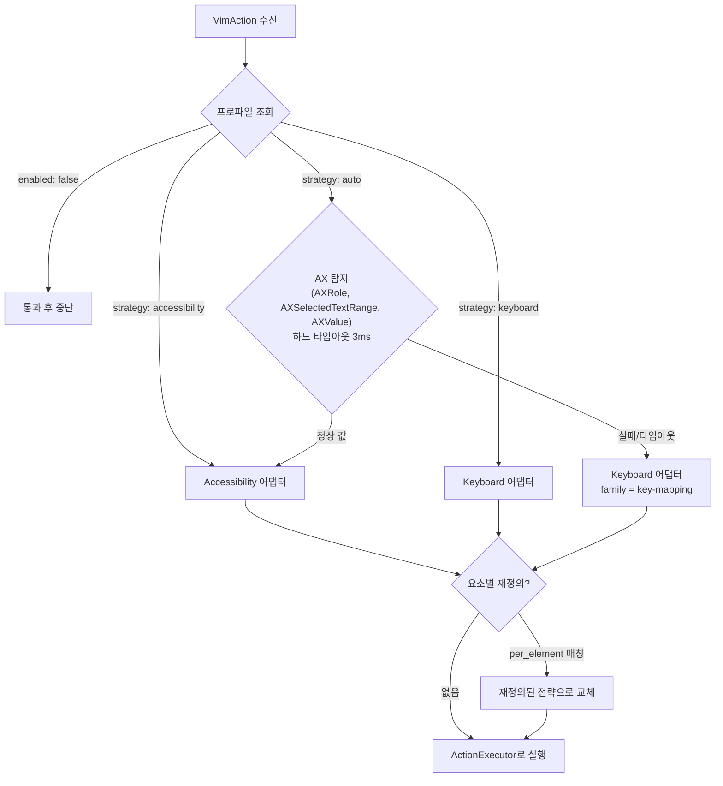

# 전략 디스패치

- **Last updated**: 2026-07-26

## 현재 구조

엔진에서 온 각 `VimAction`은 전략 디스패처가 앱별 프로파일과 AX 자동 감지(하드 타임아웃 3ms)를 통해 **Accessibility 어댑터** 또는 **Keyboard 어댑터** 중 하나로 라우팅한다. Keyboard 어댑터는 `key-mapping`(요소 인식, 선호 폴백)과 `force-text`(요소 감지 우회, 최후 수단) 두 계열을 가진다.

**과도기 상태 (MVP 구간)**: 실행 계층은 **Keyboard 어댑터부터** 구축한다 — MVP 1단계 동안 번들 기본 전략은 `keyboard`(key-mapping) 고정이며, Accessibility 어댑터·`auto` 프로브·force-text는 MVP 이후 1차 확장에서 들어온다. 아래 선택 플로우는 그 확장까지 완성된 최종 상태다 ([20260725_keyboard-first-mvp-build-order.md](../../decisions/references/20260725_keyboard-first-mvp-build-order.md)). 포커스/컨텍스트 리졸버도 같은 순서로 분해 구축된다: 앱 수준(bundleID) → 요소 수준(AXObserver+focusedRole) → AX 프로브.

M2의 최소 디스패처에서 앱 수준 게이트는 **탭 콜백의 엔진 진입 전**에 판정한다: 최전면 앱이 disable 목록(하드코딩, 초기값 `com.mitchellh.ghostty` — M4 프로파일이 교체)이면 번역·엔진 없이 원본 키를 통과시키고, 엔진 모드 상태는 동결한다(리셋 없음). 판정 위치는 마커 가드·마스터 토글 가드 뒤, 번역 앞. 최전면 bundleID는 `@MainActor` 캐시가 `NSWorkspace` 앱 활성화 알림으로 갱신하고 콜백은 캐시만 읽는다 — 디스패치 시점 게이트는 삼킨 뒤 실행만 막아 "죽은 키"가 되므로 기각됐다 ([20260726_m2-app-gate-pre-engine-passthrough.md](../../decisions/references/20260726_m2-app-gate-pre-engine-passthrough.md)).

### 선택 플로우 (VimAction마다 실행)

```mermaid
flowchart TD
    VA[VimAction 수신] --> P{프로파일 조회}
    P -->|"enabled: false"| Pass[통과 후 중단]
    P -->|"strategy: accessibility"| AX[Accessibility 어댑터]
    P -->|"strategy: keyboard"| KB[Keyboard 어댑터]
    P -->|"strategy: auto"| Probe{"AX 탐지<br/>(AXRole, AXSelectedTextRange, AXValue)<br/>하드 타임아웃 3ms"}
    Probe -->|정상 값| AX
    Probe -->|실패/타임아웃| KM["Keyboard 어댑터<br/>family = key-mapping"]
    AX --> Override{요소별 재정의?}
    KB --> Override
    KM --> Override
    Override -->|"per_element 매칭"| Re[재정의된 전략으로 교체]
    Override -->|없음| Exec[ActionExecutor로 실행]
    Re --> Exec
```

### Accessibility 어댑터

`VimAction` → AX 호출 변환. 예: `move(.charLeft)` → `kAXSelectedTextRangeAttribute`를 `(location-1, 0)`으로 설정, `delete(.line)` → 줄 범위 얻어 `kAXSelectedText`를 `""`로 설정, `yank(.selection)` → `kAXSelectedText` 읽어 `NSPasteboard`에 쓰기.

### Keyboard 어댑터 — 요소 계열(element family)

같은 `VimAction`이라도 리졸버가 보고한 요소 계열(TextArea / TextField / List·비텍스트)에 따라 다른 `CGEvent` 시퀀스를 낸다. 키 시퀀스가 요소 타입마다 다르게 동작하기 때문 (예: `delete(.line)`은 TextArea에서 `Cmd-Left, Shift-Down, Cmd-X`, TextField에서 `Cmd-A, Delete`).

- **key-mapping 계열**: 리졸버를 참조해 요소 인식 시퀀스 선택. AX 불가 시 자동 감지가 사용하는 기본 폴백.
- **force-text 계열**: 항상 TextArea 시퀀스 사용. 프로파일 명시 선택 전용, 자동 감지 금지.

모션 매핑은 순수 매퍼 `Motion → [KeyStroke]`(`(keyCode, flags)` 값 타입)가 담당한다 — **배열 반환이 계약**이라 모션 1개를 키스트로크 N개 조합으로 실행하는 확장이 매핑 테이블 원소 교체만으로 된다. CGEvent 변환(keyDown+keyUp 쌍)은 매퍼 밖, 게시 직렬 큐 위에서 한다. Keyboard 전략은 캐럿(문자 사이) 모델이라 macOS에 프리미티브가 없는 곳은 조합·수렴으로 처리한다: `wordForward`(w)는 `Opt-→,Opt-→,Opt-←` 3타, `lineFirstNonBlank`(^·I)는 `Cmd-←,Opt-→,Opt-←` 3타(단어 끝을 지나친 뒤 시작으로 복귀 — 수용 엣지는 결정 문서 참조, 탭 들여쓰기의 ^·I는 Chromium 계열에서 0으로 퇴행), `charRightForAppend`/`lineEndForAppend`는 l·$와 자연 수렴(케이스는 M5 AX용으로 유지) — [20260726_motion-keystroke-mapping-contract.md](../../decisions/references/20260726_motion-keystroke-mapping-contract.md), [20260726_word-forward-first-nonblank-multi-stroke.md](../../decisions/references/20260726_word-forward-first-nonblank-multi-stroke.md), [20260726_tab-indent-first-nonblank-chromium-edge.md](../../decisions/references/20260726_tab-indent-first-nonblank-chromium-edge.md). 합성 이벤트는 keyDown·keyUp 모두 flags를 **명시 대입**한다(빈 flags 포함) — 소스 nil 이벤트의 flags 기본값은 실행 시점의 물리 modifier 상태라, 대입이 없으면 사용자가 누르고 있던 Shift가 새어 들어간다 ([20260726_shift-leak-event-flags-sufficient.md](../../decisions/references/20260726_shift-leak-event-flags-sufficient.md)).

### 포커스/컨텍스트 리졸버

`(bundleID, focusedRole, selectedRange)` 튜플을 캐싱해 키 입력마다 AX를 재탐지하지 않는다. 캐시 무효화 시점: 포커스 변경 시(`AXObserver`의 `kAXFocusedUIElementChangedNotification`, `NSWorkspace`의 앱 활성화 알림), 그리고 캐럿을 이동시킨 것으로 알려진 Keyboard 전략 동작 후.

## 불변식·계약

- AX 자동 감지는 하드 타임아웃(3ms)을 절대 초과하지 않는다 — 응답 없는 AX 호출이 이벤트 탭 전체를 멈추게 하면 안 된다.
- `force-text`는 프로파일에서 명시적으로만 선택하며, 자동 감지가 선택하는 일은 없다.

## 근거 요약

올바른 AX 앱에서는 AX가 정밀하지만 너무 많은 앱이 AX 지원을 거짓말하므로, 자동 감지 + Keyboard 폴백의 이중 전략이 필요하다.

- 관련 결정: [20260712_ax-keyboard-strategy-dispatch.md](../../decisions/references/20260712_ax-keyboard-strategy-dispatch.md)

## 미결 질문 (결정 시 decisions에 기록 후 이 파일 갱신)

- 일회성 Accessibility → Keyboard 다운그레이드 수정 키 (kindaVim의 `fn` 방식) — 채택 여부와 키 선택.
- "AX 거짓말" 감지 휴리스틱 (왕복 테스트, 번들 거부 목록) — `strategy: auto` 신뢰 전 결정.
- `key-mapping` → `force-text` 자동 폴백 휴리스틱 존재 여부.

## 관련

- 선택 알고리즘 요구사항: 워크스페이스 `docs/prd.md` §9
- 프로파일 스키마: [profiles-and-config.md](profiles-and-config.md)
- 실행/재진입: [reentrancy-and-safety.md](reentrancy-and-safety.md)
- 테스트: 기록된 `AXUIElement` 픽스처로 회귀 테스트, 어댑터는 골든 출력 테스트 (워크스페이스 `docs/architecture.md` §7)
