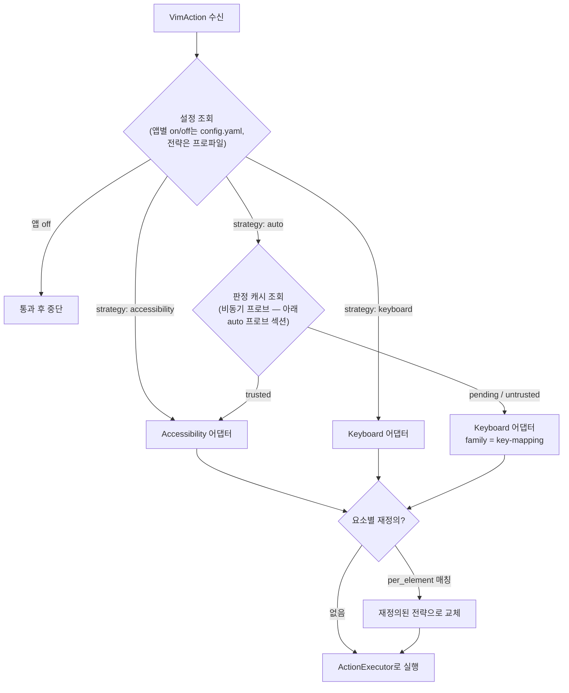

# 전략 디스패치

- **Last updated**: 2026-08-18 (M5 PR-D2 세션 6 — auto 프로브 계층 1에 **브라우저 클래스** 동적 축(https 핸들러 앱 → 즉시 untrusted, `.browser`), 판정 신호에 **요소 기하**(`AXSize` 짧은 변 <4pt → `.geometry`, 확정 답변) 추가. 도그푸딩 실측: Arc URL바 trusted가 웹 콘텐츠로 전염 + Google Docs 숨은 contenteditable(625×1pt)의 조용한 거짓말)

## 현재 구조

엔진에서 온 각 `VimAction`은 전략 디스패처가 앱별 프로파일과 AX 자동 감지(하드 타임아웃 3ms)를 통해 **Accessibility 어댑터** 또는 **Keyboard 어댑터** 중 하나로 라우팅한다. Keyboard 어댑터는 `key-mapping`(요소 인식, 선호 폴백)과 `force-text`(요소 감지 우회, 최후 수단) 두 계열을 가진다.

**과도기 상태 (MVP 구간)**: 실행 계층은 **Keyboard 어댑터부터** 구축한다 — MVP 1단계 동안 번들 기본 전략은 `keyboard`(key-mapping) 고정이며, Accessibility 어댑터·`auto` 프로브·force-text는 MVP 이후 1차 확장에서 들어온다. 아래 선택 플로우는 그 확장까지 완성된 최종 상태다 ([20260725_keyboard-first-mvp-build-order.md](../../decisions/references/20260725_keyboard-first-mvp-build-order.md)). 포커스/컨텍스트 리졸버도 같은 순서로 분해 구축된다: 앱 수준(bundleID) → 요소 수준(AXObserver+focusedRole) → AX 프로브.

M2의 최소 디스패처에서 앱 수준 게이트는 **탭 콜백의 엔진 진입 전**에 판정한다: 최전면 앱이 disable 목록(하드코딩, 초기값 `com.mitchellh.ghostty` — M4에서 `config.yaml`의 앱별 on/off 목록이 교체, [20260801_app-enable-config-yaml-only.md](../../decisions/references/20260801_app-enable-config-yaml-only.md))이면 번역·엔진 없이 원본 키를 통과시키고, 엔진 모드 상태는 동결한다(리셋 없음). 판정 위치는 마커 가드·마스터 토글 가드 뒤, 번역 앞. 최전면 bundleID는 `@MainActor` 캐시가 `NSWorkspace` 앱 활성화 알림으로 갱신하고 콜백은 캐시만 읽는다 — 디스패치 시점 게이트는 삼킨 뒤 실행만 막아 "죽은 키"가 되므로 기각됐다 ([20260726_m2-app-gate-pre-engine-passthrough.md](../../decisions/references/20260726_m2-app-gate-pre-engine-passthrough.md)).

### 선택 플로우 (VimAction마다 실행)

```mermaid
flowchart TD
    VA[VimAction 수신] --> P{"설정 조회<br/>(앱별 on/off는 config.yaml,<br/>전략은 프로파일)"}
    P -->|"앱 off"| Pass[통과 후 중단]
    P -->|"strategy: accessibility"| AX[Accessibility 어댑터]
    P -->|"strategy: keyboard"| KB[Keyboard 어댑터]
    P -->|"strategy: auto"| Probe{"판정 캐시 조회<br/>(비동기 프로브 — 아래<br/>auto 프로브 섹션)"}
    Probe -->|trusted| AX
    Probe -->|"pending / untrusted"| KM["Keyboard 어댑터<br/>family = key-mapping"]
    AX --> Override{요소별 재정의?}
    KB --> Override
    KM --> Override
    Override -->|"per_element 매칭"| Re[재정의된 전략으로 교체]
    Override -->|없음| Exec[ActionExecutor로 실행]
    Re --> Exec
```

### auto 전략 프로브 (M5 D2 설계 확정 — 구현은 PR-D2)

`strategy: auto`(파싱은 D2에서 정식 추가 — [20260813_auto-parsing-in-d2.md](../../decisions/references/20260813_auto-parsing-in-d2.md)) 앱의 라우팅은 **비동기 캐시 판정**이다: 리졸버 밖의 **별도 협력자**가 전용 직렬 큐에서 판정하고(`AXRead` 50ms 상속 — 콜백·메인 스레드 AX 무접촉 불변식 유지), 결과는 `@MainActor` 판정 캐시에 실린다. **캐시 키·수명은 pid**(앱 실행 1회)다 — 앱 재시작이 곧 재프로브이고, 번들 ID(게이트)와 pid(리졸버)가 별개 옵저버 캐시라 생기는 앱 전환 어긋남 창도 pid 조회가 원리적으로 닫는다. 콜백은 스냅샷 시점에 `(profile.strategy, verdict[pid]) → 실효 전략`을 **순수 함수로 접어** `DispatchContext`에 싣고, `usesAXWrite`는 접힌 전략만 본다(판정 단일 지점 계약 불변) ([20260813_auto-probe-async-cached-verdict-pid-lifetime.md](../../decisions/references/20260813_auto-probe-async-cached-verdict-pid-lifetime.md)).

**판정 계층 — default-deny, 전부 통과해야 trusted** ([20260813_ax-lie-detection-read-attestation-settable.md](../../decisions/references/20260813_ax-lie-detection-read-attestation-settable.md)):

1. **계층 1 — AX 무접촉 탈락, 두 축** (둘 다 즉시 untrusted·재시도 없음·pid 수명 종단, **auto 판정에만 적용** — 명시 `strategy: accessibility`가 이기며 override는 `.notice` 1회): ⓐ **거부 목록**(`.denyList`) — 코드 상수, 초기값 `{notion.id}`, 등재 기준은 "프로브 신호가 잡지 못함이 실측된 거짓말 앱" ([20260813_ax-trust-deny-list-code-constant.md](../../decisions/references/20260813_ax-trust-deny-list-code-constant.md)). ⓑ **브라우저 클래스**(`.browser`) — 정적 목록이 아니라 **LaunchServices의 https URL 핸들러 등록 앱** 집합(`NSWorkspace.urlsForApplications(toOpen:)`, 앱 시작 시 1회 계산해 프로버에 주입 — 테스트 기본은 빈 집합, 라이브 조회는 `forCurrentEnvironment()` 프로덕션 분기뿐). 근거는 pid 판정이 브라우저의 요소 이질성(URL바 = 네이티브·정직, 웹 콘텐츠 = 사이트마다 다른 편집기)을 못 담는다는 실측 — URL바에서 얻은 trusted가 같은 pid의 웹 콘텐츠로 전염해 Google Docs에서 조용한 거짓말이 났다. 잃는 것은 URL바 AX뿐이고, 요소가 https `AXWebArea` 하위인지 보는 per-element 판정은 PR-E `per_element`로 이월 ([20260818_browser-class-auto-untrusted.md](../../decisions/references/20260818_browser-class-auto-untrusted.md)).
2. **요소 실증** — 포커스 요소 존재 + `AXSelectedTextRange` 속성 노출. **리졸버 family 값은 재사용하지 않는다**(폴백이 `.textArea` 허용 방향) — 같은 검사를 default-deny 방향으로 재실행하되, 신호 수집은 리졸버가 이미 하는 속성 목록 패스에 얹을 수 있다(값이 아니라 패스의 재사용). **콜드 형태 실패(요소 없음·미노출·읽기 실패 — settable=false 단독 제외) 시 그 앱에 `AXManualAccessibility=true`를 1회 쓰고 유계 재시도** — Electron 트리 기상. 기상을 쓴 실행은 재시도 4회·지수 백오프(200/400/800/1600ms, 누적 ~3s — 프로브 전용 큐 위), 이미 깨운 앱의 재프로브는 2회·백오프다. 트리거가 계층 2 탈락 한정이 아닌 이유는 도그푸딩 실측(2026-08-14): Chromium auto-disable은 "요소는 보이는데 읽기만 콜드"인 **반콜드**로 나타나 계층 3에서 떨어지고, 그때 기상이 안 나가면 프로브가 매번 활성화 지연(수 초)과의 레이스에 진다 ([20260814_probe-wake-on-cold-form-and-backoff.md](../../decisions/references/20260814_probe-wake-on-cold-form-and-backoff.md)). 기상 자체의 실측(2026-08-13): 기상 상태의 Slack은 포커스 `AXTextArea` + 읽기 전부 success + 쓰기 왕복 10/10(수렴 p50 10.6ms)로, 기존 "미노출" 실측은 전부 수면 상태 측정이었다 ([20260813_electron-tree-wake-on-probe-failure.md](../../decisions/references/20260813_electron-tree-wake-on-probe-failure.md)).
3. **요소 기하 실증**(`.geometry`) — 포커스 요소 `AXSize` 1회 읽기, **짧은 변 4pt 미만 또는 미노출이면 untrusted**. 숨은 입력 편집기(캔버스 렌더 + 숨은 contenteditable/textarea — Google Docs 실측 625×1pt, 제로폭 공백 값)는 요소·읽기·settable을 전부 통과하고 되읽기도 일치해 런타임 강등·되읽어 검증까지 사각이라, 기하만이 갈라 준다(정상 요소는 한 줄짜리도 16pt 이상 — VS Code Monaco 800×23pt 실측). **확정 답변**이라 콜드 형태가 아니다 — 재시도·Electron 기상 없음(settable=false 단독과 같은 편) ([20260818_hidden-input-geometry-signal.md](../../decisions/references/20260818_hidden-input-geometry-signal.md)).
4. **읽기·쓰기 가능성 실증**(`.readWrite`) — `selectedRange` 값·`characterCount`·`StringForRange` 창 읽기 + **`AXUIElementIsAttributeSettable(selectedTextRange)`**(무돌연변이 쓰기 축). **값을 바꾸는 쓰기 왕복은 없다** — 진짜 적용 검증은 값 변경이 필요해 캐럿·활성 선택·IME·타이핑 레이스가 전부 프로브 위험이 된다. visible 정합 검사도 없다(짧은 문서 오탐 실측, 소비자는 `provenViewport`가 하류에서 가드).

**판정 수명과 강등**: pending(캐시 부재)·untrusted = key-mapping(완전 기능 — auto는 점진 강화), trusted = accessibility와 동일 라우팅. **프로브는 trusted 방향으로만 캐시를 움직이고, 반증은 런타임 증거뿐이다**: auto가 라우팅한 실행의 `.axUnavailable`이 **슬라이딩 창 안 임계**(10초 안 3회 — 도그푸딩 조절값 상수, `FailureBurstCounter` 재사용. 결정 문언 "연속 N회"의 창 근사 — 신호가 execute당 최대 1건이고 표적 실패는 지속 상태라 실질 동일, 성공 리셋 seam을 새로 뚫지 않는다·사용자 확정)에 닿으면 untrusted(`.runtime`)로 강등한다(pid 수명 sticky — 왕복 없음). 진입점은 `update`(프로브 전용·단조성 가드)와 **나란한 별도 간선 `noteAutoAXUnavailable`**(신호는 어댑터 `.axUnavailable` 분기 → 게시 큐 시각 캡처 → main hop — `reportFailure` 선례 동형)이고, 강등은 **종단**이다 — 활성화 재장전과 늦게 착지한 프로브의 상향 덮어쓰기 모두 거부 목록과 같은 가드(`Entry.isTerminal`)가 막는다. 실패한 액션은 현행대로 접고 **다음 액션부터** keyboard라 "쓰기 후 폴백 금지"와 충돌하지 않는다. 되읽어 검증 불일치는 강등 신호가 아니다(정상 앱의 사용자 개입 49건 실측 — 관측 버킷만) ([20260813_auto-trusted-runtime-demotion-and-observability.md](../../decisions/references/20260813_auto-trusted-runtime-demotion-and-observability.md)). untrusted(비종단)는 앱 활성화에서 재장전된다. **트리거는 그 앱의 첫 `.replace` 디스패치**(콜백은 플래그만 세우고 프로브는 큐에서) — vim 키를 안 쓰는 앱은 왕복 0건이고, 기상 개입도 그 앱들에 한정된다. 마스터 토글 off·config.yaml off 앱은 프로브를 돌리지 않고, 설정 리로드는 판정 캐시를 비운다. keyboard로 진입한 Visual 세션 중 판정 착지는 세션 경로 pin이 이미 막는다(진입 시점 고정 — 아래 Visual 문단). **AX로 pin된 Visual 세션 × 강등의 교차는 미결 질문**(아래) — pin이 세션 수명이라 강등 뒤에도 확장·전환이 재진입 전까지 `.skipped`(DEBUG 전용)로 남는다. 단 그 세션의 파괴 축인 `.edit(op, .selection)`만은 위임 직전 재검증 가드가 **강등 뒤에도** 잡는다(가드 기준이 실효 전략이 아니라 `sessionPath`다 — 아래 가드 문단).

**관측**: 판정 전이(번들 ID + 판정 + 탈락 계층)·auto발 `.axUnavailable` 요약(어댑터 `.axUnavailable` 분기에서 **auto 유래일 때만** 상시 — 출처 라벨 포함. 명시 accessibility의 같은 스킵은 현행 DEBUG 그대로라 어느 쪽에서도 섞이지 않는다·사용자 확정)·강등 이벤트(강등 1줄이 판정 전이와 강등 이벤트 관측을 겸한다)·**untrusted 프로브 완료**(신호 Bool 5종(요소·노출·기하·읽기·settable) + 기상 여부 + 재프로브 횟수 — untrusted → untrusted 재프로브는 전이가 아니라 전이 로그의 사각이었다)가 **릴리스에서 생존·디스크 영속되는 `.notice`** 다(`log show` 사후 회수 — 기본값 전환 게이트와 거부 목록 성장의 판정 데이터. `.info`는 macOS가 영속하지 않음이 실측돼 승격 — [20260814_observation-notice-promotion-and-probe-completion-log.md](../../decisions/references/20260814_observation-notice-promotion-and-probe-completion-log.md)). 메뉴바가 최전면 앱의 현재 판정을 표시한다 — "Frontmost:" 줄 아래 `Strategy: AX / Keyboard / probing…` 1줄(`strategyStatusText(declared:verdict:)` 순수 함수 — 접기는 pending·untrusted를 못 가른다), **pid는 게이트 비자신 (bundleID, pid) 짝**(메뉴 열림의 자기 pid 오표시 봉쇄 — [20260814_menu-verdict-pid-from-gate-non-self-pair.md](../../decisions/references/20260814_menu-verdict-pid-from-gate-non-self-pair.md)), 프로버는 `@Observable`(게이트와 같은 근거 — 발화는 실제 전이에만).

**선택 보고 진실성 축은 프로브가 원리적으로 못 본다**(프로브 시점에 살아 있는 선택이 없다 — Notion 블록 경계 `[0,0)` 실측이 이 축) — 검출자는 런타임 Visual 자가 검증과, **AX 세션의 `.edit(op, .selection)` 위임 직전 선택 재검증 1회**다. 구현은 `mapping`의 `.edit` 분기 최상단(부수효과 `recordEditWise`보다 앞) — 가드 기준은 실효 전략이 아니라 `visualAnchor.sessionPath == .accessibility`라 런타임 강등 뒤에도 발동하고(pin된 화면 선택은 여전히 AX가 쓴 범위), 읽기는 그 액션의 확대 창 lazy 읽기(`axText.value()` — AX 경로에서는 memo 공유라 추가 왕복 0건)이며 술어는 기존 `validated(against:processID:)` 재사용이다. 읽기 실패 = 정직한 스킵(상태 유지 — 폐기 트리거 아님, DEBUG 로그), 불일치 = 상태 폐기(+pin 생존) + 정직한 스킵(**상시 `.notice`** + 번들 ID — "가드 불일치가 잦으면 수렴 폴링 재검토"의 판정 데이터, [20260814_visual-guard-mismatch-log-info.md](../../decisions/references/20260814_visual-guard-mismatch-log-info.md)). keyboard 세션은 가드 밖·현행 그대로다. 앱이 우리가 쓴 범위를 재정규화한 위의 맨 `Cmd-X`가 앱의 선택을 자르는 파괴 경로를 닫는다 ([20260813_visual-selection-edit-pre-delegation-guard.md](../../decisions/references/20260813_visual-selection-edit-pre-delegation-guard.md)).

**번들 기본 전략은 `defaultStrategy` 단일 상수**다 — 파서 기본값(필드 없음)과 프로파일 부재 경로가 함께 소비하고, `ResolvedProfile.empty`(builtIn 재조회 센티널)는 keyboard로 남는다. keyboard → auto 전환은 **D2 마지막 단계의 별도 커밋**(opt-in 도그푸딩 게이트, 문제 시 전환만 철회) ([20260813_bundled-default-strategy-auto-flip-gated.md](../../decisions/references/20260813_bundled-default-strategy-auto-flip-gated.md)).

### Accessibility 어댑터 (M5 D1 설계 확정 — 구현은 PR-D1a·D1b)

실행 수단은 **범위/캐럿 쓰기(`AXSelectedTextRange`) 하나뿐**이다 — 텍스트 쓰기(`AXSelectedText`)는 채택하지 않았다. 클립보드를 채우는 주체가 앱(`Cmd-X`/`Cmd-C`)이어야 리치 클립보드·앱 undo 스택 등록이 보존되고, 명시 클립보드 쓰기·2단계 쓰기 부분 실패가 통째로 소거된다 ([20260808_ax-edit-select-then-operator-delegate.md](../../decisions/references/20260808_ax-edit-select-then-operator-delegate.md)). 쓰기는 **`AXWriter`가 단독 소유**한다(프리미티브당 단일 통로 — [reentrancy-and-safety.md](reentrancy-and-safety.md)): seam은 `@Sendable (AXUIElement, String, CFTypeRef) -> AXError`, 요소는 반드시 `AXRead.focusedElement` 경유(50ms 상수 상속)로 액션당 1회 lazy·memo이며, 읽기·계산·쓰기가 **같은 요소 핸들·같은 게시 큐에서 동기**라 keyboard의 "낡은 읽기" 문제가 구조적으로 없다 ([20260808_ax-writer-per-primitive-channel.md](../../decisions/references/20260808_ax-writer-per-primitive-channel.md)).

**위임 표** — 골격 규칙은 "명령 매퍼 계열 = 위임, 모션·편집·Visual 매퍼 계열 = AX" ([20260808_ax-delegation-table-single-driver.md](../../decisions/references/20260808_ax-delegation-table-single-driver.md)):

| 액션 | 실행 |
|---|---|
| `.move` (j/k 제외 + append 2) | AX 캐럿 쓰기 |
| `.move(.lineUp/.lineDown)` | 위임 — 오프셋 대입은 희망 열(desired column)을 잃는다 |
| `.edit` 전 범위 | 하이브리드 — AX 범위 선택(**되읽어 검증** 후) + `Cmd-X`/`Cmd-C` 1타 위임. yank collapse는 **게시 `←`** — 정확 선택 위라 착지가 곧 범위 시작이고, AX 캐럿 쓰기는 게시를 상시 이겨 빈 복사가 됨이 실측됐다 ([20260808_ax-collapse-posted-arrow-not-caret-write.md](../../decisions/references/20260808_ax-collapse-posted-arrow-not-caret-write.md)) |
| Visual 4종 | AX 범위 쓰기 |
| `.clearSelection` | **게시 `←` 유지** — `[yank, clearSelection]`에서 동기 AX 쓰기가 `Cmd-C` 게시를 상시 이긴다(위 결정과 같은 실측) |
| `.openLine` | 하이브리드 — AX 위치 접두(**논리** 줄 끝/줄 시작) + `Return` 위임(`O`는 `Return, ↑`). 자동 들여쓰기·리스트 연속은 Return만 태우고, `.textField` 게이트는 위임분 안에 있다 |
| `.paste` | 하이브리드 — AX 위치 접두 + `Cmd-V`×count 위임. **마지막 줄(뒤 개행 없음)의 linewise after는 문서 끝 캐럿 + `[Return, Cmd-V]` 원자 그룹** — naive 문서 끝 캐럿은 병합 훼손이 실측됐고, 끝 개행 1개 편차를 수용한다 ([20260808_last-line-linewise-paste-return-synthesis.md](../../decisions/references/20260808_last-line-linewise-paste-return-synthesis.md)). 단 **그 합성만은 `o`/`O`와 같은 두 게이트를 지난다** — 계열 `.textField`(단일행 필드는 상시 이 경로인데 `Return`이 submit이다)와 프로파일 `open_line: disabled`(사용자 지시). 어느 쪽이든 위임으로 강등하며 결과가 현행 `P` 퇴행이라 새 위험이 없다 ([20260809_newline-synthesis-gates.md](../../decisions/references/20260809_newline-synthesis-gates.md)) |
| `.undo`/`.redo` (AX API 없음) · `.scroll` | 위임 |
| quote/pair | 양쪽 미지원 유지 (패리티만) |
| 계열 `.nonText`/`.unresolved` | **전 액션 keyboard 강등** — AX 대입은 텍스트 요소 전제(Finder 리스트에서 무동작) |

하이브리드·위임은 **액션 단위 all-or-nothing**이다. 순서는 항상 "동기 AX 쓰기 → 게시"이며, 그 안전 근거는 구조 보장이 아니라 **지연 마진 + 되읽어 검증**이다 — 쓰기 `.success`가 적용 완료를 뜻하지 않는 앱이 실측됐고(Notion 적용 ~10ms 비동기), 적용이 게시 소비(~25ms)보다 빨리 수렴하는 마진 위에서 검증이 어긋난 앱을 잡는다. 역방향("게시 → 동기 AX 쓰기")은 **상시 역전**이 실측돼 금지다 — collapse 계열이 게시 `←`로 남는 이유다(위 표). **접두 실패는 세 축으로 갈린다**: 오프셋 증명 실패(`unproven`)만 keyboard 위임(쓰기 시도 전이라 이중 실행 불가 — 액션 통째, 맨 `Cmd-V`/`Return` 금지), 요소·읽기 실패는 `.axUnavailable` 스킵, 쓰기 시도 후 실패·검증 실패는 폴백 없음(아래) ([20260808_hybrid-prefix-failure-axes-clarified.md](../../decisions/references/20260808_hybrid-prefix-failure-axes-clarified.md)). **접두 쓰기(및 되읽어 검증)와 첫 게시 그룹 사이에는 중단 질의가 없다** — 원자 그룹 ④, 편집에서 살아 있는 선택이 잔류하는 창을 닫는다 ([20260808_hybrid-prefix-atomic-with-first-group.md](../../decisions/references/20260808_hybrid-prefix-atomic-with-first-group.md)). `unproven` 편집 위임은 이미 읽은 AX 창(4096)의 `FocusedText`를 keyboard 정확화에 그대로 전달한다 — 한 액션은 창을 한 번만 읽는다 ([20260808_ax-unproven-edit-delegation-reuses-ax-window.md](../../decisions/references/20260808_ax-unproven-edit-delegation-reuses-ax-window.md)). AX 접두는 합성 이벤트가 아니라 드롭 모드가 없어 페이싱 비대상. 비-QWERTY 게이트·치환은 위임 행에만 적용된다(`requiredCommandCharacters`가 실행 계획 인지).

**되읽어 검증**(**하이브리드 전체** — 위임 그룹 게시 전 접두 착지 확인)은 **신선한 선택 전용 재읽기의 수렴 폴링**이다. 접두가 캐럿 이동뿐인 `.openLine`·`.paste`도 예외가 아니다 — 검증을 빼면 낡은 캐럿 위에서 `Cmd-V`·`Return`이 터져(`.appendingLine`에서는 줄 분리) "비파괴"라는 전제가 무너지고, 규칙을 액션별로 가르면 원자 그룹 ④와 같은 이유로 표가 된다 ([20260809_hybrid-insertion-readback-verify-kept.md](../../decisions/references/20260809_hybrid-insertion-readback-verify-kept.md)). 검증 없이 쓰기만 하는 것은 뒤에 아무것도 게시하지 않는 `.ax` 캐럿 모션뿐이다. 형태는: `AXWindowSnapshot` memo를 재사용하지 않고(쓰기 전 값이라 검증이 장식이 된다) `AXSelectedTextRange`만 다시 읽으며, 쓴 범위와 일치할 때까지 간격 2ms·총 상한 40ms(도그푸딩 조절값 — Notion 수렴 ~10ms 실측의 3~4배 마진)를 기다린다. 상한 도달 = 검증 실패이며 **무동작 스킵 + execute 잔여 중단**(보고 아님 — 파괴는 시도 전), 로그는 전용 버킷 상시 `.notice`(번들 ID 포함 — Visual 양단 검증 승격·오프셋 공간 판정의 사후 회수 데이터)다. 이 검증은 Notion의 서로게이트 mid-pair 쓰기를 잡지 못하므로(쓴 값 == 읽은 값) grapheme 경계 불변식이 그 축의 유일한 방어선이라는 전제는 그대로다 ([20260808_ax-readback-verify-convergence-poll.md](../../decisions/references/20260808_ax-readback-verify-convergence-poll.md)).

**오프셋 산출은 `FocusedTextOffsets`**(순수 함수 계층 — `FocusedTextAnalysis` extension 확장 금지: `RunClass`가 갈린다 — Analysis는 비ASCII `other`(포기 방향), Offsets는 `keyword`(CJK `w`/`diw` 성립). UTF-16 배관은 `offsetInWindow` internal 승격으로 공유하되 **스캔 단위는 `Character`(grapheme cluster)** 다 — 산출이 항상 클러스터 경계 위여야 하고 `\r\n`이 한 `Character`라 떠돌이 `\r`가 원천 소거된다. **캐럿 자체가 경계 위가 아니면 아무것도 증명하지 않는다**). 입력은 `FocusedText` 창이되 **AX 쓰기 경로 전용 확대 반경**(`FocusedTextReader.axWindowRadius` = 4096 UTF-16 — 실측 확정, keyboard 경로 256 불변)을 쓴다. 창 읽기는 `AXWindowSnapshot`이 담당하며 **pid가 아니라 `AXElementSnapshot`의 요소를 받는다** — 오프셋을 계산한 읽기와 뒤따르는 쓰기가 같은 핸들을 써야 `AXWriter`의 요소 수신 계약이 성립한다(덤으로 액션당 `focusedElement` 왕복이 1회다). 반환은 3상태(`.invalid` = Vim 무효 → 스킵 / 범위 → AX 쓰기 / `.unproven` → keyboard 위임).

**커서 모델은 캐럿 그대로다** — 목표 오프셋은 지금 keyboard가 겨냥하는 자리이고(`e` = 단어 마지막 글자 **뒤**, `$`·`A` = 줄 끝 캐럿, `gg` = 오프셋 0, `G` = `characterCount`), 캐럿 모델에서 `l`/`a`와 `$`/`A`는 각각 같은 목표다. AX가 정확하게 만드는 것은 **단어 경계 정의**(`RunClass` 기반 Vim 시맨틱 — `foo.bar`의 `w`가 `.`에 선다)와 `^`(탭 들여쓰기 퇴행 소멸)뿐이며, Vim 자체가 no-op인 자리(줄 시작 `h`·줄 끝 `l`·문서 시작 `b`·문서 끝 `w`/`e`, 그리고 일반 규칙 "목표 == 현재 캐럿")만 `.invalid`다. 블록 커서 모델 전면 채택은 `.edit` 범위·정확화 표·D1b 편집 배선까지 재조정을 요구해 기각됐다 ([20260808_ax-motion-caret-model-vim-word-definition.md](../../decisions/references/20260808_ax-motion-caret-model-vim-word-definition.md)). 살아 있는 선택 위에서는 캐럿이 애매하므로 증명하지 않는다.

산출 함수는 **캐럿 1종 + 구간 5종**이며 반환 타입이 둘로 갈린다. `Target`(캐럿)·`Span`(구간)은 동형 3상태(`.invalid`/값/`.unproven`)이고 "목표 == 현재"를 `.invalid`로 접지만, **`Insertion`(삽입 위치)에는 `.invalid`가 없다** — `o`·`O`·`p`·`P`는 Vim에서 무효인 자리가 없고, 줄 끝의 `o`는 목표 == 캐럿이면서 유효하기 때문이다(같은 타입을 쓰면 접는 헬퍼를 재사용하는 순간 `o`가 조용히 죽는다). `Insertion`의 셋째 케이스 `.appendingLine`이 마지막 줄 linewise `p`의 `Return` 합성 지시를 타입으로 실어 나른다 — 조건은 **뒤 개행이 없는** 마지막 줄이다. 캐럿이 끝 개행 **뒤**(빈 마지막 줄)에 있으면 구분 개행이 이미 있으므로 `.at`이며, 거기서 합성하면 빈 줄이 하나 더 생겨 keyboard 경로보다 나빠진다(`dd` 뒤 `p`가 그 자리다).

| 함수 | 담당 | 반환 |
|---|---|---|
| `caretTarget(for:in:)` | `.move` 모션 목표 | `Target` |
| `editSpan(for:range:in:)` | `.edit` 전 범위 — `.motion`·`.line`·`.linewiseMotion`·`iw`, `cw` 리타깃 포함 | `Span` |
| `openLineInsertion(above:in:)` | `o`(줄 끝) / `O`(줄 시작) | `Insertion` |
| `pasteInsertion(before:wise:in:)` | `p`/`P` 삽입점 + 마지막 줄 분기 | `Insertion` |
| `visualEntrySelection(linewise:in:)` | `v`(캐럿 글자 1개) / `V`(논리 줄 + 종결자) | `Selection` |
| `visualExtendSelection(for:anchor:in:)` | `extendSelection` — 앵커 + 포커스 끝 | `Selection` |
| `visualSwitchSelection(toLinewise:anchor:in:)` | `v`↔`V` 전환 — 양방향 | `Selection` |

`editSpan`이 `(op, range)` 단일 진입점인 것은 `cw` 리타깃이 `EditKeyMapper.retargeted`와 같은 자리에서 한 번만 일어나야 판정과 실행이 갈라지지 않기 때문이고, Visual 3종이 `VisualAnchorState`를 통째로 받는 것은 포커스 끝 도출(`side`)·희망 열·원래 캐럿이 전부 범위 산술의 일부라서다. **Visual만 반환이 `Span`이 아니라 `Selection`(범위 + 새 논리 앵커 + 새 희망 열)인 것도 같은 이유다** — 매 액션이 세션 상태를 갱신하는 유일한 어휘라 범위만으로는 다음 상태를 세울 수 없다(`v`→`V` 후진형의 새 앵커는 앵커 줄 시작이라 범위의 끝점이 아니라 한가운데다). `side`·`pinnedEnd`는 범위와 앵커에서 도출되므로 싣지 않으며, 그 도출 규칙은 `VisualAnchorState.moved(to:anchor:column:)` 한 곳에 있다. `.selection`·`aw`·quote/pair는 `.unproven`(위임 = 현행 keyboard와 바이트 동일)이며, `.selection`의 위임 결과가 정확히 `Cmd-X`/`Cmd-C` 1타라 의미까지 맞는다. 살아 있는 선택 위의 편집·삽입은 전부 `.unproven`(출발점 미증명 — 정확화 표의 공통 조건)이고, Visual 확장만 그 선택을 입력으로 쓴다.

**답은 정확화 표와 같되, 표가 침묵하는 자리는 Vim 정확값이다** ([20260809_ax-span-vim-exact-where-table-is-silent.md](../../decisions/references/20260809_ax-span-vim-exact-where-table-is-silent.md) — Vim 실측 14건): 줄 마지막 단어의 `dw`는 **개행을 넘지 않으며**(뒤 공백은 줄 끝까지 포함, 카운트가 있으면 클램프는 마지막 스텝에만), linewise 카운트는 **클램프**하고 **모션 성분이 0줄일 때만 무효**다(마지막 줄 `dj`·`2dd`, 첫 줄 `dk`). 마지막 항목은 엣지 2 문언(`위 줄 수 < count → 무효`)이 count 1에서만 참이었다는 실측의 부산물이라, count 2 이상에서 keyboard와 갈린다. `iw`는 2자 이상의 공백·구두점 런까지 정확해져 무상태 시퀀스의 마지막 잔여 엣지가 닫힌다. **Visual 진입에도 무효가 없다** — 빈 줄처럼 잡을 글자가 없으면 `.invalid`가 아니라 `.unproven`으로 강등한다(진입을 스킵하면 엔진은 이미 Visual로 전이한 뒤라 모드와 화면이 어긋난다). charwise 확장은 포커스 **글자**(전진형은 선택 끝 −1자) 위에서 모션을 적용하고 `[min, max+1)`로 합치되, inclusive를 더하지 않는 것은 `e` 하나다 — **`$`·`l`·`j`가 줄 종결자 위에 서면 그 개행까지 문다**(비-마지막 줄 `v$`의 레지스터가 `"ab\n"`, `lvl`도 같다는 Vim 실측: [20260810_visual-inclusive-end-bites-terminator.md](../../decisions/references/20260810_visual-inclusive-end-bites-terminator.md)). **`j`/`k`는 어느 세션에서도 위임이 아니다** — `V` 세션에는 열이 없어 위임 사유가 없고, charwise 세션은 **희망 열(Vim curswant)을 `VisualAnchorState.desiredColumn`에 추적**해 사유를 없앤다: 포커스 = 줄 시작 + `min(희망 열, 줄 길이)`, 수평 모션마다 갱신·`j`/`k`는 물려받음, `$` 뒤는 줄 끝 고정 sentinel(`lineEndColumn`), 열 미상(`gg`/`G` 경유)은 정직한 스킵이다 ([20260810_ax-visual-desired-column-tracked.md](../../decisions/references/20260810_ax-visual-desired-column-tracked.md)). `v`↔`V` 전환도 양방향 정확이다 — `V` 진입이 원래 캐럿을 정확값으로 읽어 두므로 열이 뺄셈이고, keyboard ⑦의 조건부 지원·상한 32·페이싱이 필요 없다 ([20260810_ax-visual-switch-both-directions-exact.md](../../decisions/references/20260810_ax-visual-switch-both-directions-exact.md)).

**단 마지막 줄 linewise(delete/yank)는 앞 개행을 흡수하지 않는다** — 범위는 `[줄 시작, 문서 끝)`이고 빈 줄 1개가 남는다(keyboard와 같은 답). Vim의 레지스터는 구조체(linewise 플래그 + 줄 텍스트)라 버퍼에서 빈 줄을 안 남기면서 레지스터에 `줄\n`을 담지만, **우리 레지스터는 OS 클립보드의 생 텍스트**라 한 번의 `Cmd-X`가 자르는 범위가 곧 레지스터의 모양이다 — 흡수하면 내용이 `"\n마지막줄"`(구분자가 앞)이 되어 `ddp`가 빈 줄을 만들고, `yy`·외부 앱 붙여넣기·wise 휴리스틱(끝 글자만 본다)까지 함께 틀린다(도그푸딩 실측). 표시상 편차보다 레지스터의 정확성을 택한 것이다 ([20260809_no-leading-newline-absorb-clipboard-is-the-register.md](../../decisions/references/20260809_no-leading-newline-absorb-clipboard-is-the-register.md)).

**linewise는 논리 줄**이다 — 소프트 랩 문단의 `dd`가 논리 줄 전체를 지운다(keyboard 수용 엣지의 AX 경로 해소, `dj` ≠ `d`+`j` 편차 명시 수용). `dgg`/`dG`는 끝점 두 개(상수 + 현재 줄 로컬)만 필요해 문서 규모 무관이고, 파라미터화 속성(`AXLineForIndex`/`AXRangeForLine`)은 표시 줄 시맨틱이라 미채택. 산출은 항상 grapheme cluster 경계 위, 줄 종결자는 `\r\n`·`\n`·`\r`·U+2028/2029, 경계 불변식(`location ≥ 0`, `upperBound ≤ characterCount`)은 순수 함수 테스트로 고정 ([20260808_ax-offset-layer-window-logical-lines.md](../../decisions/references/20260808_ax-offset-layer-window-logical-lines.md)).

**실패 처리**: `AXError` 분류는 default-deny 화이트리스트 — D1 실보고는 `.failure`만, `.illegalArgument`(사전 경계 검증 통과 후 거부)는 관측 전용 요약 로그(번들 ID 포함, D1 종료 시 승격 재심사), `.attributeUnsupported`류 = 미지원 스킵, `.invalidUIElement`/`.cannotComplete` = 경합 스킵, 미지 코드 = 미보고 + error 로그. **쓰기 시도 후 실패의 keyboard 폴백은 없다**(이중 실행·어긋난 상태 위 상대 시퀀스 위험). **중단 규칙은 `.success` 외 전부**다 — 나머지도 앱의 정적 성질이거나 50ms 타임아웃 승수라 이어가서 얻는 것이 없고, default-deny가 흐름 제어에도 적용돼 새 코드가 조용히 "계속 진행"으로 흘러들지 않는다. **쓰기 시도 전 단계 실패**(포커스 요소 미노출·창 읽기 실패)는 보고도 폴백도 아닌 스킵이되 역시 execute 잔여를 접으며, `.unproven`(창이 답 못 함 → 위임)과 **별개 축**이라 `Mapping.axUnavailable`로 표현된다 — 물어볼 창이 없는 것을 위임으로 접으면 AX 전략이 조용히 무효화돼 D2가 볼 표본이 사라지고, 접지 않으면 Slack류에서 `100j`가 100×50ms로 게시 큐를 잡는다 ([20260808_ax-pre-write-failure-ends-execute.md](../../decisions/references/20260808_ax-pre-write-failure-ends-execute.md)). 사전 경계 검증 탈락은 우리 계산이 어긋났다는 신호라 요약이 아닌 즉시 error 로그다. AX 스킵은 전용 요약 버킷으로 집계 ([20260808_ax-write-failure-whitelist-no-fallback.md](../../decisions/references/20260808_ax-write-failure-whitelist-no-fallback.md)). 분류(`AXWriteOutcome.classify` — 16 → 7클래스 순수 함수)와 **효과 실행**(`AXWriteEffects` — 보고·요약 로그·버킷, execute 1회 수명)은 갈려 있다: 분류가 로깅까지 하면 표를 테스트로 고정할 수 없고, `AXWriter`가 `AXError`를 raw로 내보내는 이유와 같은 규칙이다. 사전 경계 검증은 `AXWriteOutcome.provenWriteRange`이며 통과 실패는 보고가 아니라 스킵이다. 보고 seam은 어댑터 주입(`KeyboardAdapter(reportExecutionFailure:now:)` → `axWriteEffects(bundleID:)`)이고 시각은 게시 큐에서 캡처한다 — 자세한 배선·로그 레벨은 [reentrancy-and-safety.md](reentrancy-and-safety.md).

**Visual은 세션 단위 경로 고정**: 진입(`beginSelection`) 증명 성공이면 세션 전체 AX, 실패면 세션 전체 keyboard(기존 재앵커 기계). 세션 중간 실패는 그 액션만 정직한 스킵 — **무상태 폴백 금지**(AX가 쓴 범위는 앱의 포커스 끝이 미정의라 무상태 `Shift-→`가 파괴 방향 불확정). 그래서 `.unproven`도 Normal 경로와 달리 위임이 아니라 스킵이고, 요소·읽기 실패만 `.axUnavailable`(execute 잔여 접기)이다. **경로 pin(`VisualAnchorTracker.sessionPath`)은 진입 확정 시점에만 쓰이고 상태 폐기로는 지워지지 않는다** — 자가 검증 실패의 원인 중 하나가 "앱이 우리가 쓴 범위를 정규화·클램프"라 그때 화면에 남은 선택이 AX가 쓴 범위이기 때문이다(TextEdit 클램프 실측). 따라서 검증이 깨진 AX 세션은 재진입 전까지 확장·전환이 전부 스킵이며, `clearSelection`(게시 `←`)은 그대로 동작하고 `.edit(_, .selection)`(위임)은 **위임 직전 선택 재검증 1회**를 거친다(같은 자가 검증 술어 `validated` 재사용 — 상태가 폐기된 세션은 재검증이 설 수 없어 역시 스킵이다. 읽기 실패·불일치 처리와 로그 레벨은 위 auto 프로브 섹션의 가드 문단, [20260813_visual-selection-edit-pre-delegation-guard.md](../../decisions/references/20260813_visual-selection-edit-pre-delegation-guard.md)) ([20260810_ax-visual-session-path-outlives-state-discard.md](../../decisions/references/20260810_ax-visual-session-path-outlives-state-discard.md)). `VisualAnchorTracker`는 두 경로가 공유하고 AX는 `side`·`pinnedEnd`까지 정확값으로 채운다(전략 인수인계 공짜 — 단 포커스 줄 거리는 AX가 추적하지 않아 미상으로 좁힌다). 자가 검증은 AX에서도 유지(단측 + 비어 있지 않음 — 포커스 끝 불일치는 DEBUG 로그만), 확정 부수효과(상태 적용·경로 고정·세션 wise note)는 `confirmVisual` 한 함수가 담당하며 위임은 매핑 확정 시·AX는 쓰기 `.success` 확인 시이되 **`.success`가 적용 완료를 뜻하지 않는 앱이 실측돼**(Notion ~10ms 비동기) 실질 방어선은 다음 액션 읽기의 자가 검증이다 ([20260808_ax-visual-session-path-pinning.md](../../decisions/references/20260808_ax-visual-session-path-pinning.md), 근거 보정은 [20260808_ax-readback-verify-convergence-poll.md](../../decisions/references/20260808_ax-readback-verify-convergence-poll.md)). **프로파일 `motions:` 항목이 있는 모션의 `extendSelection`은 AX 세션에서 정직한 스킵**이다 — 재정의 시퀀스도 무상태 시퀀스라 무상태 폴백 금지의 뿌리가 그대로 적용되고, 사용자 지시("그 키를 쓰지 마라")를 위반하지 않는다 ([20260808_ax-visual-overridden-motion-honest-skip.md](../../decisions/references/20260808_ax-visual-overridden-motion-honest-skip.md)).

**배선은 단일 실행 드라이버**: execute 루프(중단 래치·스냅샷·요약 로그)와 게이트 3종·부수효과(`recordEdit` 등)를 keyboard와 공유하고, `Mapping`에 `.ax`(쓰기 계획)와 `.hybrid`(접두 범위 + 위임 그룹) 형제 케이스를 얹는다. `.hybrid`의 연관값은 `(NSRange, [[KeyStroke]], paced: Bool)`로 **`.groups`와 같은 모양**이며, **원자인 것은 첫 그룹뿐**이다 — 둘째 그룹부터는 `.groups`와 같은 청크·페이싱 루프로 낙하한다(코드로는 분기 끝의 `groups = Array(substituted.dropFirst())` 대입이고, 하이브리드 전용 게시 루프를 두지 않아 청크 규칙이 한 곳에 남는다). 그룹이 여럿인 액션은 `.paste` 하나다(`1000p` = `Cmd-V` 1,000타 — 통짜로 내면 중단 래치가 파고들 틈이 없다). `paced`는 편집·`.openLine`이 `false`, `.paste`가 `true`이며 실효 지점은 `.appendingLine`의 `[Return, Cmd-V]` 한 그룹뿐이다(나머지 paste 그룹은 1타라 페이싱 규칙 밖) — 그 자리가 Notion 0간격 버스트 약점의 재현 지점이다 ([20260809_hybrid-mapping-multi-group-paced.md](../../decisions/references/20260809_hybrid-mapping-multi-group-paced.md)). "AX 어댑터가 keyboard 어댑터를 부른다"(감사 안 되는 둘째 진입점)와 "디스패처가 액션 단위로 어댑터를 가른다"(execute당 계약 분열·하이브리드 표현 불가)는 기각. `paced:`가 `.ax`에 없는 것도 계약이다 — AX 쓰기는 드롭 모드가 없어 페이싱 비대상이고 `paced`는 위임 전용 속성으로 남는다. `PasteWiseResolver`는 현행 계약 그대로다 — 클립보드 주체가 앱이라 델타-1·`recordEdit`(게시 확정 시)이 무변경으로 성립한다. 다만 **하이브리드에서는 "게시 확정"의 자리가 다르다**: 위임(`.groups`)은 매핑 확정이 곧 게시 확정에 가깝지만 하이브리드는 그 사이에 접두 쓰기·되읽어 검증이라는 **설계된 실패 단계**가 있어, 기록은 매핑 시점이 아니라 **실제 게시 뒤**여야 한다. 매핑 시점에 기록하면 검증 불일치로 접힌 편집의 wise가 남고, 델타-1 규칙은 그때 자가 치유하지 못한다 — 뒤이은 외부 복사 1회가 델타를 정확히 1로 만들어 `p`가 나가지도 않은 편집의 wise로 오판된다. 호출 자리는 **액션 무관 단일 지점**(게시 직후)이며 함수 자체가 `.edit` 가드로 시작한다 — `.openLine`·`.paste`에는 옮길 부수효과가 없어 no-op이다. `.paste`의 `pasteWise.resolve()`가 매퍼보다 앞에 남는 것도 계약이다: 기억을 소비하지 않는 **순수 조회**임이 감사로 확정됐고, wise가 접두 삽입점과 위임 그룹 모양을 둘 다 정하므로 뒤로 옮길 수도 없다 ([20260809_paste-resolve-is-pure-lookup.md](../../decisions/references/20260809_paste-resolve-is-pure-lookup.md)).

AX 실행 계획의 판정은 **`usesAXWrite(action:family:profile:)` 한 곳**이며(위임 표의 단일 지점), 넷 중 하나라도 걸리면 현행 keyboard 경로다: 전략이 accessibility가 아님 / 계열이 `.nonText`·`.unresolved` / `j`·`k` / **프로파일 `motions:`에 그 액션이 이름한 모션 항목이 있음**(strokes 재정의든 disable이든 — 재정의는 "이 앱에서 이 모션을 달성하는 방법"이라는 사용자 지시라 AX가 덮어쓰지 않는다. 스크롤 사다리와 같은 우선순위이고, disable은 기존 경로가 `.disabledByProfile`로 정직하게 집계한다 — [20260808_profile-motion-override-outranks-ax.md](../../decisions/references/20260808_profile-motion-override-outranks-ax.md)). **편집에서 넷째 가드의 대상은 "범위가 이름한 모션"까지다** — `dw`의 `w`, `cw`의 리타깃 `e`, `dk`의 `k`. `dd`·`diw`가 내부적으로 쓰는 조합(`lineStart`·`wordBackward` 등)은 사용자가 그 액션에 대해 지시한 모션이 아니고, 거기까지 보려면 `EditKeyMapper`의 시퀀스 조립표가 어댑터로 복사돼 두 곳이 갈라진다. **`.openLine`·`.paste`에는 넷째 가드의 대상이 아예 없다** — `o`의 줄 끝·`p`의 한 칸 오른쪽은 접두의 내부 분해이지 사용자가 그 액션에 대해 이름한 모션이 아니다(`dd`의 `lineStart`와 같은 편). 사용자가 그 두 액션에 대해 지시할 수 있는 것은 `new_line`·`paste` 스트로크이고, 그 둘은 위임분에 남아 매퍼를 그대로 지난다. `actions:` disable은 `mapping` 최상단이라 이 판정보다 앞이다.

드라이버의 `.ax` 처리 순서는 ① `flush()`(**순서 봉인** — 같은 execute의 미게시 위임 이벤트를 먼저 비운다. 게시는 배달만 걸고 돌아오고 AX 쓰기는 대상 앱 런루프까지 동기라, 두고 쓰면 화면 순서가 액션 순서와 뒤집힌다) → ② 중단 래치 → ③ 요소·읽기·`provenWriteRange` → ④ 쓰기·`effects.apply` → ⑤ `.success`가 아니면 반환. `.hybrid`는 그 사이에 둘이 더 낀다 — ③과 ④ 사이에 **위임 그룹의 CGEvent 생성**(만들 수 없으면 접두 쓰기 자체를 하지 않는다), ④와 게시 사이에 **되읽어 검증**. 게시는 래치 질의도 페이싱도 거치지 않고 `executor.post`로 곧장 나간다(원자 그룹 ④ — `flush()`가 `isCurrent()`를 부르므로 그 경로를 지나면 안 된다). 순서 봉인 ①과 쓰기·효과 반영 ④는 두 케이스가 같은 함수를 공유한다 — 감사 경로가 한쪽에서만 바뀌는 일이 없어야 한다. 중단 래치 질의는 액션 사이 + 파괴적 게시 직전(AX 경로에 청크 없음 — keyboard 8타 청크보다 촘촘). `AXWriteEffects`는 execute 진입 시 1개 만들고 `defer { logSummary() }`로 중단 경로까지 덮는다. 반대 방향("게시 → AX 쓰기")의 소비 순서는 미확정이며 D1a에서는 도달 불가여야 해서, 전제가 깨지면 보이도록 DEBUG 감사 로그가 남는다.

### Keyboard 어댑터 — 요소 계열(element family)

`ElementFamily`는 `.textArea` / `.textField` / `.nonText` / `.unresolved` 넷이며 리졸버가 보고한다. 앞의 셋이 판정 결과이고 `.unresolved`는 **앱 전환 직후 첫 읽기가 아직 착지하지 않은 상태**다 — 폴백(`.textArea`)과 구분되는 별개 값이며, 걸러내기에서는 `.nonText`와 같은 편에 선다. **계열은 시퀀스를 다변화하지 않는다 — 걸러낼지만 정한다.** `.textField`는 편집·Visual·붙여넣기·undo에서 `.textArea`와 **같은 시퀀스**를 쓴다: 단일행 필드에서 TextArea 시퀀스가 자연 수렴하고(주소창에서 `Shift-↓`는 끝까지 선택된다), 전용 분기는 role 오보고 시 여러 줄 검색창의 `dd` 1줄 삭제를 전체 삭제로 개악한다 — 실패 방향이 비대칭이다 ([20260801_textfield-edit-sequences-scrapped.md](../../decisions/references/20260801_textfield-edit-sequences-scrapped.md)).

- **key-mapping 계열**: 리졸버를 참조해 요소 인식 시퀀스 선택. AX 불가 시 자동 감지가 사용하는 기본 폴백.
- **force-text 계열**: 항상 TextArea 시퀀스 사용. 프로파일 명시 선택 전용(`keyboard_family: force_text` — 어휘는 `key_mapping`(기본)/`force_text`), 자동 감지 금지 — `key-mapping`→`force-text` 자동 폴백도 없다(20260712 유지 확인). 구현은 실효 계열 치환이다: `KeyboardAdapter.mapping` 진입부(부수효과·게이트보다 앞) **한 곳**의 로컬 `effectiveFamily`(`force_text`면 `.textArea`, 아니면 원본)가 **keyboard 실행 쪽에만** 흐른다 — 걸러내기 게이트·매퍼 호출(`classifyEdit`·`classifyVisual`·`CommandKeyMapper` 3종)·매퍼 내부 `.nonText` 봉쇄·하이브리드 위임분 진입점(`openLineDelegatedStrokes`/`pasteDelegatedGroups`/`pasteStrokeGroups`)이 같은 치환값을 보고, `usesAXWrite`와 AX 분기의 계열 판정(`.nonText`/`.unresolved` 강등, `axVisualMapping`/`axVisualSession`)은 **원본 family**를 유지한다 — 치환이 AX까지 새면 비텍스트 요소에 AX 쓰기가 나가고 `.unresolved` 창(위험 어휘 보류)이 뚫린다. AX 강등·`unproven` 위임이 낳는 keyboard 실행은 같은 `mapping` 호출 안의 순차 낙하라 치환을 자연히 승계한다(force-text는 "이 앱의 role 보고를 믿지 말라"는 사용자 지시라 경로 무관 일관 적용). execute 요약 로그의 계열 표기는 원본이다(리졸버 실측값 보고가 감사 목적). 강등·위임 두 경로의 회귀 테스트는 `KeyboardAdapterForceTextAXTests`가 고정한다 ([20260813_force-text-keyboard-family-substitution.md](../../decisions/references/20260813_force-text-keyboard-family-substitution.md)).

**걸러내기 표** — 계열이 실제로 가르는 전부다:

| 액션 | `.textArea` | `.textField` | `.nonText` | `.unresolved` |
|---|---|---|---|---|
| `.move` · `.scroll` | 게시 | 게시 | **게시** | **게시** |
| `.edit` · Visual 4종 · `.paste` · `.undo` · `.redo` | 게시 | 게시 | `nil` 스킵 | `nil` 스킵 |
| `.openLine` (`o`/`O`) | 게시 | **`nil` 스킵** | `nil` 스킵 | `nil` 스킵 |

`.nonText`에서 모션·스크롤이 살아남는 것은 위험 등급을 가르는 축이 "비텍스트인가"가 아니라 **"앱이 이미 아는 명령인가"** 이기 때문이다. Finder에서 `p`는 파일을 붙여넣고 `u`는 파일 조작을 되돌리는 반면, 화살표는 무해하게 흘러가며 리스트 이동·페이지 스크롤로 유용하다 — 엔진이 이미 키를 삼킨 뒤라 스킵은 네이티브 동작으로의 복귀가 아니라 **완전 무동작**이다. `.scroll`이 명령 매퍼 소속인데도 여기 속하는 것은 그 매퍼에서 유일하게 네이티브 명령에 위임하지 않는 액션(화살표 반복)이기 때문이다 ([20260801_non-text-filter-keeps-motion-and-scroll.md](../../decisions/references/20260801_non-text-filter-keeps-motion-and-scroll.md)). 이것이 [20260730_native-command-non-text-ui-hazard.md](../../decisions/references/20260730_native-command-non-text-ui-hazard.md)가 단계 3에 위임한 구조적 해소다.

`.unresolved`가 `.nonText`와 같은 열인 것은 **모르는 동안은 위험 어휘를 보류한다**는 규칙이다. 실측에서 앱 전환 후 ~15~20ms에 도착한 첫 키는 이전 앱 계열로 판정돼 게이트를 그대로 통과했고, TextEdit→Finder 직후의 `u`가 그 창을 타고 `Cmd-Z`로 Finder에 도달했다. 모션·스크롤까지 막지 않는 이유는 이 창이 앱을 옮길 때마다 열려서다 — 화살표를 막으면 "앱을 바꾸면 첫 `j`가 사라진다"가 된다 ([20260801_unresolved-window-after-app-switch.md](../../decisions/references/20260801_unresolved-window-after-app-switch.md)).

**걸러내기 게이트는 `KeyboardAdapter.mapping(for:family:)` 최상단 한 곳**이며 매퍼가 아니다. 같은 자리에 두 번째 축인 **비-QWERTY 레이아웃 처리**가 나란히 선다: `KeyTranslator`가 레이아웃 캐시를 채울 때마다 합성 키코드 4종(`kVK_ANSI_Z/X/C/V`)을 현재 ASCII-capable 레이아웃으로 번역해 기대 문자와 일치하는지 **행동 검사**하고(레이아웃 ID 화이트리스트 아님) 잠금 상자 `hasQwertyCommandKeys`에 캐시하며, **같은 자리에서 키코드 0~50 역조회로 `z/x/c/v`를 내는 실제 키코드를 찾아 두 번째 잠금 상자 `commandKeyCodes`(`[Character: CGKeyCode]`, 못 찾은 문자는 항목 없음)에 캐시한다** — 두 값의 갱신 트리거·생명주기가 같아 어긋날 창이 없다. 어댑터는 문자 명령 키를 합성하는 액션(`.edit`·`.paste`·`.undo`·`.redo`)에 대해 액션마다 레이아웃 상태를 **한 번만** 읽고(게이트와 치환이 같은 값을 공유 — TOCTOU 없음): QWERTY면 그대로 통과(치환 생략 — 현행 바이트 동일), 비-QWERTY면 그 액션이 필요로 하는 문자(`.edit`는 yank가 `c`·그 외 `x`, `.paste`는 `v`, `.undo`/`.redo`는 `z`)를 테이블에서 찾아 **게시 직전 논리 ANSI 키코드 6/7/8/9를 역조회 키코드로 치환**하는 단일 변환 단계를 거친다(플래그 보존 — redo의 Shift는 z 키코드에 그대로 얹힌다). 필요 문자를 못 찾으면 종전대로 보류한다(`Mapping.layoutBlocked` — AZERTY에서 `u`의 `Cmd-Z`가 `Cmd-W`(창 닫기)로 나가는 데이터 손실 축의 **최후 방어선**). 치환이 안전한 근거: 매퍼는 ANSI 상수를 **논리 키코드**로 내고(매퍼 순수성·골든 무변경), 우리가 합성하는 다른 키는 화살표·Return·기능 키뿐이며 프로파일 스트로크 어휘(`ConfigKey`)도 문자 키를 제외해 6/7/8/9가 명령 키 외 의미로 등장할 길이 없다. 화살표·Return만 쓰는 액션(모션·스크롤·openLine·선택)은 레이아웃 무관이라 이 축을 아예 지나지 않는다 ([20260806_non-qwerty-command-key-reverse-lookup.md](../../decisions/references/20260806_non-qwerty-command-key-reverse-lookup.md), [20260801_non-qwerty-command-key-layout-guard.md](../../decisions/references/20260801_non-qwerty-command-key-layout-guard.md)). 게이트가 매퍼가 아니라 어댑터인 것은 세 부수효과를 앞설 수 없기 때문이다: `.move`에는 애초에 family가 없고(모션은 계열 무관이 계약), `.edit`은 게시 확정 시 `recordEdit`으로 내용의 wise를 기억하는데 게시하지도 않을 편집이 기억되면 뒤따르는 `p`가 오염되며, `.paste`는 매퍼 호출 전에 클립보드를 읽어 걸러내기가 "텍스트 없음"(`.skipped`)으로 잘못 집계된다. 매퍼 쪽에는 `.nonText → nil` 봉쇄만 남아 있다(`EditKeyMapper`에서 `.selection` 조기 반환이 계열 분기보다 앞에 있던 함정의 방어선). 걸러내기 스킵은 **미지원(`.unsupported`) 경로로 집계**되고, 요약 로그에 결정된 계열이 함께 실려 단계 4 심사자가 "미구현"과 "의도적 걸러내기"를 구분한다.

키 시퀀스 생성은 **네 순수 매퍼**(`MotionKeyMapper` / `EditKeyMapper` / `VisualKeyMapper` / `CommandKeyMapper`)가 담당하고, 어댑터는 액션을 넷 중 하나로 보내 나온 `[KeyStroke]`를 CGEvent 쌍으로 바꿔 게시한다. 매퍼가 `nil`을 내면 그 액션은 **미지원**이며 스킵+요약 DEBUG 로그로 간다. **네 매퍼 어디도 빈 배열을 반환하지 않는다** — "지원 ⟹ 빈 시퀀스 아님"이 공통 불변식이라, 게시할 것이 없는 경우는 `nil`(정직한 스킵)로 표현한다. 무로그 삼킴 금지가 릴리스 게이트 규칙이기 때문이다. CGEvent 변환은 **액션 단위 all-or-nothing**이다 — 스트로크 하나라도 생성에 실패하면 그 액션 전체를 버리고 error 로그를 남긴다(부분 시퀀스는 편집에서 "선택은 어긋난 채 `Cmd-X`만 나가는" 파괴적 실행이 된다).

어댑터의 스킵은 **네 종류로 갈린다**: 매퍼 `nil` = 미지원(요약 로그에 집계), 지원하지만 이번 입력에는 게시할 것이 없는 경우(`skipped` — 사유를 아는 자리에서 자체 로그. 사례는 텍스트 없는 클립보드의 `p`, 읽기가 Vim 무효를 증명한 편집, `V` 세션의 범위 무변화 charwise 모션 셋), 비-QWERTY 레이아웃 보류(`layoutBlocked` — 미지원과 **별도 요약** `비-QWERTY 레이아웃 스킵 ×N`), 그리고 프로파일 disable(`disabledByProfile` — 역시 별도 요약). 구분이 필요한 이유는 같다: 섞이면 심사자가 구현된 어휘를 미구현으로 읽고, 사용자 설정이 만든 무동작을 버그로 읽는다.

**편집과 Visual은 분류 프로브가 셋**이다 — 매퍼가 읽기(편집은 `text`, Visual은 앵커 상태)를 받으면서 `nil`이 "미지원"과 "정확화가 증명한 무게시" 두 뜻을 갖기 때문이다. 전용 함수 `classifyEdit`/`classifyVisual`이 ① 정확화 입력을 넘긴 호출 → ② **정확화 프로브**(입력 없이 재조회, 값이 나오면 `.skipped`) → ③ **builtIn 프로브**(`profile: .empty`, 정확화 입력을 받지 않는다) 순서로 묻는다. 순서가 계약이며 그것을 **구조가 강제한다**: 범용 `classify(_:builtIn:)`처럼 클로저로 열어 두면 호출부가 입력을 어느 프로브에 넘기든 컴파일이 통과하고, 하나만 어긋나면 정확화 결과가 `.unsupported`로 집계돼 게이트 심사자가 구현된 어휘를 미구현으로 읽는다. 그래서 정확화 입력을 받는 자리를 각 함수 안 한 곳으로 닫았다 (매퍼 쪽도 같다 — `VisualKeyMapper.keyStrokes(...anchor:)`의 `anchor`에 기본값이 없어 호출부가 상태를 조용히 빠뜨리면 컴파일이 실패한다). 모션·명령 매퍼는 계속 프로브 둘이다 ([20260803_edit-keystrokes-takes-focused-text.md](../../decisions/references/20260803_edit-keystrokes-takes-focused-text.md)).

**편집 매퍼** `EditKeyMapper`는 `(Operator, TextRange, ElementFamily, ResolvedProfile, FocusedText?) → [KeyStroke]?`이며, 모든 편집이 한 형태다: **범위를 Shift+모션으로 선택한 뒤 오퍼레이터 1타**(delete·change = `Cmd-X`, yank = `Cmd-C` + `←` collapse). change는 엔진이 이미 Insert로 전이해 뒤에 붙일 키가 없다. 선택 스트로크는 모션 매핑 결과의 각 스트로크에 `.maskShift`를 얹어 만들므로, `w`·`^`의 3타 조합도 앵커 고정·엔드포인트 이동으로 그대로 성립한다 — 편집 시퀀스의 모션별 특례는 `cw`→`ce` 하나뿐이다. linewise 반올림은 오퍼레이터별로 갈리고(delete/yank는 개행 포함, change는 줄 유지) 문서 끝에서는 빈 줄 1개가 남는다(`dgg`만 정확 — 감지가 원리적으로 불가). `iw`의 무상태 시퀀스는 모션과 같은 "끝을 지나친 뒤 시작 복귀" 3타다(`Opt-→,Opt-←` 후 `Shift-Opt-→` — 캐럿이 단어 시작이어도 그 단어를 잡는다). 읽기가 성공하면 아래 정확화 표가 1자 런과 줄 끝을 갈라내고, 남는 무상태 엣지는 **2자 이상의 공백·구두점 런**뿐이다. 오퍼레이터 키만 ANSI 키코드이며 이는 **논리 키코드**다 — 비-QWERTY에서는 어댑터가 게시 직전에 역조회 키코드로 치환한다(위 걸러내기 게이트 문단). `Shift-Cmd-↑/↓`를 블록 이동에 쓰는 앱(Notion)에서는 `d/c/y`+`G`·`gg` 6조합이 파괴적으로 오동작한다 — 회피가 앱 축을 요구해 M4 프로파일까지 수용된 한계다. 문서 경계에서 선택이 접히거나 포화하던 **수용 엣지 5종은 전부 해소됐다**(아래 정확화 표). 소프트 랩 문단의 **시각 줄 단위** linewise(랩 문단에서 `dd`가 화면 행만 삭제)는 아직 수용 상태이며, 창 읽기로는 해소되지 않는다.

**정확화 표** — 읽기가 증명하면 시퀀스가 갈리고, 증명하지 못하면 위의 무상태 시퀀스가 그대로 나간다. 전부 캐럿(`selection.length == 0`)일 때만 발동한다. 살아 있는 선택은 우리가 비동기로 배달한 합성 이벤트가 만든 것이라 출발점을 증명할 수 없어 제외된다.

| 모션 / 범위 | 증명된 조건 | 결과 |
|---|---|---|
| `charRight` | 줄 끝 & 줄에 글자 있음 | `Shift-←` 1타 — **엣지 1** |
| `charRight` | 줄 끝 & 빈 줄 | 무효 (스킵) |
| `charRight` | 줄에 남은 글자 `r < count` | `Shift-→ × r` |
| `charLeft` | 줄 시작 (문서 시작 포함) | 무효 |
| `charLeft` | 앞에 남은 글자 `r < count` | `Shift-← × r` |
| `wordForward` | 캐럿 뒤 단어 시작 없음 | `Shift-Opt-→` 1타(= `ce`), 카운트 무관 — **엣지 3** |
| `wordEndForward` | 문서 끝 | 무효 |
| `wordBackward` | 문서 시작 | 무효 |
| `lineEnd` / `lineStart` | 줄 끝 / 줄 시작 | 무효 |
| `lineFirstNonBlank` | 캐럿이 그 줄 첫 비공백 | 무효 |
| `.linewiseMotion(.lineUp, n)` | 위 줄 수 `< n` | 무효 — **엣지 2** |
| `.linewiseMotion(.documentStart)`, `op != .change` | 마지막 줄 | 접두를 `Cmd-→`로 (= `cgg` 시퀀스) — **엣지 4** |
| `.textObject(.word(.inner))` | 캐럿 런이 1자 | `Shift-→` 1타 |
| `.textObject(.word(.inner))` | 줄 끝 && 직전이 `keyword` | `Shift-Opt-←` 1타 |
| `wordEndForward`, `cw` 리타깃, `count == 1` | 캐럿이 런의 마지막 글자 | `Shift-→` 1타 |
| `wordEndForward`, `cw` 리타깃, `count == 1` | 줄 끝 (문서 끝 포함) | `Shift-←` 1타 |
| `wordEndForward`, `cw` 리타깃, `count == 1` | 빈 문서 | 무효 |

무효는 매퍼 `nil` → 어댑터 `.skipped`이며 선택 스트로크도 나가지 않는다. 판정은 시퀀스와 **같은 `cw` 리타깃 함수**를 거치므로 `cw`는 `wordEndForward` 행으로 가며, 그 함수가 **리타깃 여부까지 함께 돌려준다** — Vim의 `e`는 단어 끝에서 다음 단어 끝으로 뛰므로 진짜 `ce`·`de`는 위의 `cw` 행에 들어오지 않고 현행 `Shift-Opt-→`가 옳다. 기본값은 "증명 못 함 = 현행 시퀀스"라 모션이 늘어도 조용한 억제·조용한 재조립이 생기지 않는다.

**줄 끝에서만 Vim의 블록 커서 모델을 따른다**(캐럿이 줄 끝 = 커서가 마지막 글자 위) — 적용 범위는 `charRight`(엣지 1)와 **단어 어휘 `iw`·`cw`** 셋이다. 단어 어휘는 캐럿을 옮기는 것이 아니라 "커서가 놓인 대상"을 고르는 어휘라 모델 선택이 그 액션 안에서 닫히고, 줄 중간에서는 캐럿과 커서가 일치해 문제 자체가 없다. 모션 쪽은 계속 캐럿 모델이며 `charLeft`는 줄 시작에서 그냥 무효다. 문서 끝은 줄 끝의 특수 경우이므로 세션 1의 "문서 끝 `x`·`cw`는 무동작" 억제를 이 재조립들이 덮어썼다(남는 무효는 빈 줄·빈 문서). `iw`의 줄 끝만 `keyword`로 한정되는 것은 `Opt-←`가 구두점을 건너뛰어 `foo.` 뒤에서 `foo.` 전체를 잡기 때문이다 ([20260803_line-end-cursor-model-for-word-objects.md](../../decisions/references/20260803_line-end-cursor-model-for-word-objects.md)).

설계 축은 **읽기를 분기의 근거로만 쓰는 것**이다: 절대 오프셋에 비례하는 스트로크(`Shift-→ × (문서끝 − 캐럿)` 류)는 채택하지 않으므로 재조립 결과가 위치 상대적이거나, 현행의 부분집합이거나, **상수 1타**다. 그래서 `execute` 사이의 낡은 읽기에서도 **최악이 현행 동작을 넘지 않는다** — 단어 어휘에서는 오히려 작아진다(현행 3타는 이웃 단어를 통째로 지우지만 재조립은 1자다). 유일한 예외가 엣지 1의 방향 반전(왼쪽 1글자)이며 규모·가시성·1 undo 단위를 근거로 명시 수용됐다. 부수 효과로 원자 그룹·청크 규칙에 새로 걸리는 것이 없다(재조립이 현행보다 길어지지 않는다). 남는 한계는 소프트 랩 미탐지다 — 줄 질의는 논리 줄, `Cmd-→`/`Cmd-←`는 시각 줄이라 랩 문단 중간에서는 증명이 서지 않고 현행 동작으로 간다(놓치는 방향). [20260803_boundary-saturation-refinement-table.md](../../decisions/references/20260803_boundary-saturation-refinement-table.md), [20260803_line-end-charwise-vim-cursor-model.md](../../decisions/references/20260803_line-end-charwise-vim-cursor-model.md), [20260803_constant-stroke-word-refinement.md](../../decisions/references/20260803_constant-stroke-word-refinement.md), [20260803_refinement-branches-not-stroke-counts.md](../../decisions/references/20260803_refinement-branches-not-stroke-counts.md), [20260802_empty-selection-edit-suppression.md](../../decisions/references/20260802_empty-selection-edit-suppression.md), [20260803_soft-wrap-linewise-not-resolved-by-window-read.md](../../decisions/references/20260803_soft-wrap-linewise-not-resolved-by-window-read.md).

`ElementFamily`는 리졸버가 채우지만 이 매퍼에서 시퀀스를 가르지는 않는다 — `.textArea`와 `.textField`가 같은 분기이고 `.nonText`는 `nil` 봉쇄다(위 걸러내기 표). 모션 매퍼에는 family가 없다(화살표 이동은 계열 무관). [20260727_edit-keystroke-mapping-contract.md](../../decisions/references/20260727_edit-keystroke-mapping-contract.md), [20260727_linewise-newline-rounding.md](../../decisions/references/20260727_linewise-newline-rounding.md), [20260727_yank-collapse-to-range-start.md](../../decisions/references/20260727_yank-collapse-to-range-start.md), [20260727_operator-key-ansi-layout-assumption.md](../../decisions/references/20260727_operator-key-ansi-layout-assumption.md), [20260727_inner-word-anchor-via-word-end.md](../../decisions/references/20260727_inner-word-anchor-via-word-end.md), [20260727_notion-cmd-shift-vertical-conflict.md](../../decisions/references/20260727_notion-cmd-shift-vertical-conflict.md), [20260728_linewise-visual-line-wrap-accepted-edge.md](../../decisions/references/20260728_linewise-visual-line-wrap-accepted-edge.md).

**Visual 매퍼** `VisualKeyMapper`는 선택 **세션**(진입·확장·wise 전환·이탈)만 담당한다 — 선택에 오퍼레이터를 적용하는 `.edit(op, .selection)`은 `EditKeyMapper`의 몫이다(선택 시퀀스 없이 `Cmd-X`/`Cmd-C` 1타, 계열 분기 밖). **어댑터는 Visual 세션 동안 앵커 상태를 든다** (M5 PR-C1): `PasteWiseResolver` 동형의 주입 협력자 **`VisualAnchorTracker`**(`VisualAnchor.swift`)가 논리 앵커 A(UTF-16 절대 오프셋)·wise·**side**(앱에 박힌 앵커가 논리 앵커의 왼쪽=전진형 / 오른쪽=후진형 어느 끝인가)·**`pinnedEnd`**(앱 앵커의 절대 오프셋 — 검증 비교값. charwise는 side에서 파생되지만 linewise 재앵커의 앱 앵커는 A만으로 파생 불가라 수립·재앵커 시점에 기록한다)·pid·원래 캐럿(`V` 전용)·포커스 줄 거리(정확 모션 `j`/`k`로만 추적, `gg`/`G` 뒤 미상 — **폴백 확장은 미상으로 좁힌다**, 낡은 known이 남지 않게)를 들며, 게시 직렬 큐가 단독 소유한다. 수립은 `beginSelection` **게시 직전**의 캐럿 읽기다 — 진입 시퀀스가 원래 캐럿을 파괴하므로 이 시점뿐이며, 캐럿(길이 0)·줄 시작(`V`)을 증명하지 못한 진입은 수립하지 않고 옛 상태만 폐기한다(새 진입이 옛 세션을 절대 남기지 않는다). 매 Visual 액션의 읽기에서 **자가 검증**(읽은 선택의 앵커 쪽 끝 + pid 일치 + 선택이 비어 있지 않음 — 빈 선택은 세션이 화면에서 죽은 증거다. 포커스 쪽은 착지를 앱만 알아 검증 불가)을 하고, 불일치·상태 부재면 상태 폐기 + **현행 무상태 시퀀스 폴백**이다(Slack·VS Code 상시, 전용 무효화 신호 없음 — 헛실패 방향이 "현행 강등"이라 안전). **읽기 실패는 폐기 트리거가 아니다** — 그 액션만 폴백하고 상태는 남긴다(Notion 타임아웃 1회로 세션을 잃지 않게, 그 사이 화면이 어긋나면 다음 성공 읽기의 검증이 잡는다). 단 **linewise의 포커스 줄 거리만은 그때도 미상으로 좁힌다** — 무상태 확장이 게시되어 포커스를 옮기는데 알던 거리가 남으면 `V`→`v`가 낡은 거리로 잘못 재선택한다(좁히는 방향은 언제나 안전). 매퍼는 시퀀스와 **상태 변화(`VisualAnchorUpdate`)를 함께** 반환하고 어댑터는 게시가 확정된(`.groups`) 액션의 것만 적용한다(`recordEdit`과 같은 규칙 — 검증 실패의 폐기만 예외다). 적용은 게시 **전**(매핑 확정 시점)이므로, 중단(`isCurrent` false)·CGEvent 생성 실패로 이벤트가 버려지는 **드롭 경로는 상태를 폐기한다** — 재앵커 `.set`이 화면과 어긋난 채 남으면 진입형 선택이 새 `pinnedEnd`와 우연히 일치해 자가 검증을 거짓 통과하는 유일한 자리다. 정확화는 전부 `VisualKeyMapper.refined` 한 함수의 분기이며 반환은 `EditKeyMapper.Refinement` 동형의 3상태다(`.invalid` = 증명된 무게시 → `nil` 경유 `.skipped` / `.refined` / `.unproven` = 무상태 위임). **정확화 다타 시퀀스는 페이싱 대상**(`VisualStrokes.paced` → `Mapping.groups(paced:)`)이다 — 스트로크 사이 5ms 고정 간격으로 단독 게시하며(Notion 0간격 버스트 드롭 실측), 스크롤·카운트 버스트·폴백 경로는 타이밍까지 현행 그대로다 ([20260805_visual-refined-group-stroke-pacing.md](../../decisions/references/20260805_visual-refined-group-stroke-pacing.md)). 정확화 경로 넷: ① 후진·**방향 전환**은 재앵커 시퀀스 — 선택을 앵커 반대쪽 끝으로 접고(collapse 1타 접두 — `←,→` 2타와 동치 단축, [20260805_reanchor-prefix-collapse-shortcut.md](../../decisions/references/20260805_reanchor-prefix-collapse-shortcut.md)) 위치 상대 스트로크로 재확장한다. 후진형에서는 진입 `Shift-→`의 +1 원점 이동이 없어 **연속 후진이 무보정 정확**하다. 구현된 재앵커: charwise `h`(진입형 `→`+`Shift-←×2`)·`l`(후진형이 앵커에 닿은 뒤의 전진 — `←`+`Shift-→×2`, `vhll`의 둘째 `l`)·`b`(진입형 `→`+`Shift-Opt-←`, 캐럿이 좁은 정의의 단어 시작이면 ×2), linewise `k`(d=0에서 `→`+`Shift-↑×2`, 첫 줄은 증명된 무게시)·`j`(후진형 d=0에서 `←`+`Shift-↓×2` — `Vkjj`의 둘째 `j`)·`gg`(`←,↓` 후 `Shift-Cmd-↑` 상수 1타 — d 미상에도 성립). **개행 없는 마지막 줄**의 `k`·`gg`는 오른쪽 끝이 문서 끝(열 ≠ 0)이라 위 접두가 못 서는 대신 `→, Shift-Cmd-←`(문서 끝 collapse 후 포커스를 앵커 줄 시작 열 0에 재수립)로 재앵커한다 — `isAtDocumentEnd` 증명이 조건이며, 이 변형 없이는 폴백 `Shift-↑`가 앵커를 넘어 위 줄만 선택하는 크로싱이 된다(도그푸딩 실증). 축소 방향(`Vk` d>0·`Vj` d<0 등)은 폴백과 같은 1타를 내며 **거리만 ±1로 유지**한다 — 폴백은 미상으로 좁히므로 이 차이가 `V`→`v` 조건부 지원의 생명선이다. 확장·재앵커의 거리 갱신은 창 증명(선택 끝 다음 문자 실재, 선택 끝의 줄 시작 여부)이 설 때만이다 — 문서 경계 포화로 화면은 안 움직이는데 거리만 어긋나는 것을 막는다. 앵커가 **줄 시작(열 0)이면 `h`를, 줄 끝이면 `l`을 재앵커하지 않는다** — Vim은 줄을 넘지 않으므로 재앵커가 개행을 선택하는 파괴적 회귀가 되고, 폴백은 선택을 접을 뿐이라 무해하다. ② `V` 세션의 charwise 모션(`h l w b e 0 ^ $`)은 **무게시 `.skipped`** — Vim에서 범위 무변화가 정확 동작이고, desync 실패 모드는 무해한 no-op다. 열 이동이 없는 것은 수용 편차이며 그 덕에 ④의 열 근사가 실제로 일치한다. ③ `v`→`V`는 앵커 쪽도 줄 반올림한다 — 재앵커로 앵커를 줄 시작(전진형 `←,Cmd-←`) 또는 줄 끝 다음(후진형 `→,↓,Cmd-←`)에 재수립하고 줄 거리(선택 내부의 개행 수 — 선택이 창 안에 들어올 때만 증명)만큼 재확장하며, 상태를 완전히 재수립한다. 단 **`originalCaret`은 보관하지 않는다** — ④의 열 근사는 `V` 진입 세션에서만 성립하므로(②가 열 이동을 막는다) charwise를 거쳐 온 세션의 `V`→`v`는 정직한 스킵으로 남는다. 증명 실패의 폴백 `v`→`V`는 wise·앵커가 어긋난 채 앱 앵커만 그대로라 검증을 거짓 통과하므로 **게시 시점에 상태를 폐기**한다. ④ `V`→`v`는 원래 캐럿 P와 줄 거리 d를 **다 알 때만** 위치 상대 시퀀스(`collapse, →×열, Shift-↓×d, Shift-→` 꼴)로 재선택하고, 모르면 현행 `nil`(정직한 스킵)이다. 추가로 **포커스 줄에 목표 열의 문자가 실재함**을 창에서 증명해야 한다 — 줄이 열보다 짧으면 Vim 커서는 마지막 글자 *위*로, macOS 캐럿은 마지막 글자 *뒤*(개행)로 클램프가 갈려 inclusive 1타가 개행을 집는 초집합이 된다(전진형은 `selectionLastLineLength`, 후진형은 줄 시작 증명 + 앵커 줄 이탈 가드). 열·줄 거리는 공통 상한 32로 클램프한다(`reselectSpanClamp` — 페이싱 그룹은 원자라 내부 중단이 없어 폭주를 여기서 자른다, 도그푸딩 실측으로 확정하는 조절값). 폴백 시퀀스는 종전 그대로다: `v`=`Shift-→`(Vim inclusive — 무게시면 `vd`/`vy` 무동작·이탈 캐럿 표류), `V`=`Cmd-←, Shift-↓`(`dd` 접두와 동일), `v`→`V`=`Shift-↓, Shift-Cmd-←`(포커스 줄만), `V`→`v`=`nil`, `clearSelection`=`←`(collapse 전담 — 그래서 `.selection` yank는 `Cmd-C`만 낸다). `extendSelection`의 폴백·전진 경로는 `MotionKeyMapper.selectionStrokes(for:)`의 순수 재사용이라 모션 매핑 개선이 편집과 Visual에 동시 전파되는 구조도 유지된다. 수용 엣지: **앵커 크로싱** — 한 모션이 앵커를 한 번에 넘는 경우는 착지를 앱만 알아 게시 전 판정이 불가하다(현행도 틀리는 케이스라 악화 없음). 이로써 엔진 계약("앵커·범위는 어댑터 상태")의 의도적 이탈은 읽기 성공 경로에서 해소됐고, 무상태 편차 표는 폴백 경로 전담이다. [20260728_visual-charwise-entry-inclusive-selection.md](../../decisions/references/20260728_visual-charwise-entry-inclusive-selection.md), [20260804_visual-backward-keyboard-reanchor.md](../../decisions/references/20260804_visual-backward-keyboard-reanchor.md), [20260804_visual-anchor-state-collaborator.md](../../decisions/references/20260804_visual-anchor-state-collaborator.md), [20260804_visual-anchor-read-self-validation.md](../../decisions/references/20260804_visual-anchor-read-self-validation.md), [20260804_visual-switch-charwise-conditional.md](../../decisions/references/20260804_visual-switch-charwise-conditional.md), [20260804_visual-linewise-motion-range-noop.md](../../decisions/references/20260804_visual-linewise-motion-range-noop.md), [20260728_visual-clear-selection-collapse-left.md](../../decisions/references/20260728_visual-clear-selection-collapse-left.md).

**명령 매퍼** `CommandKeyMapper`는 **네이티브 명령 위임 계열**(`o`/`O`·`p`/`P`·`u`/`Ctrl-r`·스크롤)을 담당한다 — 모션의 캐럿 이동이나 편집의 "선택 후 오퍼레이터"와 달리 앱이 이미 아는 명령 키 하나에 위임하고, 우리가 조립하는 것은 위치를 잡는 접두뿐이다(접두는 전부 `MotionKeyMapper` 재사용이라 모션 매핑 개선이 함께 전파된다). 진입점이 2개인 것은 붙여넣기만 wise라는 추가 입력이 필요하기 때문이다: `keyStrokes(for:family:)`(openLine·undo·redo·scroll)와 `pasteStrokes(before:count:wise:family:)`. 여기에 **위임분 진입점 2종**(`openLineDelegatedStrokes(above:family:profile:)`·`pasteDelegatedGroups(count:appendsLine:family:profile:)`)이 나란히 선다 — 위치 접두를 뺀 나머지(`Return`(+`O`의 `↑`)·`Cmd-V`×count)를 내며, 위의 keyboard 진입점 둘이 그 위에 접두를 얹는 형태로 구현된다. 하이브리드가 갈아끼우는 것은 **접두뿐**이라는 계약을 두 경로가 같은 함수를 지나는 것으로 강제한다(`EditKeyMapper.operatorStrokes`와 같은 자리) — 갈라지면 `.textField` 게이트와 `new_line`·`paste` 재정의가 한쪽에만 걸린다. 개행을 내는 헬퍼(`newLine`)는 **옵셔널 반환**이다: `newLineStrokes`의 `nil`이 "재정의 없음"과 "disable"을 뭉치므로 기본 `Return`으로 fail-open 하면 안 되고, 그 판정은 `ResolvedProfile.newLineDisabled`가 답한다(매퍼는 계속 `ConfigAction`을 모른다). 시퀀스: `o`=`Cmd-→, Return`, `O`=`Cmd-←, Return, ↑`(개행이 현재 줄을 아래로 밀고 새 빈 줄로 복귀 — `↑, Cmd-→, Return`은 첫 줄에서 `↑`가 no-op이라 조용히 `o`로 퇴행해 기각), `u`=`Cmd-Z`, `Ctrl-r`=`Shift-Cmd-Z`, 스크롤만은 **위임할 네이티브 명령이 없어** 이 매퍼에서 유일하게 명령 키를 쓰지 않는다 — `↓`/`↑` 반복이다. macOS에는 캐럿을 한 뷰포트만큼 옮기는 키 프리미티브가 없고(`Opt-Page*` 무동작, `Shift-PageDown`은 1줄 확장, 휠은 마우스 포인터 아래 창으로 배달), `PageUp`/`PageDown`은 뷰만 옮겨 **다음 모션 한 번에 스크롤이 원위치한다** — Vim 레이어는 모든 키가 모션이라 사실상 죽은 기능이었다. **반복 줄 수의 출처는 사다리다: 프로파일 명시값 > AX 뷰포트 정확값 > 코드 상수 15/30** (extent별 독립 — half만 명시면 full은 AX를 쓴다, [20260806_scroll-line-count-priority-ladder.md](../../decisions/references/20260806_scroll-line-count-priority-ladder.md)). 뷰포트는 **별개 프리미티브 `ViewportReader`**(`ViewportReader.swift`)가 읽는다 — `AXVisibleCharacterRange` 양 끝의 `AXLineForIndex` **표시 줄** 번호 차 + 1로, 화살표가 걷는 시각 줄과 단위가 일치한다(개행 세기는 소프트 랩에서 6× 과소 실측으로 기각 — 20260803의 `AXLineForIndex` "논리 줄" 기각과는 용도가 달라 충돌 없음). **문서 전체 가시는 오보로 기각한다**(`provenViewport`: `visible.length >= characterCount` → `nil`) — Notion이 visible을 문서 전체로 오보하는 것이 실측됐고 클램프만으로는 실패 방향이 "과다 스크롤"이다; 정말 전체가 보이는 짧은 문서는 화살표가 문서 끝에서 포화해 정밀도가 애초에 무의미하다 ([20260806_viewport-lines-via-line-for-index.md](../../decisions/references/20260806_viewport-lines-via-line-for-index.md)). 산식은 Vim 그대로 half = 뷰포트/2·full = 뷰포트 − 2(문맥 겹침 — "full == half×2" 불변식은 상수 경로 한정), AX 유래 값은 `min(max(1, n), 200)` 클램프(파서 `scrollLineRange` 상한 정렬, 하한은 `Array(repeating:count:)` 음수 트랩·빈 시퀀스 가드), 그룹은 계속 무페이싱(`paced: false` — 드롭의 실패 방향이 "덜 스크롤"이라 무해, [20260806_scroll-viewport-clamp-no-pacing.md](../../decisions/references/20260806_scroll-viewport-clamp-no-pacing.md)). 읽기 술어는 `scrollConsultsViewport(extent:profile:)` — 그 extent의 프로파일 명시값이 있으면 묻지 않는다(우선순위상 AX가 어차피 지므로 왕복 생략 — 번들 Notion 프로파일 12/24 **유지**가 오보 앱의 이중 방어선). `ViewportSnapshot`은 lazy·실패도 memo이되 수명이 **execute당 1회**다 — 뷰포트 높이는 버스트 불변이라 `FocusedTextSnapshot`의 액션별 계약에서 의도적으로 이탈했다(엔진이 카운트를 액션 복제로 풀어 최대 33건 — [20260806_viewport-snapshot-per-execute.md](../../decisions/references/20260806_viewport-snapshot-per-execute.md)). 읽기 실패·미노출(Slack·VS Code)·pid 없음은 현행 사다리(프로파일 → 상수)와 바이트 동일 폴백이고, 정확화가 `nil`을 새로 만들지 않아 프로브는 둘 그대로다. 붙여넣기는 위치 접두 1회 + `Cmd-V`×count(charwise `p`=`→`·`P`=접두 없음, linewise `p`=`Cmd-→, →, Cmd-←`·`P`=`Cmd-←`). linewise `p`의 꼬리 `Cmd-←`는 멱등 보정자다 — 마지막 줄에서 `→`가 포화하면 그것 없이는 붙여넣기가 마지막 줄에 이어붙어 텍스트를 훼손한다. charwise `p`의 `→`는 **읽기가 캐럿(길이 0)의 줄 끝을 증명하면 생략**된다 — 줄 끝의 Vim 커서는 마지막 글자 위라 "커서 뒤"가 곧 캐럿 자리이고, `→`는 다음 줄 시작으로 포화해 `xp`가 글자를 다음 줄로 보낸다(도그푸딩 실측). 술어는 `pasteConsultsFocusedText`(charwise `p`만 참 — `P`·linewise는 왕복 0건), 증명 실패는 현행 접두 폴백이며, 정확화가 `nil`을 만들지 않아 프로브는 둘 그대로다 ([20260806_charwise-paste-line-end-no-prefix.md](../../decisions/references/20260806_charwise-paste-line-end-no-prefix.md)). `.paste` 그룹은 **페이싱 대상**이다 — 접두 다타 그룹이 Notion 0간격 버스트에서 화살표를 잃고 `Cmd-V`가 낡은 캐럿에서 터지는 것이 로그 판독으로 확정됐다(Visual 정확화와 같은 약점·같은 5ms 대응, 후속 `Cmd-V` 반복은 1타라 자연히 일반 경로 — [20260806_paste-groups-stroke-pacing.md](../../decisions/references/20260806_paste-groups-stroke-pacing.md)). **붙여넣기 단위(wise)는 `PasteWiseResolver`가 정한다** — 게시 직렬 큐가 단독 소유하는 상태 보유 협력자다(둘째는 `VisualAnchorTracker`). 우선순위는 "우리가 아는 것 먼저"다: **클립보드를 쓰는 편집 전부**(delete·change는 `Cmd-X`, yank는 `Cmd-C`)가 게시 확정(`.groups`) 시 그 시점의 `NSPasteboard.changeCount`와 함께 내용의 wise를 기억해 두고(`recordEdit`), 붙여넣기 시점에 카운트가 **정확히 1 늘었으면** 그 기억을 쓴다. 기록 표: `op ≠ change`의 `.line`/`.linewiseMotion` = linewise, change 전 범위(`cc`·`cw` — 줄 유지 반올림이라 개행 없음) = charwise, `.motion`/`.textObject` = charwise, 미지 범위 = 기록 안 함. **`.selection`(Visual `d`/`y`/`c`)만은 범위가 아니라 세션이 wise를 정한다** — 어댑터가 게시 확정된 `beginSelection(linewise:)`·`switchSelectionWise(linewise:)`의 값을 `noteSelectionWise`로 note해 두고 `recordSelectionEdit()`이 소비한다. 엔진 상태가 아니라 **화면 진실 추적**이라는 것이 요점이다: 스킵된 `V`→`v` 전환(폴백 매퍼 `nil`)은 화면 선택이 줄 단위 그대로이므로 wise도 안 바뀌어야 내용과 일치하고, AX 무관(액션 스트림에서 옴)이라 Slack·VS Code 폴백 경로에서도 동작한다. note 없는 `.selection` 편집은 기록하지 않으며, "begin = 리셋"(엔진 계약)은 `forgetSelectionWise`가 **게이트보다 앞에서, 게시 확정과 무관하게** 코드로 복원한다 — 걸러진 begin(`.nonText`·`.unresolved`)은 note를 못 남기므로 옛 세션 wise를 잊지 않으면 뒤의 `.selection` 편집이 이전 세션 wise로 기록된다(망각은 기록이 아니라 보수 방향이라 "게이트가 부수효과보다 앞" 계약 밖이다). 그 외에는 순수 함수 `PasteWise(clipboardText:)`의 **끝 개행 휴리스틱으로 폴백**한다 — 이 휴리스틱은 이제 외부에서 복사된 내용 전담이다. 오판은 양방향이 실측됐다: 앱이 줄을 복사해도 끝 개행을 붙이지 않는 경우(Notion `dd`·`Vd`)와, charwise 내용이 개행으로 끝나는 경우(줄 끝 `x`의 개행 잘림, 개행을 문 charwise 선택)가 모두 기억으로 해소된다. 패스트보드 접근은 전부 `Clipboard`(주입 기본값)가 맡아 매퍼 순수성이 유지되고 골든이 개발자 클립보드에 의존하지 않는다. 텍스트가 아예 없으면 기억 여부와 무관하게 정직한 스킵이다. **위 접두 조립 전체가 이제 keyboard 경로 전담이다** — `strategy: accessibility` 앱에서는 AX 캐럿 접두가 그 자리를 대신하므로 줄 끝 접두 생략(`pasteConsultsFocusedText`)도, linewise after의 꼬리 `Cmd-←` 멱등 보정자도 하이브리드 경로에서는 지나지 않는다(삭제하지 않고 폴백 전담으로 남긴다). 수용 편차: charwise `p`의 줄 끝 다음-줄-시작 붙여넣기는 **읽기 실패 폴백 한정**으로 강등됐고(위 접두 생략), **마지막 줄의 linewise `p`는 `P`로 퇴행한다**(`→`가 문서 끝에서 포화하고 멱등 보정자가 줄 시작으로 되돌린다 — 훼손 대신 위치 오차를 택한 교환. `ddp`에서 재현되며 하이브리드의 `[Return, Cmd-V]` 합성이 이를 해소한다 — 남는 것은 폴백 경로와 `.textField`뿐이다, [20260808_last-line-linewise-paste-degrades-to-P.md](../../decisions/references/20260808_last-line-linewise-paste-degrades-to-P.md)), charwise `P`는 접두가 없어 살아 있는 선택을 덮어쓰며, `3p`는 undo 3단위이고, 소프트 랩 문단에서 `O`는 빈 줄을 아예 만들지 못한다. `Return`이 전송인 앱(Slack류 컴포저)은 M4 프로파일 몫이고, 비-QWERTY의 `Cmd-Z/X/C/V`는 어댑터가 게시 직전 역조회 키코드로 치환하며 역조회 실패 시에만 레이아웃 가드가 보류한다(위 걸러내기 게이트 문단). [20260730_command-key-mapper-scope.md](../../decisions/references/20260730_command-key-mapper-scope.md), [20260730_openline-return-sequence.md](../../decisions/references/20260730_openline-return-sequence.md), [20260730_paste-wise-trailing-newline-heuristic.md](../../decisions/references/20260730_paste-wise-trailing-newline-heuristic.md), [20260730_paste-wise-from-our-own-edit.md](../../decisions/references/20260730_paste-wise-from-our-own-edit.md), [20260730_scroll-arrow-repetition.md](../../decisions/references/20260730_scroll-arrow-repetition.md), [20260730_cmd-z-ansi-layout-escalation.md](../../decisions/references/20260730_cmd-z-ansi-layout-escalation.md).

**모션 매핑**은 순수 매퍼 `Motion → [KeyStroke]`(`(keyCode, flags)` 값 타입)가 담당한다 — **배열 반환이 계약**이라 모션 1개를 키스트로크 N개 조합으로 실행하는 확장이 매핑 테이블 원소 교체만으로 된다. CGEvent 변환(keyDown+keyUp 쌍)은 매퍼 밖, 게시 직렬 큐 위에서 한다. Keyboard 전략은 캐럿(문자 사이) 모델이라 macOS에 프리미티브가 없는 곳은 조합·수렴으로 처리한다: `wordForward`(w)는 `Opt-→,Opt-→,Opt-←` 3타, `lineFirstNonBlank`(^·I)는 `Cmd-←,Opt-→,Opt-←` 3타(단어 끝을 지나친 뒤 시작으로 복귀 — 수용 엣지는 결정 문서 참조, 탭 들여쓰기의 ^·I는 Chromium 계열에서 0으로 퇴행), `charRightForAppend`/`lineEndForAppend`는 l·$와 자연 수렴(케이스는 M5 AX용으로 유지) — [20260726_motion-keystroke-mapping-contract.md](../../decisions/references/20260726_motion-keystroke-mapping-contract.md), [20260726_word-forward-first-nonblank-multi-stroke.md](../../decisions/references/20260726_word-forward-first-nonblank-multi-stroke.md), [20260726_tab-indent-first-nonblank-chromium-edge.md](../../decisions/references/20260726_tab-indent-first-nonblank-chromium-edge.md). 합성 이벤트는 keyDown·keyUp 모두 flags를 **명시 대입**한다(빈 flags 포함) — 소스 nil 이벤트의 flags 기본값은 실행 시점의 물리 modifier 상태라, 대입이 없으면 사용자가 누르고 있던 Shift가 새어 들어간다 ([20260726_shift-leak-event-flags-sufficient.md](../../decisions/references/20260726_shift-leak-event-flags-sufficient.md)).

### 포커스/컨텍스트 리졸버

`FocusedElementResolver`(`@MainActor`)가 포커스 요소의 계열을 캐싱해 키 입력마다 AX를 재탐지하지 않는다. **탭 콜백은 캐시만 읽고**(앱 게이트와 같은 형태), 계열은 `.replace` 시점에 콜백이 읽어 디스패치 페이로드로 실린다 — 게시 큐가 나중에 읽으면 버스트 도중 옮겨간 포커스를 기준으로 걸러진다.

갱신 트리거는 둘이며 **둘 다 실기기에서 살아 있음이 확인됐다**: `NSWorkspace` 앱 활성화 알림(옵저버를 새 앱으로 갈아탄다)과 `AXObserver`의 `kAXFocusedUIElementChangedNotification`(런루프 소스는 메인). 후자는 앱을 바꾸지 않는 **앱 내부** 포커스 이동도 잡는다 — Chrome 옴니박스→페이지 본문 클릭, Finder 리스트→`Cmd-F` 검색창이 각각 전이로 관측됐다. 그래서 콜백은 캐시만 읽어도 충분하며, 라이브 AX 읽기가 필요한 케이스는 도그푸딩 8항목 어디에서도 나오지 않았다 ([20260801_cache-only-callback-confirmed-sufficient.md](../../decisions/references/20260801_cache-only-callback-confirmed-sufficient.md)). **AX 호출은 전용 직렬 큐 위에서만** 하고 메인 스레드는 AX를 아예 호출하지 않는다 — 콜백 경량 불변식보다 강한 보장이며, 그래서 타임아웃 값이 탭 안정성과 무관하다. 타임아웃은 **50ms**다: 실측상 앱 최초 접촉의 focusedRole 읽기는 ~20ms가 걸리고 **3ms 캡에서는 앱 6종 전부 실패**해, 3ms를 지키면 앱 전환 직후 첫 판정이 반드시 폴백이 된다(리졸버가 겨냥한 순간이 정확히 거기다). 큐로 넘기는 값은 `pid_t` 하나뿐이라 비-`Sendable` `AXUIElement`가 격리를 건너지 않는다. 앱 전환 순간 캐시는 **즉시 리셋**되고(이전 앱 계열을 들고 있으면 편집기 진입 직후 편집이 통째로 죽는다) 늦게 착지한 읽기는 토큰 비교로 폐기된다 ([20260801_focused-role-cache-shape.md](../../decisions/references/20260801_focused-role-cache-shape.md)). 리셋이 채우는 값은 폴백이 아니라 `.unresolved`이며, 읽을 앱이 없을 때(pid `nil`)만 폴백이 곧 최종 판정이다 — 착지할 읽기가 애초에 없기 때문이다.

**계열 판정은 role이 아니라 `AXSelectedTextRange` 노출 여부**다 — `AXUIElementCopyAttributeNames` 목록에 있는가로 보며, 값 조회는 판별자가 되지 못한다(Finder도 `.success`를 돌려준다). role은 텍스트로 판정된 뒤 TextArea/TextField를 가르는 데만 쓴다. role 화이트리스트가 기각된 이유는 실측이다: **Finder는 리스트에 포커스가 있어도 `AXGroup`을 보고**하는데 그 role은 Chromium·Electron이 편집 가능한 영역에도 붙여, 텍스트로 두면 Finder를 못 막고 비텍스트로 두면 웹 앱이 죽는다. 어느 단계에서 실패하든(포커스 요소 없음·속성 조회 실패·미지 role) **폴백은 `.textArea`** 이며, 걸러내기는 확실한 보고에만 발동한다 — AX가 트리를 열지 않는 VS Code가 그 경로의 실증이다 ([20260801_element-family-classification-table.md](../../decisions/references/20260801_element-family-classification-table.md), [20260801_resolver-fallback-defaults-to-text-area.md](../../decisions/references/20260801_resolver-fallback-defaults-to-text-area.md)). `selectedRange`는 캐싱하지 않는다 — 키마다 변해 캐시가 원리적으로 불가하며, 아래 디스패치 경로 읽기가 담당한다.

### 디스패치 경로 AX 읽기 (M5 혼용의 읽기 기반)

정확 오프셋이 필요한 시퀀스(단어 경계, 경계 포화, Visual 앵커 등)를 위해 **게시 직렬 큐 위에서** 동기 AX 읽기를 한다. 콜백·메인 스레드는 계속 AX 무접촉이다 ([20260802_dispatch-read-on-posting-queue.md](../../decisions/references/20260802_dispatch-read-on-posting-queue.md), [20260802_focused-text-read-api-shape.md](../../decisions/references/20260802_focused-text-read-api-shape.md)).

- **lazy 읽기**: `KeyboardAdapter.execute`가 **액션마다** `FocusedTextSnapshot`을 새로 만들고, 처음 물을 때 읽어 그 액션 동안 기억한다 — 같은 버스트의 앞 액션이 캐럿을 옮기므로 실행 직전 값만 정확하고(계열 스냅샷과 시점 요구가 정반대), 한 액션 안의 여러 소비자가 왕복을 곱하지 않는다. **실패도 기억한다** — 그러지 않으면 타임아웃 나는 앱에서 물음 수만큼 캡(50ms)을 문다.
- **pid는 키 입력 시점 스냅샷** — `DispatchContext.processID`에 실려 오고 출처는 `FocusedElementResolver.observedProcessID`다(게이트가 아니다 — 같은 곳에서 나온 `family`와 짝이라 둘이 다른 앱을 가리킬 수 없다). `AXUIElement`는 큐 위에서 생성한다 (격리를 건너는 비-`Sendable` 값 없음).
- **프리미티브는 `AXSelectedTextRange` + `AXNumberOfCharacters` + `AXStringForRange`(캐럿 ±256, 문서 경계 clamp; 선택이 범위면 양 끝 바깥으로)**. `AXValue` 전체 읽기는 키당 경로 금지 — 비용이 문서 크기에 비례한다 (실측 100만자 3.5~5.3ms vs 창 읽기 크기 무관 ~0.2ms). 반환 타입 `FocusedText`는 `selection`·`characterCount`·`window`에 **`windowRange`** 를 더한 넷이다 — 마지막이 없으면 절대↔상대 오프셋 변환이 안 된다.
- **실패·타임아웃은 현행 무상태 시퀀스로 폴백** — 정확화만 포기하고 실행은 한다. 스킵도, 실행 실패 보고도 아니다. 실패는 단계·에러코드를 가리지 않는 **단일 `nil`** 이며(pid 없음도 같다), 소비자의 폴백이 하나뿐이라 갈라 봐야 쓸 데가 없다. Slack·VS Code처럼 포커스 요소를 노출하지 않는 앱은 이 폴백이 상시 경로다.

읽기 비용 실측(웜 p50): TextEdit ~0.03ms, Notion `selectedRange` **7.1ms(max 16)** — 후자가 콜백 배치를 기각시킨 수치다. 리더(`FocusedTextReader`)는 어댑터에 주입한다 (골든 테스트가 실기기 AX 없이 읽기 결과를 주입하는 seam — `ActionExecutor.postEvent`·`PasteWiseResolver`와 같은 형태). 타임아웃과 포커스 요소 조회는 **`AXRead`가 단독 소유**해 리졸버 경로와 디스패치 경로가 같은 상수를 쓰는 것이 코드로 강제된다.

**읽은 것에서 사실을 뽑는 파생 질의는 `FocusedText`의 extension**(`FocusedTextAnalysis.swift`, `nonisolated`)이며 읽기와 파일이 나뉜다 — 소비자가 늘어나는 쪽이 여기다. 열넷이다: 절대↔창 내 상대 오프셋 변환, 문서 시작/끝, 캐럿 기준 줄 시작/끝, **줄 끝/줄 시작까지 남은 문자 수**, **캐럿 위의 줄 수**, **마지막 줄 여부**, **캐럿 뒤 단어 시작 부재 증명**, **캐럿이 줄의 첫 비공백인가**, 그리고 단어 런 셋 — **런이 1자인가**, **캐럿이 런의 마지막 글자인가**, **줄 끝일 때 직전 글자의 런 클래스**. **증명하지 못하면 전부 `false`/`nil`** 이다(= 정확화하지 않음 = 현행 시퀀스) — 그래서 `hasWordStartAhead`가 아니라 `provesNoWordStartAhead`다: `false`가 항상 "정확화 안 함"이라야 확장의 보수 방향이 균일하다. 오프셋 단위는 **UTF-16**이다 — `Character` 단위로 인덱싱하면 이모지가 있는 창에서 개행 위치가 밀려 "잘못 정확화"라는 안전하지 않은 방향으로 틀린다. `isAtDocumentEnd`는 `>=`가 아니라 `==`이며 창이 문서 끝에 닿았다는 방증까지 요구한다(`AXNumberOfCharacters`를 어긋나게 보고하는 앱에서 `>=`는 편집 키를 영구히 삼킨다). 줄 거리·줄 수 질의도 같은 규칙이다: 창 안에 개행이 없으면 문서 경계에 **닿은 방향으로만** 답하고, 닿지 않았으면 `nil`이다. 단어 시작의 정의는 "공백류(space·tab·개행) 다음의 비공백"으로 macOS `Opt-→`(구두점도 경계)보다 **좁게** 잡는다 — 좁게 보면 "있다고 보고 정확화를 포기하는" 쪽으로 틀린다.

**단어 런 질의는 오프셋을 만들지 않는다** — "이 단어가 어디서 시작해 어디서 끝나는가"가 아니라 캐럿 **±1자**의 술어다. 런 클래스는 넷(`blank` = space·tab / `keyword` = ASCII 영숫자·`_` / `punctuation` = 그 외 ASCII / `other` = 비ASCII)이고 **개행은 어느 런에도 속하지 않는 종결자**다(런에 넣으면 줄 끝 `iw`가 개행을 지워 줄이 병합된다). 로컬 술어라 ① 반경 clamp상 그 두 자리가 항상 창 안이라 "창 가장자리에 걸려 잘린 단어" 난점이 없고, ② 정확화하는 가지가 클래스와 무관한 `Shift-→`·`Shift-←`라 **우리 정의를 macOS `Opt-→`와 맞출 필요가 없다**(포기하는 가지는 기존 macOS 시맨틱 시퀀스 그대로다). 비ASCII를 `keyword`가 아니라 `other`로 둔 것은 보수 방향 때문이다 — 이웃과 클래스가 같아 런이 길게 세어져 포기하는 쪽으로 떨어지고, 이모지는 UTF-16 2단위라 애초에 1자 런이 되지 않는다 ([20260803_word-run-local-predicates-no-offsets.md](../../decisions/references/20260803_word-run-local-predicates-no-offsets.md)).

**소비 지점은 `mapping`의 `.edit` 분기·Visual 세션 분기·`.paste` 분기 세 곳**이다 (`.scroll` 분기도 읽지만 대상이 다르다 — `FocusedText`가 아니라 별개 프리미티브 `ViewportReader`의 뷰포트 줄 수, 위 명령 매퍼 문단). 편집은 `EditKeyMapper.consultsFocusedText(_:)`로 "이 범위가 묻는가"를 답해 어댑터가 읽을지 정하는 **범위 술어**이고 — 범위 표가 어댑터로 복사되지 않는다 — Visual은 앵커 상태의 수립·검증 때문에 세션 액션마다 읽는 **세션 술어**다(M5 PR-C1, 위 Visual 매퍼 문단). 붙여넣기는 `CommandKeyMapper.pasteConsultsFocusedText(before:wise:)`가 charwise `p`에만 참을 내는 술어다(줄 끝 접두 생략 — 위 명령 매퍼 문단). 묻지 않는 어휘(모션·`P`·linewise paste·undo)는 AX 왕복이 0건이다. 묻는 범위는 `.motion` 전체 + `.linewiseMotion(.lineUp)`·`.linewiseMotion(.documentStart)` + `.textObject(.word(.inner))`(`iw`)이며, `.line`(`dd`)과 `.linewiseMotion(.lineDown)`(`dj`)은 **일부러 빠져 있다** — 소프트 랩 논리 줄이 이 읽기로 해소되지 않아 물을 이유가 없고, 읽기 1회는 Notion에서 ~7ms이며 액션 수만큼 곱해진다.

읽은 값은 `EditKeyMapper.keyStrokes(..., text:)`로 들어가 시퀀스를 다시 조립한다(위 정확화 표). 그래서 매퍼의 `nil`이 "미지원"과 "읽기가 증명한 무효" 두 뜻을 갖고, 어댑터의 편집 분류가 3-프로브로 늘었다(위 걸러내기 게이트 문단). `.skipped`의 자체 로그는 `op`·`range`·액션을 다 아는 `.edit` 분기에 남고, 분류 결과를 보고 남기므로 판정과 로그가 갈라질 자리가 없다. `recordEdit`은 `.groups`일 때만 불리는 기존 구조 그대로라, 무효로 스킵된 `dk`는 붙여넣기 단위 기억도 남기지 않는다 ([20260803_edit-keystrokes-takes-focused-text.md](../../decisions/references/20260803_edit-keystrokes-takes-focused-text.md), [20260802_read-consumption-via-mapper-predicates.md](../../decisions/references/20260802_read-consumption-via-mapper-predicates.md)).

## 불변식·계약

- **AX 호출은 콜백·메인 스레드에 들어오지 않는다** — 리졸버는 전용 큐, 디스패치 경로 읽기는 게시 큐. 탭 생존을 지키는 것은 타임아웃 값이 아니라 이 배치다. 메시징 타임아웃은 **경로 불문 50ms 단일 상수**이며 병적 정지가 큐를 잡아두는 것을 자르는 차단기다 — 실패 반환은 캡+2ms로 바운드됨이 실측됐고, 유일한 예외는 프로세스 생애 최초 AX 호출 1회(~23ms, 리졸버가 앱 시작 직후 흡수) ([20260802_ax-read-timeout-50ms-supersedes-3ms.md](../../decisions/references/20260802_ax-read-timeout-50ms-supersedes-3ms.md)).
- `AXValue` 전체 읽기는 키당 경로에 넣지 않는다 — 비용이 문서 크기에 비례한다.
- **읽기는 분기의 근거이지 스트로크 수의 근거가 아니다 — 단 keyboard 경로 전용 불변식이다.** 절대 오프셋에 비례하는 스트로크를 내지 않는다. `execute` **사이**에는 낡은 값을 읽을 수 있고(`CGEvent.post`는 배달만 걸고 돌아온다), 오프셋 비례 스트로크는 그때 "엉뚱한 범위를 정확하게" 자른다. 재조립은 위치 상대적이거나, 현행 시퀀스의 부분집합이거나, 상수 1타여야 하며, 예외는 명시적으로 수용된 것 하나뿐이다(엣지 1의 방향 반전) ([20260803_refinement-branches-not-stroke-counts.md](../../decisions/references/20260803_refinement-branches-not-stroke-counts.md)). **AX 경로에는 적용되지 않는다** — 읽기·쓰기가 같은 큐에서 동기라 낡은 읽기 창이 없고, 오프셋이 실행 수단 그 자체다 ([20260808_ax-offset-layer-window-logical-lines.md](../../decisions/references/20260808_ax-offset-layer-window-logical-lines.md)).
- `force-text`는 프로파일에서 명시적으로만 선택하며, 자동 감지가 선택하는 일은 없다. force-text의 family 치환은 keyboard 실행 쪽에만 닿는다 — AX 경로의 계열 판정은 항상 원본 family다.
- **auto 판정 캐시는 프로브로는 trusted 방향으로만 움직인다** — 반증(강등)은 런타임 증거(auto발 `.axUnavailable` 연속)뿐이고, 강등은 pid 수명 sticky다. 판정이 왕복(플립플롭)하는 경로는 없다.

## 근거 요약

올바른 AX 앱에서는 AX가 정밀하지만 너무 많은 앱이 AX 지원을 거짓말하므로, 자동 감지 + Keyboard 폴백의 이중 전략이 필요하다.

- 관련 결정: [20260712_ax-keyboard-strategy-dispatch.md](../../decisions/references/20260712_ax-keyboard-strategy-dispatch.md)

## 미결 질문 (결정 시 decisions에 기록 후 이 파일 갱신)

- 일회성 Accessibility → Keyboard 다운그레이드 수정 키 (kindaVim의 `fn` 방식) — 채택 여부와 키 선택.
- 기상 상태의 Slack에서 keyboard 혼용 정확화(디스패치 경로 읽기)도 살아나는가 — "Slack은 읽기 실패 상시 폴백" 전제가 수면 상태 측정이었음이 실측됐다(D2 세션 0 추가 실측). auto 도그푸딩에서 함께 관측 후 판단.
- **AX로 pin된 Visual 세션 × 런타임 강등의 교차** (세션 3 리뷰 발견): 강등돼도 pin이 세션 수명이라 그 세션의 확장·전환은 재진입(`Esc` → `v`) 전까지 `.skipped`(DEBUG 전용)로 남는다 — "다음 액션부터 keyboard"가 이 모서리에서는 성립하지 않는다. 강등 전 `.axUnavailable` `.notice` ×3 + 강등 `.notice`가 로그에 남아 사후 진단은 되고, 무상태 폴백 금지·pin 수명 결정과 충돌 없이 낙하시킬 경로가 없어 코드 수정은 보류(pin 해제 + 무상태 낙하는 AX가 쓴 선택 위의 파괴 방향). **방향은 "현행 수용 + auto 도그푸딩 실빈도 관측 후 판단"으로 확정**(2026-08-14 사용자 확정 — 스킵 `.info` 승격은 결정 문언 밖 관측 확장이라 실증 없이 하지 않는다). 세션 4의 위임 직전 가드가 이 모서리의 유일한 파괴 축(`.edit(op, .selection)`)을 강등 무관하게 닫아, 잔여는 무해한 no-op 스킵(확장·전환)뿐이다.

## 관련

- 선택 알고리즘 요구사항: 워크스페이스 `docs/prd.md` §9
- 프로파일 스키마: [profiles-and-config.md](profiles-and-config.md)
- 실행/재진입: [reentrancy-and-safety.md](reentrancy-and-safety.md)
- 테스트: 기록된 `AXUIElement` 픽스처로 회귀 테스트, 어댑터는 골든 출력 테스트 (워크스페이스 `docs/architecture.md` §7)
