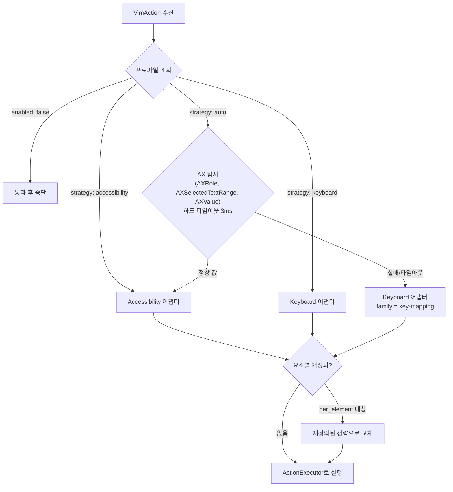

# 전략 디스패치

- **Last updated**: 2026-07-30

## 현재 구조

엔진에서 온 각 `VimAction`은 전략 디스패처가 앱별 프로파일과 AX 자동 감지(하드 타임아웃 3ms)를 통해 **Accessibility 어댑터** 또는 **Keyboard 어댑터** 중 하나로 라우팅한다. Keyboard 어댑터는 `key-mapping`(요소 인식, 선호 폴백)과 `force-text`(요소 감지 우회, 최후 수단) 두 계열을 가진다.

**과도기 상태 (MVP 구간)**: 실행 계층은 **Keyboard 어댑터부터** 구축한다 — MVP 1단계 동안 번들 기본 전략은 `keyboard`(key-mapping) 고정이며, Accessibility 어댑터·`auto` 프로브·force-text는 MVP 이후 1차 확장에서 들어온다. 아래 선택 플로우는 그 확장까지 완성된 최종 상태다 ([20260725_keyboard-first-mvp-build-order.md](../../decisions/references/20260725_keyboard-first-mvp-build-order.md)). 포커스/컨텍스트 리졸버도 같은 순서로 분해 구축된다: 앱 수준(bundleID) → 요소 수준(AXObserver+focusedRole) → AX 프로브.

M2의 최소 디스패처에서 앱 수준 게이트는 **탭 콜백의 엔진 진입 전**에 판정한다: 최전면 앱이 disable 목록(하드코딩, 초기값 `com.mitchellh.ghostty` — M4 프로파일이 교체)이면 번역·엔진 없이 원본 키를 통과시키고, 엔진 모드 상태는 동결한다(리셋 없음). 판정 위치는 마커 가드·마스터 토글 가드 뒤, 번역 앞. 최전면 bundleID는 `@MainActor` 캐시가 `NSWorkspace` 앱 활성화 알림으로 갱신하고 콜백은 캐시만 읽는다 — 디스패치 시점 게이트는 삼킨 뒤 실행만 막아 "죽은 키"가 되므로 기각됐다 ([20260726_m2-app-gate-pre-engine-passthrough.md](../../decisions/references/20260726_m2-app-gate-pre-engine-passthrough.md)).

### 선택 플로우 (VimAction마다 실행)

```mermaid
flowchart TD
    VA[VimAction 수신] --> P{프로파일 조회}
    P -->|"enabled: false"| Pass[통과 후 중단]
    P -->|"strategy: accessibility"| AX[Accessibility 어댑터]
    P -->|"strategy: keyboard"| KB[Keyboard 어댑터]
    P -->|"strategy: auto"| Probe{"AX 탐지<br/>(AXRole, AXSelectedTextRange, AXValue)<br/>하드 타임아웃 3ms"}
    Probe -->|정상 값| AX
    Probe -->|실패/타임아웃| KM["Keyboard 어댑터<br/>family = key-mapping"]
    AX --> Override{요소별 재정의?}
    KB --> Override
    KM --> Override
    Override -->|"per_element 매칭"| Re[재정의된 전략으로 교체]
    Override -->|없음| Exec[ActionExecutor로 실행]
    Re --> Exec
```

### Accessibility 어댑터

`VimAction` → AX 호출 변환. 예: `move(.charLeft)` → `kAXSelectedTextRangeAttribute`를 `(location-1, 0)`으로 설정, `delete(.line)` → 줄 범위 얻어 `kAXSelectedText`를 `""`로 설정, `yank(.selection)` → `kAXSelectedText` 읽어 `NSPasteboard`에 쓰기.

### Keyboard 어댑터 — 요소 계열(element family)

같은 `VimAction`이라도 리졸버가 보고한 요소 계열(TextArea / TextField / List·비텍스트)에 따라 다른 `CGEvent` 시퀀스를 낸다. 키 시퀀스가 요소 타입마다 다르게 동작하기 때문 (예: `delete(.line)`은 TextArea에서 `Cmd-Left, Shift-Down, Cmd-X`, TextField에서 `Cmd-A, Delete`).

- **key-mapping 계열**: 리졸버를 참조해 요소 인식 시퀀스 선택. AX 불가 시 자동 감지가 사용하는 기본 폴백.
- **force-text 계열**: 항상 TextArea 시퀀스 사용. 프로파일 명시 선택 전용, 자동 감지 금지.

리졸버가 붙기 전까지 어댑터가 `.textArea`를 고정 주입하는데, **명령 어휘가 들어오면서 그 고정의 대가가 달라졌다**: 모션·편집은 텍스트가 아닌 곳에서 무해하게 퇴행하지만(화살표는 흘러가고 `Cmd-X`는 대개 미바인딩), 명령 어휘는 정의상 앱이 아는 명령이라 포커스가 무엇이든 발사된다 — Finder에서 `p`는 파일을 붙여넣고 `u`는 파일 조작을 되돌린다. 릴리스 금지 게이트가 유효해 사용자 노출은 없고, 구조적 해소는 비텍스트 계열에서 `nil`을 내는 리졸버다 ([20260730_native-command-non-text-ui-hazard.md](../../decisions/references/20260730_native-command-non-text-ui-hazard.md)).

키 시퀀스 생성은 **네 순수 매퍼**(`MotionKeyMapper` / `EditKeyMapper` / `VisualKeyMapper` / `CommandKeyMapper`)가 담당하고, 어댑터는 액션을 넷 중 하나로 보내 나온 `[KeyStroke]`를 CGEvent 쌍으로 바꿔 게시한다. 매퍼가 `nil`을 내면 그 액션은 **미지원**이며 스킵+요약 DEBUG 로그로 간다. **네 매퍼 어디도 빈 배열을 반환하지 않는다** — "지원 ⟹ 빈 시퀀스 아님"이 공통 불변식이라, 게시할 것이 없는 경우는 `nil`(정직한 스킵)로 표현한다. 무로그 삼킴 금지가 릴리스 게이트 규칙이기 때문이다. CGEvent 변환은 **액션 단위 all-or-nothing**이다 — 스트로크 하나라도 생성에 실패하면 그 액션 전체를 버리고 error 로그를 남긴다(부분 시퀀스는 편집에서 "선택은 어긋난 채 `Cmd-X`만 나가는" 파괴적 실행이 된다).

어댑터의 스킵은 **두 종류로 갈린다**: 매퍼 `nil` = 미지원(요약 로그에 집계)과, 지원하지만 이번 입력에는 게시할 것이 없는 경우(사유를 아는 자리에서 자체 로그, 요약 카운터 미집계). 후자의 유일한 사례가 텍스트 없는 클립보드의 `p`다. 구분이 필요한 이유는 게이트 해제 판정이 미지원 스킵 로그의 전수 확인이라, 섞이면 심사자가 구현된 어휘를 미구현으로 읽기 때문이다.

**편집 매퍼** `EditKeyMapper`는 `(Operator, TextRange, ElementFamily) → [KeyStroke]?`이며, 모든 편집이 한 형태다: **범위를 Shift+모션으로 선택한 뒤 오퍼레이터 1타**(delete·change = `Cmd-X`, yank = `Cmd-C` + `←` collapse). change는 엔진이 이미 Insert로 전이해 뒤에 붙일 키가 없다. 선택 스트로크는 모션 매핑 결과의 각 스트로크에 `.maskShift`를 얹어 만들므로, `w`·`^`의 3타 조합도 앵커 고정·엔드포인트 이동으로 그대로 성립한다 — 편집 시퀀스의 모션별 특례는 `cw`→`ce` 하나뿐이다. linewise 반올림은 오퍼레이터별로 갈리고(delete/yank는 개행 포함, change는 줄 유지) 문서 끝에서는 빈 줄 1개가 남는다(`dgg`만 정확 — 감지가 원리적으로 불가). `iw`는 모션과 같은 "끝을 지나친 뒤 시작 복귀" 3타로 앵커를 잡는다(`Opt-→,Opt-←` 후 `Shift-Opt-→` — 캐럿이 단어 시작이어도 그 단어를 잡는다). 오퍼레이터 키만 ANSI 키코드라 QWERTY 계열을 가정한다. `Shift-Cmd-↑/↓`를 블록 이동에 쓰는 앱(Notion)에서는 `d/c/y`+`G`·`gg` 6조합이 파괴적으로 오동작한다 — 회피가 앱 축을 요구해 M4 프로파일까지 수용된 한계다. 문서 경계에서 선택이 접히거나 포화하는 **수용 엣지 5종**(줄 끝 `x` 줄 병합, 첫 줄 `dk` 아래 줄 삭제, 마지막 단어 `dw` 반전, 마지막 줄 `dgg` 누락, 빈 선택+오퍼레이터)과 소프트 랩 문단의 **시각 줄 단위** linewise(랩 문단에서 `dd`가 화면 행만 삭제)는 무상태 전제상 감지 불가로 수용됐다 — 정확화는 M5 AX 읽기 혼용의 몫. `ElementFamily`는 지금 `.textArea` 하나로 어댑터가 고정 주입하지만 테이블 키에 처음부터 포함돼 있다 — 요소 리졸버가 붙으면 시퀀스 표 확장만으로 TextField가 갈린다. 모션 매퍼에는 family가 없다(화살표 이동은 계열 무관). [20260727_edit-keystroke-mapping-contract.md](../../decisions/references/20260727_edit-keystroke-mapping-contract.md), [20260727_linewise-newline-rounding.md](../../decisions/references/20260727_linewise-newline-rounding.md), [20260727_yank-collapse-to-range-start.md](../../decisions/references/20260727_yank-collapse-to-range-start.md), [20260727_operator-key-ansi-layout-assumption.md](../../decisions/references/20260727_operator-key-ansi-layout-assumption.md), [20260727_inner-word-anchor-via-word-end.md](../../decisions/references/20260727_inner-word-anchor-via-word-end.md), [20260727_notion-cmd-shift-vertical-conflict.md](../../decisions/references/20260727_notion-cmd-shift-vertical-conflict.md), [20260728_edit-boundary-saturation-accepted-edges.md](../../decisions/references/20260728_edit-boundary-saturation-accepted-edges.md), [20260728_linewise-visual-line-wrap-accepted-edge.md](../../decisions/references/20260728_linewise-visual-line-wrap-accepted-edge.md).

**Visual 매퍼** `VisualKeyMapper`는 `(VimAction, ElementFamily) → [KeyStroke]?`로 선택 **세션**(진입·확장·wise 전환·이탈)만 담당한다 — 선택에 오퍼레이터를 적용하는 `.edit(op, .selection)`은 `EditKeyMapper`의 몫이다(선택 시퀀스 없이 `Cmd-X`/`Cmd-C` 1타, 계열 분기 밖). **어댑터는 wise 상태를 들지 않는다**: `extendSelection(Motion)`은 `MotionKeyMapper.selectionStrokes(for:)`(모션 스트로크마다 Shift union)의 순수한 재사용이고 linewise 줄 반올림은 적용하지 않는다 — 편집의 범위 선택과 같은 함수를 쓰므로 **모션 매핑이 개선되면 편집과 Visual이 동시에 따라온다**. 시퀀스: `v`=`Shift-→`(Vim의 inclusive 시맨틱 — 무게시면 `vd`/`vy`가 무동작이고 이탈 `←`가 캐럿을 표류시킨다), `V`=`Cmd-←, Shift-↓`(`dd` 접두와 동일), `v`→`V`=`Shift-↓, Shift-Cmd-←`(포커스 줄만 반올림 — 앵커는 앱에 박혀 손댈 수 없다), `V`→`v`=`nil`(반올림에 역연산 없음), `clearSelection`=`←`(collapse 전담 — 그래서 `.selection` yank는 `Cmd-C`만 낸다). 이는 엔진이 문서화한 "앵커·범위는 어댑터 상태" 계약으로부터의 **의도적 이탈**이며, `V` 세션에서 Vim과 충실히 일치하는 것은 `j`·`0`·`G`와 오퍼레이터뿐이다(후진 확장은 앵커가 점이라 원리적으로 불가). **후진 확장은 charwise에서도 어긋난다** — 진입의 `Shift-→`가 모션의 출발점을 앵커 P가 아니라 P+1로 밀어, 단어 경계 모션의 착지가 한 단어 어긋난다(`vb`·`vh`는 빈 선택). 앵커를 옮겨도 포커스 출발점은 그대로라 상태로 넘을 수 없고, 실패 모드가 "선택이 안 생긴다"로 눈에 보여 수용됐다. [20260728_visual-charwise-entry-inclusive-selection.md](../../decisions/references/20260728_visual-charwise-entry-inclusive-selection.md), [20260728_visual-extend-stateless-no-linewise-rounding.md](../../decisions/references/20260728_visual-extend-stateless-no-linewise-rounding.md), [20260728_visual-switch-wise-focus-end-rounding.md](../../decisions/references/20260728_visual-switch-wise-focus-end-rounding.md), [20260728_visual-clear-selection-collapse-left.md](../../decisions/references/20260728_visual-clear-selection-collapse-left.md), [20260728_visual-charwise-backward-origin-shift.md](../../decisions/references/20260728_visual-charwise-backward-origin-shift.md).

**명령 매퍼** `CommandKeyMapper`는 **네이티브 명령 위임 계열**(`o`/`O`·`p`/`P`·`u`/`Ctrl-r`·스크롤)을 담당한다 — 모션의 캐럿 이동이나 편집의 "선택 후 오퍼레이터"와 달리 앱이 이미 아는 명령 키 하나에 위임하고, 우리가 조립하는 것은 위치를 잡는 접두뿐이다(접두는 전부 `MotionKeyMapper` 재사용이라 모션 매핑 개선이 함께 전파된다). 진입점이 2개인 것은 붙여넣기만 wise라는 추가 입력이 필요하기 때문이다: `keyStrokes(for:family:)`(openLine·undo·redo·scroll)와 `pasteStrokes(before:count:wise:family:)`. 시퀀스: `o`=`Cmd-→, Return`, `O`=`Cmd-←, Return, ↑`(개행이 현재 줄을 아래로 밀고 새 빈 줄로 복귀 — `↑, Cmd-→, Return`은 첫 줄에서 `↑`가 no-op이라 조용히 `o`로 퇴행해 기각), `u`=`Cmd-Z`, `Ctrl-r`=`Shift-Cmd-Z`, 스크롤은 **half/full 모두** `PageDown`/`PageUp` 1타로 수렴(half-page 프리미티브 부재), 붙여넣기는 위치 접두 1회 + `Cmd-V`×count(charwise `p`=`→`·`P`=접두 없음, linewise `p`=`Cmd-→, →, Cmd-←`·`P`=`Cmd-←`). linewise `p`의 꼬리 `Cmd-←`는 멱등 보정자다 — 마지막 줄에서 `→`가 포화하면 그것 없이는 붙여넣기가 마지막 줄에 이어붙어 텍스트를 훼손한다. **붙여넣기 단위는 클립보드 끝 개행 휴리스틱**으로 가른다: 판정은 순수 함수 `PasteWise(clipboardText:)`이고 `NSPasteboard` 읽기는 어댑터의 주입 seam(`readPasteWise`, 기본값 `Clipboard.pasteWise()`)이 게시 직렬 큐 위에서 한다 — 매퍼 순수성이 유지되고 골든이 개발자 클립보드에 의존하지 않는다. 텍스트가 없으면 정직한 스킵이다. 수용 편차: charwise `p`는 줄 끝에서 다음 줄 시작에 붙여넣고, charwise `P`는 접두가 없어 살아 있는 선택을 덮어쓰며, `3p`는 undo 3단위이고, 소프트 랩 문단에서 `O`는 빈 줄을 아예 만들지 못한다. `Return`이 전송인 앱(Slack류 컴포저)과 비-QWERTY의 `Cmd-Z`(AZERTY에서 `Cmd-W` = 창 닫기)는 각각 M4 프로파일·단계 4 게이트 항목이다. [20260730_command-key-mapper-scope.md](../../decisions/references/20260730_command-key-mapper-scope.md), [20260730_openline-return-sequence.md](../../decisions/references/20260730_openline-return-sequence.md), [20260730_paste-wise-trailing-newline-heuristic.md](../../decisions/references/20260730_paste-wise-trailing-newline-heuristic.md), [20260730_scroll-page-key-convergence.md](../../decisions/references/20260730_scroll-page-key-convergence.md), [20260730_cmd-z-ansi-layout-escalation.md](../../decisions/references/20260730_cmd-z-ansi-layout-escalation.md).

**모션 매핑**은 순수 매퍼 `Motion → [KeyStroke]`(`(keyCode, flags)` 값 타입)가 담당한다 — **배열 반환이 계약**이라 모션 1개를 키스트로크 N개 조합으로 실행하는 확장이 매핑 테이블 원소 교체만으로 된다. CGEvent 변환(keyDown+keyUp 쌍)은 매퍼 밖, 게시 직렬 큐 위에서 한다. Keyboard 전략은 캐럿(문자 사이) 모델이라 macOS에 프리미티브가 없는 곳은 조합·수렴으로 처리한다: `wordForward`(w)는 `Opt-→,Opt-→,Opt-←` 3타, `lineFirstNonBlank`(^·I)는 `Cmd-←,Opt-→,Opt-←` 3타(단어 끝을 지나친 뒤 시작으로 복귀 — 수용 엣지는 결정 문서 참조, 탭 들여쓰기의 ^·I는 Chromium 계열에서 0으로 퇴행), `charRightForAppend`/`lineEndForAppend`는 l·$와 자연 수렴(케이스는 M5 AX용으로 유지) — [20260726_motion-keystroke-mapping-contract.md](../../decisions/references/20260726_motion-keystroke-mapping-contract.md), [20260726_word-forward-first-nonblank-multi-stroke.md](../../decisions/references/20260726_word-forward-first-nonblank-multi-stroke.md), [20260726_tab-indent-first-nonblank-chromium-edge.md](../../decisions/references/20260726_tab-indent-first-nonblank-chromium-edge.md). 합성 이벤트는 keyDown·keyUp 모두 flags를 **명시 대입**한다(빈 flags 포함) — 소스 nil 이벤트의 flags 기본값은 실행 시점의 물리 modifier 상태라, 대입이 없으면 사용자가 누르고 있던 Shift가 새어 들어간다 ([20260726_shift-leak-event-flags-sufficient.md](../../decisions/references/20260726_shift-leak-event-flags-sufficient.md)).

### 포커스/컨텍스트 리졸버

`(bundleID, focusedRole, selectedRange)` 튜플을 캐싱해 키 입력마다 AX를 재탐지하지 않는다. 캐시 무효화 시점: 포커스 변경 시(`AXObserver`의 `kAXFocusedUIElementChangedNotification`, `NSWorkspace`의 앱 활성화 알림), 그리고 캐럿을 이동시킨 것으로 알려진 Keyboard 전략 동작 후.

## 불변식·계약

- AX 자동 감지는 하드 타임아웃(3ms)을 절대 초과하지 않는다 — 응답 없는 AX 호출이 이벤트 탭 전체를 멈추게 하면 안 된다.
- `force-text`는 프로파일에서 명시적으로만 선택하며, 자동 감지가 선택하는 일은 없다.

## 근거 요약

올바른 AX 앱에서는 AX가 정밀하지만 너무 많은 앱이 AX 지원을 거짓말하므로, 자동 감지 + Keyboard 폴백의 이중 전략이 필요하다.

- 관련 결정: [20260712_ax-keyboard-strategy-dispatch.md](../../decisions/references/20260712_ax-keyboard-strategy-dispatch.md)

## 미결 질문 (결정 시 decisions에 기록 후 이 파일 갱신)

- 일회성 Accessibility → Keyboard 다운그레이드 수정 키 (kindaVim의 `fn` 방식) — 채택 여부와 키 선택.
- "AX 거짓말" 감지 휴리스틱 (왕복 테스트, 번들 거부 목록) — `strategy: auto` 신뢰 전 결정.
- `key-mapping` → `force-text` 자동 폴백 휴리스틱 존재 여부.
- **AX 읽기 + Keyboard 쓰기 혼용의 적용 범위** — 리졸버는 이미 AX로 읽고 Keyboard 시퀀스를 고르지만(`focusedRole`), `AXValue`·`AXSelectedTextRange`까지 읽어 정확 오프셋을 계산하고 실행만 합성 이벤트로 하는 형태를 어디까지 허용할지. 읽기는 실패가 즉시 드러나 폴백이 안전한 반면(쓰기와 비대칭), 오프셋만큼 스트로크를 보내면 버스트가 되어 실행 중단 래치와 묶인다. M5 착수 시 결정.

## 관련

- 선택 알고리즘 요구사항: 워크스페이스 `docs/prd.md` §9
- 프로파일 스키마: [profiles-and-config.md](profiles-and-config.md)
- 실행/재진입: [reentrancy-and-safety.md](reentrancy-and-safety.md)
- 테스트: 기록된 `AXUIElement` 픽스처로 회귀 테스트, 어댑터는 골든 출력 테스트 (워크스페이스 `docs/architecture.md` §7)
