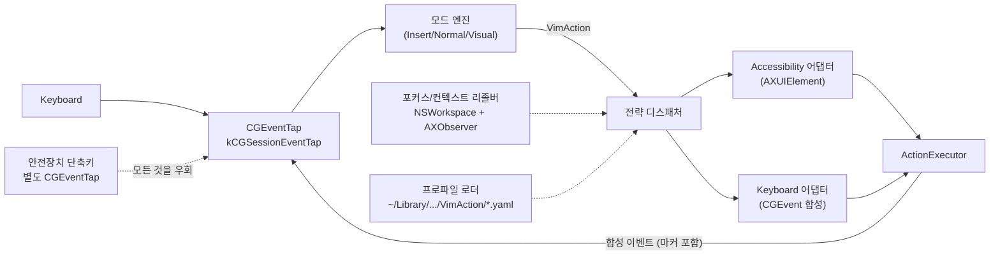

# 시스템 개요

- **Last updated**: 2026-07-12

## 현재 구조

키 입력은 단일 `CGEventTap`(kCGSessionEventTap)으로만 진입하고, 순수 Swift 모드 엔진이 이를 추상 `VimAction`으로 해석하며, 전략 디스패처가 앱/요소별로 Accessibility 실행과 Keyboard(합성 이벤트) 실행 중 하나를 선택한다.

컴포넌트별 책임:

| 컴포넌트 | 책임 | 상세 reference |
|---|---|---|
| 이벤트 탭 | 유일한 키 입력 진입점. 마커 확인, 안전장치 우선 감지, 엔진 결정(삼키기/통과/대체) 적용 | [reentrancy-and-safety.md](reentrancy-and-safety.md) |
| 모드 엔진 | `Key` → `VimAction` 해석. 실행 방법은 전혀 모름 | [mode-engine.md](mode-engine.md) |
| 포커스/컨텍스트 리졸버 | `(bundleID, focusedRole, selectedRange)` 캐싱, 포커스 변경 시 무효화 | [strategy-dispatch.md](strategy-dispatch.md) |
| 전략 디스패처 + 어댑터 | `VimAction`마다 AX vs Keyboard 선택 후 실행 | [strategy-dispatch.md](strategy-dispatch.md) |
| ActionExecutor | 모든 출력(AX 쓰기, 이벤트 게시)의 단일 통로. 재진입 마커 강제 | [reentrancy-and-safety.md](reentrancy-and-safety.md) |
| 프로파일 로더 | YAML 계층 설정 로드/감시 | [profiles-and-config.md](profiles-and-config.md) |
| 앱 셸 | 메뉴바 `NSStatusItem`(모드 글리프), SwiftUI 설정 창, 온보딩 | — |

## 불변식·계약

- 키 입력 진입점은 메인 `CGEventTap` 하나뿐이다 (안전장치 탭은 예외 — 가로채기가 아닌 킬 스위치 전용).
- 해석(엔진)과 실행(어댑터)은 분리되어 있으며, `VimAction` 생산자는 엔진 하나다.

## 근거 요약

진입점을 하나로 고정하면 그 아래 전체가 순수 Swift로 유지되어 단위 테스트가 가능하고, 해석/실행을 분리하면 두 전략 어댑터를 교체 가능한 소비자로 둘 수 있다.

- 관련 결정: [20260712_single-event-tap-pipeline.md](../../decisions/references/20260712_single-event-tap-pipeline.md)

## 관련

- 제품 요구사항: 워크스페이스 `docs/prd.md` (§7.3, §7.4, §9, §10)
- 앱 셸: `LSUIElement` 메뉴바 백그라운드 앱(SwiftUI `MenuBarExtra` + `Settings` 씬). Dock 아이콘·앱 메뉴 없음.
- App Sandbox 해제(Developer ID 직접 배포). CGEventTap/AX가 샌드박스 불가하기 때문 — [20260712_disable-sandbox-developer-id.md](../../decisions/references/20260712_disable-sandbox-developer-id.md).
- 접근성·입력 모니터링은 빌드 엔타이틀먼트가 아니라 런타임 TCC 권한(온보딩에서 요청).
