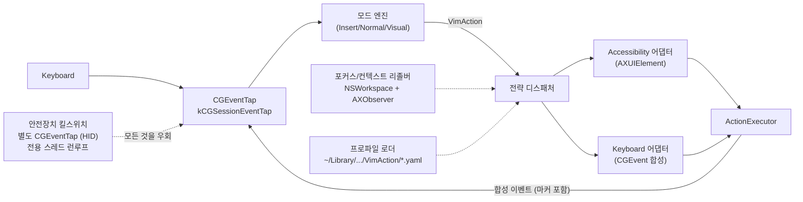

# 시스템 개요

- **Last updated**: 2026-08-12 (Dock 아이콘 닫힘 판정을 설정 창 동일성으로)

## 현재 구조

키 입력은 단일 `CGEventTap`(kCGSessionEventTap)으로만 진입하고, 순수 Swift 모드 엔진이 이를 추상 `VimAction`으로 해석하며, 전략 디스패처가 앱/요소별로 Accessibility 실행과 Keyboard(합성 이벤트) 실행 중 하나를 선택한다.

```mermaid
graph LR
    KB[Keyboard] --> Tap[CGEventTap<br/>kCGSessionEventTap]
    Tap --> Engine["모드 엔진<br/>(Insert/Normal/Visual)"]
    Engine -->|VimAction| Dispatcher[전략 디스패처]
    Dispatcher --> AX["Accessibility 어댑터<br/>(AXUIElement)"]
    Dispatcher --> KBD["Keyboard 어댑터<br/>(CGEvent 합성)"]
    AX --> Exec[ActionExecutor]
    KBD --> Exec
    Exec -->|"합성 이벤트 (마커 포함)"| Tap

    Resolver["포커스/컨텍스트 리졸버<br/>NSWorkspace + AXObserver"] -.-> Dispatcher
    Profile["프로파일 로더<br/>~/Library/.../VimAction/*.yaml"] -.-> Dispatcher
    Failsafe["안전장치 킬스위치<br/>별도 CGEventTap (HID)<br/>전용 스레드 런루프"] -.->|모든 것을 우회| Tap
```

컴포넌트별 책임:

| 컴포넌트 | 책임 | 상세 reference |
|---|---|---|
| 이벤트 탭 | 유일한 키 입력 진입점. 마커 확인, 엔진 결정(삼키기/통과/대체) 적용 | [reentrancy-and-safety.md](reentrancy-and-safety.md) |
| 킬스위치 탭 | 안전장치 콤보 전용 별도 탭. HID 최고 우선순위 + 전용 스레드 런루프라 메인이 스톨해도 발동한다 | [reentrancy-and-safety.md](reentrancy-and-safety.md) |
| 모드 엔진 | `Key` → `VimAction` 해석. 실행 방법은 전혀 모름 | [mode-engine.md](mode-engine.md) |
| 포커스/컨텍스트 리졸버 | 포커스 요소 계열 캐싱(앱 활성화·`AXObserver`가 갱신, AX 읽기는 전용 큐). `selectedRange`는 M5 몫 | [strategy-dispatch.md](strategy-dispatch.md) |
| 전략 디스패처 + 어댑터 | `VimAction`마다 AX vs Keyboard 선택 후 실행 | [strategy-dispatch.md](strategy-dispatch.md) |
| ActionExecutor | 모든 출력(AX 쓰기, 이벤트 게시)의 단일 통로. 재진입 마커 강제 | [reentrancy-and-safety.md](reentrancy-and-safety.md) |
| 프로파일 로더 | YAML 계층 설정 로드/감시 | [profiles-and-config.md](profiles-and-config.md) |
| 앱 셸 | 메뉴바 `NSStatusItem`(모드 글리프), SwiftUI 설정 창(3탭), 런치 온보딩 push, Sparkle 자동 업데이트 | 아래 "관련" |

## 불변식·계약

- 키 입력 진입점은 메인 `CGEventTap` 하나뿐이다 (안전장치 탭은 예외 — 가로채기가 아닌 킬 스위치 전용).
- 해석(엔진)과 실행(어댑터)은 분리되어 있으며, `VimAction` 생산자는 엔진 하나다.

## 근거 요약

진입점을 하나로 고정하면 그 아래 전체가 순수 Swift로 유지되어 단위 테스트가 가능하고, 해석/실행을 분리하면 두 전략 어댑터를 교체 가능한 소비자로 둘 수 있다.

- 관련 결정: [20260712_single-event-tap-pipeline.md](../../decisions/references/20260712_single-event-tap-pipeline.md)

## 관련

- 제품 요구사항: 워크스페이스 `docs/prd.md` (§7.3, §7.4, §9, §10)
- 앱 셸: `LSUIElement` 메뉴바 백그라운드 앱(SwiftUI `MenuBarExtra` + `Settings` 씬). 평소에는 Dock 아이콘·앱 메뉴가 없고, **설정 창이 열려 있는 동안에만** `DockIconController`가 activation policy를 `.regular`로 올려 둘 다 노출한다(둘은 분리 불가능한 한 세트). 신호는 비대칭이다 — 열림은 `SettingsView.onAppear`(`.accessory` 앱이라 창이 key가 되지 않아 `didBecomeKey`가 오지 않는다), 닫힘은 `NSWindow.willCloseNotification`이되 **판정은 열림 훅에서 잡아 둔 설정 창과의 동일성**이다. 열림 훅이 `windows` 주입 seam(기본 `{ NSApp.windows }`)으로 `isSettingsWindow`(`isVisible && titled && !NSPanel`) 매치를 찾아 `weak`으로 보관하고, 닫히는 창이 그 창일 때만 강등한다 — 술어는 **찾기 전용**이다. Sparkle이 상태 창·업데이트 알림을 titled 일반 `NSWindow`로 띄우므로 술어로 닫힘을 판정하면 설정 창이 열린 채 아이콘이 내려간다. 참조를 못 잡았으면 강등하지 않는다(아이콘이 남는 쪽이 fail-safe) — [20260802_dock-icon-while-settings-open.md](../../decisions/references/20260802_dock-icon-while-settings-open.md), [20260812_dock-icon-close-signal-window-identity.md](../../decisions/references/20260812_dock-icon-close-signal-window-identity.md). 열림 훅의 앱측 진입점은 `AppState.settingsWindowDidAppear()`이고 **`TabView` 루트에 붙는다** — 탭 하나 안에 두면 다른 탭이 기본으로 열릴 때 훅이 뜨지 않는다. 이 메서드는 Dock 훅과 온보딩 마무리를 겸하므로 **멱등**이다.
- 설정 창은 **`TabView` 3탭, 460×560 고정**이다 — **General**(권한 상태 + Behavior + Updates 토글 + 접힌 `DisclosureGroup` "Diagnostics") / **Apps**(설정 파일 상태 — [profiles-and-config.md](profiles-and-config.md)) / **About**(버전 + 업데이트 확인 + GitHub·이슈·키바인딩 문서 링크). 탭 순서는 General이 먼저지만 **기본 선택은 Apps**이고, 권한 섹션은 미허용이면 General 최상단·허용되면 Behavior 아래 한 줄로 자리를 옮긴다. 높이를 명시하지 않으면 greedy한 grouped `Form` 때문에 창이 임의 높이로 굳어 긴 탭이 스크롤 없이 잘린다 — [20260809_settings-window-three-tabs.md](../../decisions/references/20260809_settings-window-three-tabs.md).
- App Sandbox 해제(Developer ID 직접 배포). CGEventTap/AX가 샌드박스 불가하기 때문 — [20260712_disable-sandbox-developer-id.md](../../decisions/references/20260712_disable-sandbox-developer-id.md).
- 자동 업데이트는 **Sparkle 2.x**(앱 타깃의 첫 원격 SPM 의존, 2.9.5 고정)다. `SPUStandardUpdaterController`는 `AppState`가 소유하되 **생성만 하고**(`startingUpdater: false`) 시동은 `bootstrap()`의 XCTest 가드 뒤에서만 — 테스트·프리뷰는 appcast 조회를 하지 않는다(init 무IO 관례). 피드·공개키는 부분 Info.plist(`VimAction/Info.plist`, `GENERATE_INFOPLIST_FILE`과 병합)가 소유한다: `SUFeedURL`은 GitHub Releases 고정 URL(`releases/latest/download/appcast.xml`), `SUPublicEDKey`는 EdDSA 공개키(개인키는 로그인 키체인 — 레포 커밋 금지). UI는 공용 확인 버튼(메뉴바 메뉴 + About 탭, `canCheckForUpdates` KVO를 Combine으로 구독)과 General 탭 자동 확인 토글(값 영속은 Sparkle 소유)이고, 확인 이후의 다이얼로그·다운로드·설치는 전부 Sparkle 표준 UI다. 자동 확인 기본값은 Sparkle 표준 동의 프롬프트에 맡긴다 — [20260810_sparkle-auto-update.md](../../decisions/references/20260810_sparkle-auto-update.md), [20260810_appcast-hosting-github-releases.md](../../decisions/references/20260810_appcast-hosting-github-releases.md), [20260811_sparkle-updater-ui-and-consent.md](../../decisions/references/20260811_sparkle-updater-ui-and-consent.md).
- 권한은 빌드 엔타이틀먼트가 아니라 런타임 TCC. 온보딩은 **Accessibility만** 요청한다(General 탭 권한 섹션 + 1초 폴링으로 부여 감지 후 재시작 없이 탭 설치). active tap은 AX만으로 설치되며, Input Monitoring은 필요가 입증될 때만 추가 — [20260712_active-tap-ax-only-onboarding.md](../../decisions/references/20260712_active-tap-ax-only-onboarding.md).
- 미허용 상태의 **발견성은 밀어내기(push) 2종**이다 — 런치 시 **1회** 설정 창 자동 오픈(General 탭)과, 미허용인 동안 메뉴 최상단에 상시 뜨는 `⚠ Accessibility permission required` + `Grant Permission…`/`Open System Settings` 행. 자동 오픈은 `@Environment(\.openSettings)`를 `MenuBarExtra`의 **`label:` 뷰**(`MenuBarLabel`)에서 부른다 — 환경 액션이라 렌더된 뷰가 필요하고, 메뉴 콘텐츠는 열기 전엔 생성되지 않지만 라벨은 런치 때 렌더되기 때문이다. (`NSApp.sendAction(Selector(("showSettingsWindow:")))`는 macOS 14부터 무동작이라 대안이 아니다.) 1회성은 `UserDefaults`의 `didShowOnboarding` **키 존재**로 판정하며(`shouldPresentOnboarding`), 플래그는 지시 자리가 아니라 **창이 뜬 자리**에서 내려간다 — 그 사이에 `SettingsView.init`이 읽어 General 탭으로 열지 정한다 — [20260809_permission-discoverability-push.md](../../decisions/references/20260809_permission-discoverability-push.md).
- 메인 탭은 처음부터 active tap(`.defaultTap`)이며 메인 런루프에 부착돼 있다. **엔진이 배선돼 있다**(`EventTapController`): keyDown → `KeyTranslator` → `VimEngine.handle` → 결정 적용(passthrough=통과 / swallow=`nil`). `.replace`는 삼킨 뒤 actions를 실행 sink로 넘기고, 그 클로저가 게시 직렬 큐 위에서 Keyboard 어댑터를 부른다 — 배선 형태(주입된 sink 클로저)는 [20260726_m2-execution-wiring-shape.md](../../decisions/references/20260726_m2-execution-wiring-shape.md). M3 완료로 v1 어휘 전체가 실행되며 릴리스 배포 금지 게이트는 해제됐다 ([20260801_release-block-gate-lifted.md](../../decisions/references/20260801_release-block-gate-lifted.md)). 앱 수준 게이트(disable 목록)는 엔진 진입 전에 판정한다([strategy-dispatch.md](strategy-dispatch.md)). 메뉴바 마스터 토글(`isInterceptionEnabled`)이 가로채기 on/off를 지배하고([20260718_interception-toggle-semantics.md](../../decisions/references/20260718_interception-toggle-semantics.md)), 백그라운드 워치독이 조용히 죽은 탭을 폴링·복구한다([reentrancy-and-safety.md](reentrancy-and-safety.md)). 런루프 전용 스레드 전환은 재검토 결과 기각 — 메인 런루프 유지 확정, 재검토 트리거 3종은 결정 문서에 명시 ([20260725_tap-main-runloop-retention.md](../../decisions/references/20260725_tap-main-runloop-retention.md)).
- 탭 계층의 CGEvent→`Key` 정규화는 `KeyTranslator`(앱 타깃, `@MainActor`)가 담당한다: 특수키는 keycode, 문자키는 UCKeyTranslate + ASCII-capable 레이아웃(shift만 base에 반영, ctrl/opt/cmd는 modifiers로), 번역 불가는 `nil`이며 호출측은 무조건 통과시킨다. 임의의 `CGEvent`에 대해 답이 정의된 total function이며 keyDown 외 타입은 내부 가드로 `nil`이다. 레이아웃 `Data`는 캐시하고 입력 소스 변경 분산 노티로 무효화한다(키당 TIS 조회 제거) — [20260716_cgevent-key-translation-ascii-layout.md](../../decisions/references/20260716_cgevent-key-translation-ascii-layout.md), [20260716_keytranslator-total-function-keydown-guard.md](../../decisions/references/20260716_keytranslator-total-function-keydown-guard.md), [20260717_keytranslator-layout-caching.md](../../decisions/references/20260717_keytranslator-layout-caching.md).
