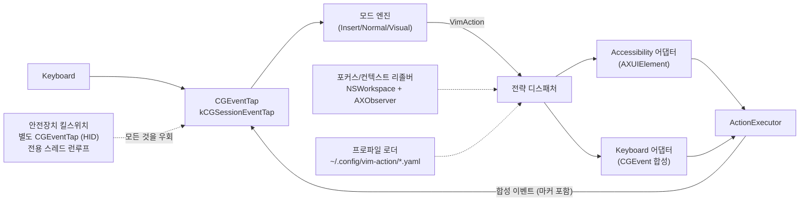

# 시스템 개요

- **Last updated**: 2026-08-20 (문서 분할 — 앱 셸 상세를 [app-shell.md](app-shell.md)로 이관)

## 현재 구조

키 입력은 단일 `CGEventTap`(kCGSessionEventTap)으로만 진입하고, 순수 Swift 모드 엔진이 이를 추상 `VimAction`으로 해석하며, 전략 디스패처가 앱/요소별로 Accessibility 실행과 Keyboard(합성 이벤트) 실행 중 하나를 선택한다.

```mermaid
graph LR
    KB[Keyboard] --> Tap[CGEventTap<br/>kCGSessionEventTap]
    Tap --> Engine["모드 엔진<br/>(Insert/Normal/Visual)"]
    Engine -->|VimAction| Dispatcher[전략 디스패처]
    Dispatcher --> AX["Accessibility 어댑터<br/>(AXUIElement)"]
    Dispatcher --> KBD["Keyboard 어댑터<br/>(CGEvent 합성)"]
    AX --> Exec[ActionExecutor]
    KBD --> Exec
    Exec -->|"합성 이벤트 (마커 포함)"| Tap

    Resolver["포커스/컨텍스트 리졸버<br/>NSWorkspace + AXObserver"] -.-> Dispatcher
    Profile["프로파일 로더<br/>~/.config/vim-action/*.yaml"] -.-> Dispatcher
    Failsafe["안전장치 킬스위치<br/>별도 CGEventTap (HID)<br/>전용 스레드 런루프"] -.->|모든 것을 우회| Tap
```

컴포넌트별 책임:

| 컴포넌트 | 책임 | 상세 reference |
|---|---|---|
| 이벤트 탭 | 유일한 키 입력 진입점. 마커 확인, 엔진 결정(삼키기/통과/대체) 적용 | [reentrancy-and-safety.md](reentrancy-and-safety.md) |
| 킬스위치 탭 | 안전장치 콤보 전용 별도 탭. HID 최고 우선순위 + 전용 스레드 런루프라 메인이 스톨해도 발동한다 | [reentrancy-and-safety.md](reentrancy-and-safety.md) |
| 모드 엔진 | `Key` → `VimAction` 해석. 실행 방법은 전혀 모름 | [mode-engine.md](mode-engine.md) |
| 포커스/컨텍스트 리졸버 | 포커스 요소 계열 캐싱 + 디스패치 경로 창 읽기 | [focus-and-dispatch-reads.md](focus-and-dispatch-reads.md) |
| 전략 디스패처 | `VimAction`마다 AX vs Keyboard 선택 (auto는 프로브 판정) | [strategy-dispatch.md](strategy-dispatch.md), [auto-strategy-probe.md](auto-strategy-probe.md) |
| 어댑터 2종 | 선택된 전략의 실행 | [ax-adapter.md](ax-adapter.md), [keyboard-adapter.md](keyboard-adapter.md) |
| ActionExecutor | 모든 이벤트 게시의 단일 통로. 재진입 마커 강제 | [reentrancy-and-safety.md](reentrancy-and-safety.md) |
| 프로파일 로더 | YAML 설정 로드/수동 리로드 | [profiles-and-config.md](profiles-and-config.md) |
| 앱 셸 | 메뉴바·설정 창·Dock 아이콘·자동 시작·Sparkle·온보딩 | [app-shell.md](app-shell.md) |

### 탭 배선

메인 탭은 처음부터 active tap(`.defaultTap`)이며 메인 런루프에 부착돼 있다(전용 스레드 전환은 재검토 후 기각 — [20260725_tap-main-runloop-retention.md](../../decisions/references/20260725_tap-main-runloop-retention.md)). `EventTapController`가 엔진을 배선한다: keyDown → `KeyTranslator` → `VimEngine.handle` → 결정 적용(passthrough=통과 / swallow=`nil`). `.replace`는 삼킨 뒤 actions를 주입된 **실행 sink** 클로저로 넘기고, 그 클로저가 게시 직렬 큐 위에서 어댑터를 부른다 ([20260726_m2-execution-wiring-shape.md](../../decisions/references/20260726_m2-execution-wiring-shape.md)). 앱 수준 게이트(config.yaml off 목록)는 엔진 진입 전에 판정한다([strategy-dispatch.md](strategy-dispatch.md)). 메뉴바 마스터 토글(`isInterceptionEnabled`)이 가로채기 on/off를 지배하고([20260718_interception-toggle-semantics.md](../../decisions/references/20260718_interception-toggle-semantics.md)), 백그라운드 워치독이 조용히 죽은 탭을 폴링·복구한다([reentrancy-and-safety.md](reentrancy-and-safety.md)).

### CGEvent → `Key` 번역

탭 계층의 정규화는 `KeyTranslator`(앱 타깃, `@MainActor`)가 담당한다: 특수키는 keycode, 문자키는 UCKeyTranslate + ASCII-capable 레이아웃(shift만 base에 반영, ctrl/opt/cmd는 modifiers로), 번역 불가는 `nil`이며 호출측은 무조건 통과시킨다. 임의의 `CGEvent`에 대해 답이 정의된 total function이며 keyDown 외 타입은 내부 가드로 `nil`이다. 레이아웃 `Data`는 캐시하고 입력 소스 변경 분산 노티로 무효화한다 ([20260716_cgevent-key-translation-ascii-layout.md](../../decisions/references/20260716_cgevent-key-translation-ascii-layout.md), [20260716_keytranslator-total-function-keydown-guard.md](../../decisions/references/20260716_keytranslator-total-function-keydown-guard.md), [20260717_keytranslator-layout-caching.md](../../decisions/references/20260717_keytranslator-layout-caching.md)).

## 불변식·계약

- 키 입력 진입점은 메인 `CGEventTap` 하나뿐이다 (안전장치 탭은 예외 — 가로채기가 아닌 킬 스위치 전용).
- 해석(엔진)과 실행(어댑터)은 분리되어 있으며, `VimAction` 생산자는 엔진 하나다.

## 근거 요약

진입점을 하나로 고정하면 그 아래 전체가 순수 Swift로 유지되어 단위 테스트가 가능하고, 해석/실행을 분리하면 두 전략 어댑터를 교체 가능한 소비자로 둘 수 있다.

- 관련 결정: [20260712_single-event-tap-pipeline.md](../../decisions/references/20260712_single-event-tap-pipeline.md)

## 관련

- 제품 요구사항: 워크스페이스 `docs/prd.md` (§7.3, §7.4, §9, §10)
- 앱 셸 상세: [app-shell.md](app-shell.md)
