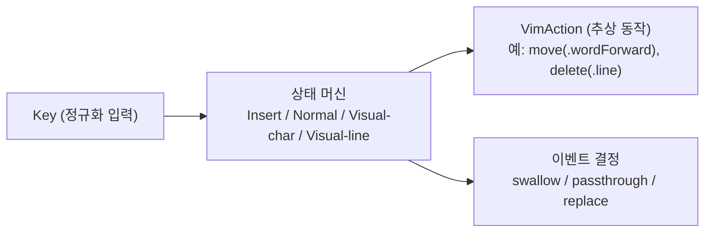

# 모드 엔진

- **Status**: accepted
- **Date**: 2026-07-12

## 결정

모드 엔진(Insert / Normal / Visual-char / Visual-line 상태 머신)은 **macOS 의존성이 전혀 없는 별도 SPM 타깃의 순수 Swift**로 만든다. 입력은 정규화된 `Key` 값, 출력은 `move(.wordForward)`, `delete(.line)` 같은 추상 `VimAction` 값이다.

## 근거 (왜)

- AppKit/CoreGraphics/AX 의존이 없으면 엔진 전체가 결정론적이고, 실제 앱을 띄우지 않고 픽스처만으로 완전한 단위 테스트가 가능하다.
- 엔진이 실행 방법을 모르면 `VimAction` 생산자는 하나로 고정되고, Accessibility/Keyboard 두 어댑터를 교체 가능한 소비자로 둘 수 있다 — 두 전략 모델을 다루기 쉬운 이유의 핵심.

## 상세

지켜야 할 불변식:

- 엔진 타깃은 `import AppKit`, `import Cocoa`, `import ApplicationServices` 등 macOS 프레임워크를 import하지 않는다. (Foundation 수준까지만.)
- 엔진은 AX API 호출, 키 이벤트 합성, 최전면 앱 인식을 **하지 않는다**. 그런 로직이 엔진에 들어오려 하면 리졸버나 디스패처로 옮긴다.
- 입출력 계약: `Key`(정규화된 키 입력) → 엔진 → `VimAction`(추상 동작) + 이벤트 처리 결정(삼키기/통과/대체).

## 관련

- 소비자: [strategy-dispatch.md](strategy-dispatch.md)
- 테스트 전략: 엔진은 픽스처 기반 단위 테스트로 철저히 커버 (워크스페이스 `docs/architecture.md` §7)
