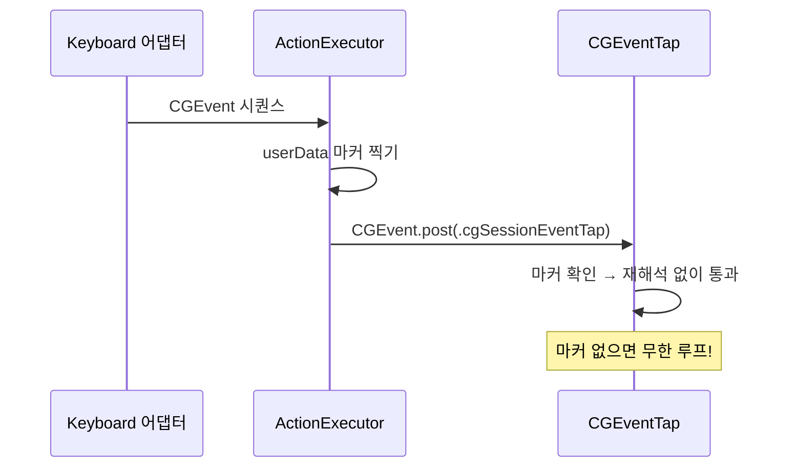

# 재진입과 안전장치

- **Status**: accepted
- **Date**: 2026-07-12

## 결정

1. 모든 출력(AX 쓰기, 합성 이벤트 게시)은 **단일 `ActionExecutor`** 를 거친다.
2. 합성한 모든 `CGEvent`에는 게시 전에 비공개 `userData` 마커(`CGEvent.setIntegerValueField(.eventSourceUserData, …)`)를 찍고, 이벤트 탭은 마킹된 이벤트를 재해석 없이 통과시킨다.
3. 안전장치 단축키(기본 `Ctrl-Option-Cmd-Esc`)는 메인 탭과 **별도의 `CGEventTap`** 으로 `kCGHIDEventTap`에 최고 우선순위로 설치한다.

## 근거 (왜)

- Keyboard 전략이 합성한 이벤트는 `CGEventTap`을 거쳐 되돌아온다. **마커를 빠뜨리면 탭이 자기 출력을 재해석해 무한 루프** — 이벤트 탭 기반 도구의 병적 루프의 가장 흔한 원인이다. 게시를 단일 실행기에 집중시키면 이 불변식을 강제하고 감사하기 쉽다.
- 안전장치를 별도 탭으로 두는 이유: 메인 탭이 멈추거나 버그가 나도 안전장치 탭은 살아 있어 메인 탭을 해체할 수 있다. 메인 탭 안에서 감지하면 킬 스위치가 버그와 함께 죽는다.
- 버그 있는 전역 키 탭은 사용자를 키보드에서 완전히 차단할 수 있으므로, 안전장치는 타협 불가.

## 상세

의존 순서대로 정리한 완화책 (전부 유지할 것):

1. **안전장치 단축키** — 별도 탭, 고정 코드, 사용자 설정 가능. 메인 탭 즉시 비활성화.
2. **예외 폭주 자동 비활성화** — 엔진·어댑터의 모든 호출 지점을 카운터로 감싸고, 1초 창에서 예외 ≥5회면 가로채기 비활성화 후 알림.
3. **동작별 AX 타임아웃** — 3ms 하드 캡 ([strategy-dispatch.md](strategy-dispatch.md)).
4. **깔끔한 SIGTERM 처리** — 종료 전 탭 제거, 대롱거리는 탭 방지.
5. **보안 입력 인식** — `IsSecureEventInputEnabled()`가 true(비밀번호 필드 등)면 가로채기 중단 + 흐릿한 인디케이터.

권한: 접근성 확인은 매 실행 시 `AXIsProcessTrustedWithOptions`로 수행하고, 권한이 없으면 이벤트 탭 설치를 거부한다.

## 관련

- 시스템 내 위치: [system-overview.md](system-overview.md)
- 합성 시퀀스 생성: [strategy-dispatch.md](strategy-dispatch.md)
