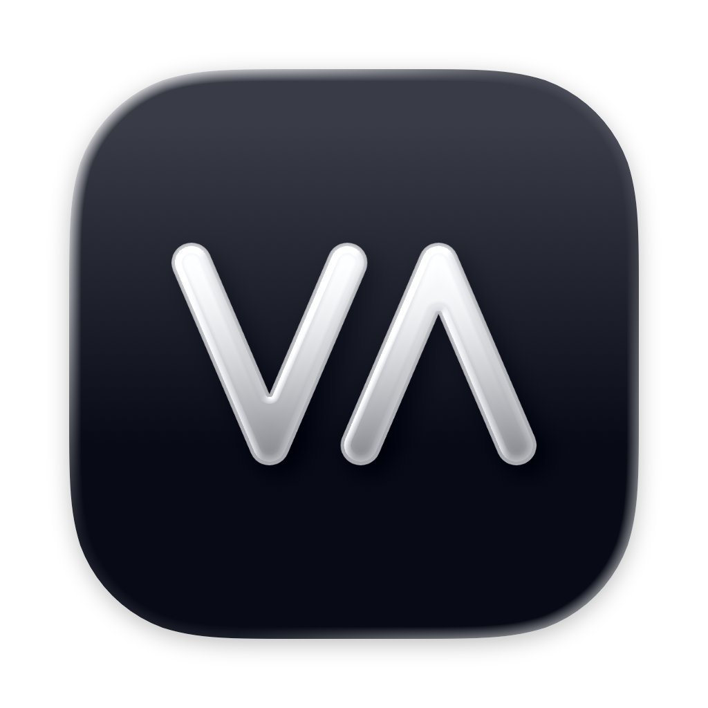
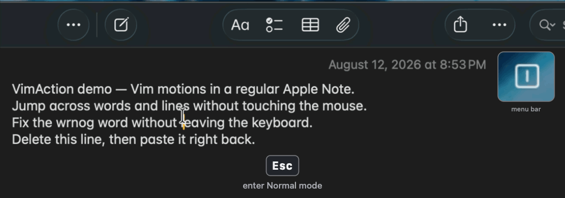
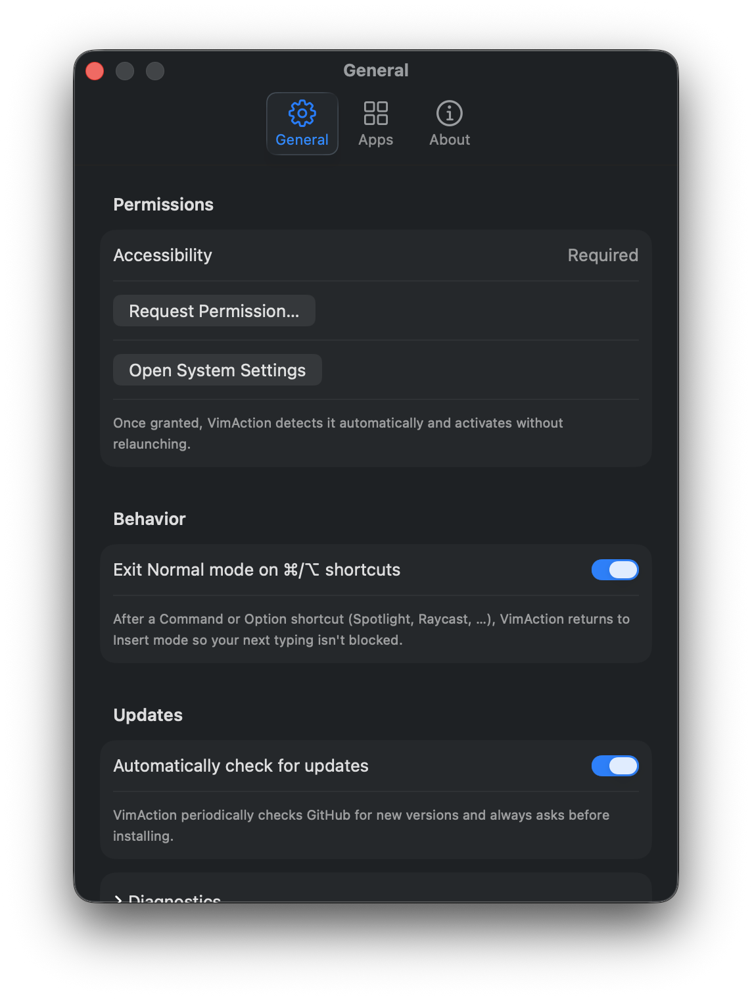
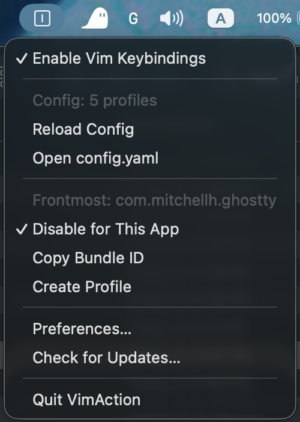
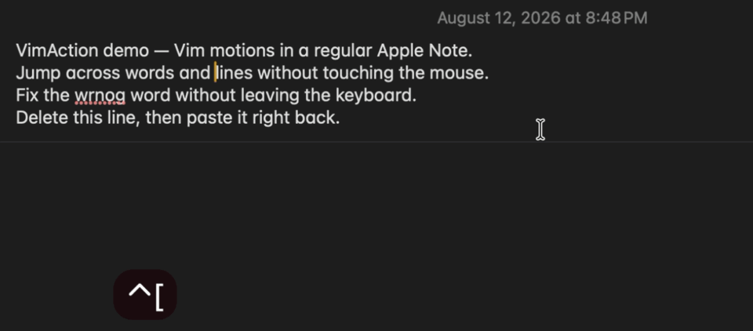

<p align="center">
  
</p>

# VimAction

**System-wide Vim keybindings for macOS.** A menu bar app that brings modal editing — Normal and Visual modes, operators, text objects — to almost every place you type on your Mac: Notion, Slack, Apple Notes, Mail, Safari, and more. Free and open source.

[](https://github.com/pilyang/vim-action/actions/workflows/ci.yml)
[](https://github.com/pilyang/vim-action/releases/latest)
[](#install)
[](LICENSE)

<p align="center">
  
</p>

## Why

If you live in Vim, every Notion page and Slack message costs you a context switch back to arrow keys and the mouse. VimAction intercepts keys at the system level and replays your Vim muscle memory as native editing commands in whatever app has focus.

It is not a full Vim emulator. It is a curated subset of motions and edits — enough to cover most text navigation and everyday editing, chosen to work reliably across apps.

## Install

### Homebrew

```sh
brew install --cask pilyang/tap/vimaction
```

### Direct download

Download the latest DMG from [Releases](https://github.com/pilyang/vim-action/releases/latest) and drag VimAction into Applications.

Either way you get the same build: Developer ID-signed, notarized, and self-updating via Sparkle (update checks ask for your consent on first run).

**Requires macOS 14 or later.** Development and day-to-day testing happen on macOS 26; earlier versions are currently covered by build checks only, with light smoke testing in VMs planned. If anything misbehaves on a version below macOS 26, please [report it in Issues](https://github.com/pilyang/vim-action/issues) — those reports are what harden support there.

## Getting started

1. **Launch VimAction.** It runs as a menu bar app — no Dock icon.
2. **Grant Accessibility permission.** The settings window opens on first launch; click *Grant Permission* and enable VimAction under *System Settings → Privacy & Security → Accessibility*. The app detects the grant within a second — no restart needed.
3. **Press `Esc` in any text field** (or `Ctrl-[`) — you are in Normal mode. `i` puts you back in Insert.

<p align="center">
  
</p>

VimAction starts in **Insert mode**: your typing is completely untouched until you explicitly press `Esc`. Unmapped `Cmd`/`Opt` shortcuts (Spotlight, Raycast, …) pass through *and* drop you back to Insert, so typing right after them just works.

The menu bar icon shows the current mode and state:

| Icon | Meaning |
|:----:|---------|
|  | Insert — every key passes through unchanged |
|  | Normal — keys are interpreted as Vim commands |
|   | Visual / Visual Line |
|  | Turned off for the app you are in — every key passes through (menu bar → "Disable for This App") |
|  | Interception paused (menu bar toggle) |
|  | Not running — usually the Accessibility permission is missing |
|  | Secure input active while the tap is down — keys aren't reaching VimAction |

If anything ever misbehaves, **`Ctrl-Option-Cmd-Esc` is the kill switch** — it turns interception off instantly. The menu bar toggle re-enables it.

## Keybindings

A taste of what works today:

| Keys | What they do |
|------|--------------|
| `h j k l` · `w b e` · `0 ^ $` · `gg G` | Motions — all accept counts (`3w`) |
| `i a I A o O` | Enter Insert mode |
| `x` · `D` `C` `Y` · `p P` · `u` · `Ctrl-r` | Delete, change, yank, paste, undo, redo |
| `d` `c` `y` + motion / text object | Operators — `dw`, `3dd`, `diw`, `ci"`, `dG`, … |
| `v` / `V` | Visual / Visual Line selection |
| `Ctrl-d` `Ctrl-u` / `Ctrl-f` `Ctrl-b` | Scroll half / full page |
| `Esc` or `Ctrl-[` | Back to Normal mode |

The full vocabulary — including what is planned and what is deliberately out of scope — lives in **[docs/KEYBINDINGS.md](docs/KEYBINDINGS.md)**.

> **Clipboard note.** As in Vim, delete and change (`x`, `dd`, `ciw`, …) cut through the system clipboard, which acts as Vim's unnamed register — `p` pastes what you last deleted.

## Per-app configuration

Configuration is plain YAML in **`~/.config/vim-action/`** — seeded with commented defaults on first launch, and never overwritten after that. The files are yours (dotfiles-friendly).

- **`config.yaml`** — per-app on/off map. Terminals (Terminal, iTerm2, Ghostty) and editors with their own Vim plugins (VS Code, Cursor, Windsurf) are **off by default**: double interpretation breaks both sides.
- **`profiles/<bundle-id>.yaml`** — optional per-app tuning: remap or disable individual motions and actions, adjust scroll distances, or pin which execution path the app uses. The bundled Slack and Notion profiles double as annotated examples. Most apps should not need a profile.

The classic case is Slack, where `Return` sends the message — so `o`/`O` would post a half-written message instead of opening a line. The bundled profile swaps in `Shift-Return` as the newline key, and `o`/`O` just work:

```yaml
# profiles/com.tinyspeck.slackmacgap.yaml
name: Slack
actions:
  open_line: [shift-return]
```

The menu bar menu covers the common flows without hand-editing: toggle VimAction for the frontmost app, copy its bundle id, open or create its profile, and **Reload Config** to apply your edits without restarting.

<p align="center">
  
</p>

Every configurable field — motion and action names, key token notation, scroll distances, and how errors are handled — is documented in **[docs/CONFIGURATION.md](docs/CONFIGURATION.md)**.

> **If an app feels flaky, pin it to key synthesis.** VimAction picks an execution path per app (see [How it works](#how-it-works)), and an app whose Accessibility layer promises more text than it delivers can swallow a keypress — the key is intercepted and the screen doesn't move. It reads like a VimAction bug; it is the wrong path for that app. Repeated failures demote the app automatically, so the symptom is usually intermittent — a few keys lost, then normal again. If one app keeps doing it, take the choice away from it:
>
> ```yaml
> # profiles/<bundle-id>.yaml
> strategy: keyboard
> ```
>
> Key synthesis is the path every app used before automatic detection — nothing stops working; a few edits are just approximate instead of Vim-exact. The menu bar's **Strategy:** line shows which path the app you are in is on right now (`AX`, `Keyboard`, or `probing…`), and an [issue report](https://github.com/pilyang/vim-action/issues) is how that app gets a better default for everyone.

## Privacy & safety

An app that intercepts every keystroke has to earn trust. VimAction is built accordingly:

- **Accessibility permission only.** Input Monitoring is never requested.
- **Keystrokes never leave your Mac.** No telemetry, no analytics; the only network traffic is Sparkle checking GitHub Releases for updates.
- **Secure-input aware.** When macOS engages Secure Input (password fields), keys stop reaching VimAction, so nothing is intercepted.
- **Hard kill switch.** `Ctrl-Option-Cmd-Esc` runs on its own event tap and dedicated thread, so it works even if the app stalls — and it also aborts any synthetic key burst mid-flight.
- **Fails off, not weird.** Repeated execution failures automatically disable interception instead of letting a broken state keep grabbing keys.
- **Open source and auditable.** MIT-licensed; every release is built, signed, and notarized by a public GitHub Actions pipeline.

## How it works

Keys enter through a single `CGEventTap` and are normalized into layout-independent key values. A pure Swift mode engine ([`Packages/VimActionCore`](Packages/VimActionCore), no macOS dependency) interprets them into abstract Vim actions — it knows nothing about how they execute. A dispatcher then performs each action in the focused app by synthesizing that app's native editing commands (e.g. `w` → `Option-Right`), reading the Accessibility API to compute exact offsets where an app exposes them and falling back to plain key synthesis where it doesn't. Every synthetic event carries a marker so the tap never re-interprets its own output.

<p align="center">
  
  <br>
  <sub>Both sides of the translation, caught by a keystroke visualizer — the key you press, then what the focused app receives.</sub>
</p>

**Two ways to execute, picked per app.** Reading is only half of it: where an app's Accessibility support holds up, VimAction performs the edits through that API too — selecting the exact range and letting the app apply it — which gets closer to Vim-exact results than synthesized shortcuts can. A trust probe makes that call automatically, the first time you use Vim keys in an app, and apps whose Accessibility layer claims text it can't actually deliver are filtered out by the probe's checks, a small built-in deny list, and a runtime demotion when Accessibility edits start failing. Web browsers are kept on key synthesis outright — one browser hosts many different editors, and some of them (Google Docs, for one) accept Accessibility edits without showing them. Apps that don't clear the bar stay on key synthesis, which remains fully functional — the difference is only in how exact the result is.

## Known limitations

- **The Unicode Hex Input keyboard layout breaks word motions.** That input source reserves `Option` for hex code entry, so `Option`-based combinations don't exist in it at all — not even typed by hand. VimAction reaches word-level motions through them, so `w`, `b`, `e`, `iw`, `^`, and `vb` do nothing while it is the active input source. This is a macOS limitation rather than something VimAction can detect or work around. Workaround: switch to a standard layout (ABC, US, or any non-hex layout) while using VimAction.
- **Some apps don't expose their text reliably to the Accessibility API** — Slack among them, and web browsers are treated that way by design. VimAction detects that per app and keeps them on key synthesis, so everything still works; but without exact offsets to read, a few edits stay approximate rather than Vim-exact — for example `x` at the end of a line joins it with the next instead of stopping.
- **That detection can misjudge an app.** Under the default `auto` strategy, an app that clears the trust probe but then fails to apply Accessibility edits swallows those keys until VimAction demotes it back to key synthesis — so the symptom is intermittent: a few keys lost, then normal again. If one app keeps doing it, pin it with `strategy: keyboard` (see [Per-app configuration](#per-app-configuration)).
- **Keystroke visualizers show VimAction's output too.** Tools like KeyCastr watch the same event stream that apps receive, so alongside the key you press they also display the shortcuts VimAction synthesizes from it — `w` shows up as `w` followed by `⌥→`. The synthesized events are real keyboard events by design; that is exactly what makes them work everywhere.

## Development

```sh
# Engine tests — pure Swift, no macOS APIs needed
swift test --package-path Packages/VimActionCore

# App unit tests
xcodebuild test -project VimAction.xcodeproj -scheme VimAction \
  -destination 'platform=macOS' -only-testing:VimActionTests

# Build (CI-equivalent, unsigned)
xcodebuild build -project VimAction.xcodeproj -scheme VimAction \
  -destination 'platform=macOS' CODE_SIGNING_ALLOWED=NO
```

```
VimAction/               # App: menu bar, event tap, adapters, settings UI
Packages/VimActionCore/  # Pure Swift engine + config layer (swift test, no macOS)
VimActionTests/          # App unit tests
docs/                    # User documentation (keybinding vocabulary)
```

Bug reports and feature requests are welcome in [Issues](https://github.com/pilyang/vim-action/issues); for pull requests, please open an issue first — [CONTRIBUTING.md](CONTRIBUTING.md) explains the workflow. VimAction is maintained by a solo developer working with an AI coding agent (Claude Code); a human reviews, tests, and decides everything that ships.

## Related projects

If VimAction isn't quite what you need, these explore the same idea:

- [kindaVim](https://kindavim.app) — a polished app that brings Vim moves to macOS system-wide.
- [SketchyVim](https://github.com/FelixKratz/SketchyVim) — an open-source project adding Vim moves and modes to macOS text fields.

## Acknowledgements

VimAction owes its vocabulary — and its reason to exist — to [Vim](https://www.vim.org) and [Neovim](https://neovim.io). It also ships on open source: [Sparkle](https://sparkle-project.org) powers updates, and [Yams](https://github.com/jpsim/Yams) parses configuration.

## License

[MIT](LICENSE)
